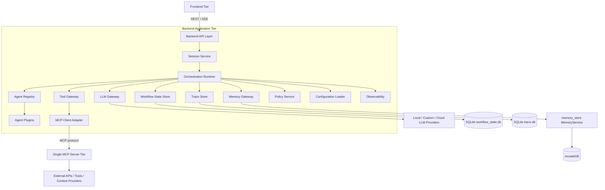
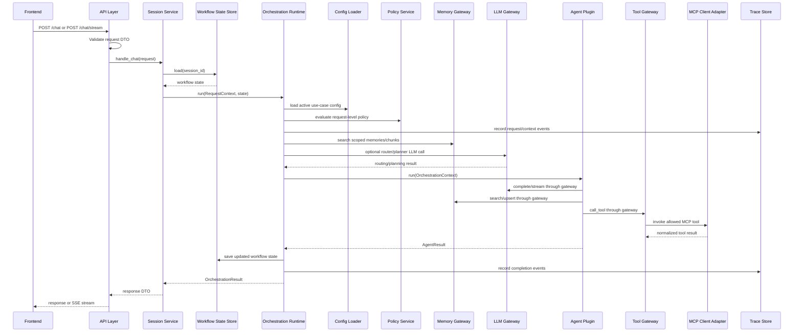

# Backend Application Architecture

**Document:** `backend-application-architecture.md`  
**Version:** 1.0  
**Source alignment:** `pluggable_agentic_ai_overall_architecture.md`  
**Scope:** Overall backend application architecture, implementation sequencing, backend module boundaries, and deep-dive documentation roadmap.

---

## 1. Purpose

This document defines the overall backend application architecture for the pluggable agentic AI system.

It is intentionally written as a foundation document rather than a module-level implementation guide. Its purpose is to establish the backend shape, dependency direction, runtime boundaries, implementation order, and the sequence of follow-on architecture documents that should be produced next.

The backend application is the central runtime tier in the three-tier V1 design:

```text
Frontend
   |
   | REST / SSE
   v
Backend Application
   |
   | MCP protocol through MCP client adapter
   v
Single MCP Server
```

The backend owns orchestration. It does not own the frontend user interface, and it does not contain the MCP server implementation.

---

## 2. Source Architecture Alignment

This backend architecture follows the V4 overall architecture rules:

- Minimal V1 has three deployable application pieces: `Frontend`, `Backend Application`, and `Single MCP Server`.
- Frontend communicates with the backend through REST / SSE.
- Backend communicates with the MCP tier through a backend-side MCP client adapter.
- Backend does not directly contain the MCP server implementation.
- Agents do not directly import LLM provider clients, MCP clients, database clients, ArcadeDB clients, SQLite clients, or external API clients.
- Agents receive controlled capabilities through `OrchestrationContext`.
- SQLite is used behind backend adapters for workflow state and traces.
- ArcadeDB is hidden behind the existing `memory_store` Python wrapper and the backend `MemoryGateway`.
- LLM providers are hidden behind the backend `LLMGateway` and YAML-driven logical model profiles.

---

## 3. Backend Architecture Goals

The backend should be:

1. **Modular**  
   Each major concern is isolated behind a small interface.

2. **Provider-neutral**  
   Agents and strategies do not know whether an LLM is local, custom, OpenAI, Google, or another provider.

3. **MCP-isolated**  
   The backend uses MCP as an external integration protocol through a client adapter only.

4. **Persistence-isolated**  
   SQLite and ArcadeDB are implementation details behind backend adapters.

5. **Configuration-driven**  
   Use cases, agents, tools, LLM profiles, persistence providers, and policies are wired through YAML configuration.

6. **Testable**  
   Orchestration, agents, and gateways should be testable with fake LLM, fake memory, fake tools, fake state, and fake traces.

7. **Implementation-sequenced**  
   The backend should be built in a dependency-aware order so each layer supports the next one.

---

## 4. Backend Non-Goals

The backend should not:

- Render the frontend UI.
- Implement the MCP server.
- Directly expose external API integrations inside agents.
- Allow agents to instantiate provider SDKs directly.
- Allow agents to call `/v1/chat/completions` endpoints directly.
- Allow agents to import SQLite, ArcadeDB, or `memory_store.service.MemoryService` directly.
- Put business workflow branching inside HTTP routes.
- Store workflow state as long-term memory.
- Delete long-term memory during a session reset.
- Expose all tools to all agents by default.
- Expose all LLM profiles to all agents by default.

---

## 5. Backend Position in the Three-Tier System



The backend is a single deployable application in V1, but internally it is organized into clear layers and adapters.

---

## 6. Backend Layering Pattern

The backend should be implemented as layered modules with strict dependency direction.

```text
API Layer
  ↓
Session Service
  ↓
Orchestration Runtime
  ↓
Gateway Interfaces
  ↓
Provider / Persistence / MCP Adapters
```

Cross-cutting modules are available through interfaces and should not invert the dependency direction:

```text
Configuration Loader
Policy / Guardrails
Observability / Tracing
```

### 6.1 Dependency Direction Rule

Higher-level modules call lower-level abstractions.

```text
Allowed:
API -> Session -> Orchestrator -> Gateway Interface -> Adapter
```

Avoid reverse dependencies.

```text
Avoid:
Adapter -> Orchestrator
Agent -> SQLite
Agent -> MCP Client
Agent -> Provider SDK
API Route -> Agent Plugin
API Route -> Provider SDK
```

### 6.2 Practical Meaning

The API layer should not know how LLMs, memory, tools, or traces work. It should validate the request, resolve the session, call the session service, and return a response.

The orchestration runtime should not know provider SDK details. It should call interfaces.

Agents should not know infrastructure details. They should receive controlled capabilities through `OrchestrationContext`.

---

## 7. Backend Internal Module Map

```text
backend/app/
  api/
  session/
  orchestration/
  llm/
  agents/
  tools/
  persistence/
  policy/
  observability/
  config/
  main.py
```

### 7.1 Module Responsibility Table

| Module | Responsibility | Should Own | Should Not Own |
|---|---|---|---|
| `api/` | HTTP and SSE boundary | Routes, DTO validation, response mapping, API errors | Agent logic, LLM calls, persistence details |
| `session/` | Session lifecycle | Session creation, resume, reset, short-term state handoff | Long-term memory deletion, LLM routing |
| `orchestration/` | Runtime coordination | Context construction, strategy execution, agent selection, result normalization | Provider SDK calls, direct DB access |
| `llm/` | Model access abstraction | LLM gateway, profile resolver, provider adapters | Business workflow decisions |
| `agents/` | Task-specific behavior | Agent plugins, agent metadata, capabilities | Direct infrastructure clients |
| `tools/` | Tool access abstraction | Tool gateway, MCP client adapter, tool specs/results | MCP server implementation |
| `persistence/` | State, trace, memory adapters | Memory gateway, SQLite state store, SQLite trace store | Business workflow logic |
| `policy/` | Permission and guardrail checks | Tool allowlists, LLM profile allowlists, memory scope rules | UI behavior, provider SDK logic |
| `observability/` | Logs, traces, metrics, diagnostics | Trace IDs, structured logs, request lifecycle telemetry | Business decisions |
| `config/` | Runtime wiring | YAML loading, schema validation, environment resolution | Agent reasoning |

---

## 8. Backend Runtime Flow



---

## 9. Core Backend Contracts

The backend should be contract-first. These contracts should exist before implementing concrete agents, provider adapters, or storage adapters.

### 9.1 RequestContext

```python
from dataclasses import dataclass
from typing import Any


@dataclass
class RequestContext:
    user_id: str
    session_id: str
    message: str
    usecase: str | None
    metadata: dict[str, Any]
```

### 9.2 OrchestrationContext

```python
from dataclasses import dataclass
from typing import Any


@dataclass
class OrchestrationContext:
    request: RequestContext
    llm: "LLMGateway"
    memory: "MemoryGateway"
    state: "WorkflowStateStore"
    tools: "ToolGateway"
    trace: "TraceStore"
    policy: "PolicyService"
    config: dict[str, Any]
```

### 9.3 OrchestrationResult

```python
from dataclasses import dataclass, field
from typing import Any


@dataclass
class OrchestrationResult:
    answer: str
    session_id: str
    agent_name: str | None = None
    strategy_name: str | None = None
    llm_profile: str | None = None
    tool_calls: list[dict[str, Any]] = field(default_factory=list)
    memory_updates: list[dict[str, Any]] = field(default_factory=list)
    trace_id: str | None = None
    metadata: dict[str, Any] = field(default_factory=dict)
```

### 9.4 AgentPlugin

```python
from typing import Protocol


class AgentPlugin(Protocol):
    name: str
    description: str
    capabilities: list[str]

    async def run(self, context: OrchestrationContext) -> "AgentResult":
        ...
```

### 9.5 OrchestrationStrategy

```python
from typing import Protocol


class OrchestrationStrategy(Protocol):
    name: str

    async def run(
        self,
        context: OrchestrationContext,
        agents: list[AgentPlugin],
    ) -> OrchestrationResult:
        ...
```

### 9.6 Gateway Contracts

The backend should define these gateway interfaces before implementing concrete adapters:

```text
LLMGateway
MemoryGateway
ToolGateway
WorkflowStateStore
TraceStore
PolicyService
ConfigurationLoader
```

---

## 10. Backend Composition Root

The backend should have one clear composition root where concrete implementations are wired together.

Recommended location:

```text
backend/app/main.py
backend/app/config/bootstrap.py optional
```

The composition root should:

1. Load environment variables.
2. Load YAML configuration.
3. Validate configuration schema.
4. Build provider adapters.
5. Build gateway implementations.
6. Build persistence stores.
7. Build policy service.
8. Build agent registry.
9. Build strategy registry.
10. Build orchestration runtime.
11. Build session service.
12. Register API routes.

Example wiring pattern:

```python
def build_app() -> FastAPI:
    settings = load_settings()
    config = load_and_validate_config(settings.app_config_path)

    trace_store = build_trace_store(config)
    workflow_state = build_workflow_state_store(config)
    memory = build_memory_gateway(config)
    policy = build_policy_service(config)
    llm = build_llm_gateway(config, policy, trace_store)
    tools = build_tool_gateway(config, policy, trace_store)

    agents = build_agent_registry(config)
    strategies = build_strategy_registry(config)

    orchestrator = OrchestrationRuntime(
        config=config,
        llm=llm,
        memory=memory,
        state=workflow_state,
        tools=tools,
        trace=trace_store,
        policy=policy,
        agents=agents,
        strategies=strategies,
    )

    session_service = SessionService(
        state=workflow_state,
        orchestrator=orchestrator,
    )

    app = FastAPI()
    register_routes(app, session_service)
    return app
```

The composition root is allowed to know concrete implementations. Most other modules should depend on interfaces.

---

## 11. Backend Package Structure

Recommended V1 package structure:

```text
backend/
  pyproject.toml
  README.md
  app/
    main.py

    api/
      __init__.py
      routes_chat.py
      routes_sessions.py
      routes_health.py
      schemas.py
      errors.py

    session/
      __init__.py
      service.py
      models.py

    orchestration/
      __init__.py
      core.py
      context.py
      results.py
      strategy_base.py
      strategy_registry.py
      strategies/
        __init__.py
        direct_agent.py
        router_strategy.py
        sequential_workflow.py

    llm/
      __init__.py
      gateway.py
      models.py
      provider_base.py
      profile_resolver.py
      providers/
        __init__.py
        openai_compatible.py
        openai.py
        google.py
        custom_http.py

    agents/
      __init__.py
      base.py
      registry.py
      support_agent.py
      document_qa_agent.py
      reviewer_agent.py

    tools/
      __init__.py
      base.py
      gateway.py
      mcp_adapter.py
      models.py

    persistence/
      __init__.py
      memory_gateway.py
      memory_store_adapter.py
      workflow_state_store.py
      sqlite_workflow_state_store.py
      trace_store.py
      sqlite_trace_store.py

    policy/
      __init__.py
      service.py
      models.py

    observability/
      __init__.py
      logging.py
      tracing.py
      metrics.py
      models.py

    config/
      __init__.py
      loader.py
      schemas.py
      settings.py

  tests/
    unit/
    integration/
    fixtures/
```

The MCP server remains outside the backend package:

```text
project-root/
  frontend/
  backend/
  mcp_server/
  config/
  data/
```

---

## 12. Backend Request Boundary

### 12.1 Minimal Backend Routes

```text
POST /chat
POST /chat/stream
POST /sessions/{session_id}/reset
GET  /sessions/{session_id}/history optional
GET  /health
GET  /capabilities
```

### 12.2 API Layer Rules

The API layer should:

- Validate incoming request schemas.
- Resolve identity/session metadata.
- Create request DTOs.
- Call `SessionService`.
- Map successful responses to HTTP/SSE responses.
- Map known errors to structured API errors.

The API layer should not:

- Select agents.
- Select LLM profiles.
- Call MCP tools.
- Search memory.
- Write trace events directly except simple request-boundary telemetry if needed.
- Execute business workflow logic.

---

## 13. Session Service Boundary

The session service is the bridge between API requests and orchestration.

It should:

- Create or resume sessions.
- Load workflow state from `WorkflowStateStore`.
- Pass stable session metadata into `RequestContext`.
- Call the orchestration runtime.
- Save final session activity metadata.
- Reset short-term workflow state when requested.

It should not:

- Delete long-term memory.
- Select tools.
- Instantiate LLM clients.
- Directly call agent plugins.

### 13.1 Reset Rule

`POST /sessions/{session_id}/reset` clears short-term workflow state only.

It may reset:

- Conversation history stored in workflow state.
- Temporary scratch state.
- Pending tool context.
- Current workflow checkpoint.

It must not delete:

- Long-term user memories.
- Project memories.
- Document chunks.
- Global knowledge records.
- LLM profile configuration.
- MCP tool configuration.

---

## 14. Orchestration Runtime Boundary

The orchestration runtime is the backend core.

It should:

- Build `OrchestrationContext`.
- Load active use-case configuration.
- Resolve the orchestration strategy.
- Resolve allowed agents.
- Search relevant scoped memory when needed.
- Optionally use an orchestrator LLM profile for routing/planning.
- Execute one or more agents.
- Normalize agent results into `OrchestrationResult`.
- Save workflow state.
- Emit trace events.

It should not:

- Instantiate provider SDKs.
- Run SQL directly.
- Import ArcadeDB directly.
- Import `memory_store.service.MemoryService` directly.
- Implement MCP server tools.
- Put frontend response rendering logic in orchestration.

---

## 15. Agent Boundary

Agents are task-specific plugins.

Agents receive `OrchestrationContext` and return `AgentResult`.

Agents may:

- Call `context.llm.complete(...)` or `context.llm.stream(...)`.
- Call `context.memory.search(...)`.
- Call `context.memory.upsert(...)` when policy allows memory writes.
- Call `context.tools.call_tool(...)` when policy allows tool use.
- Read use-case and agent configuration from `context.config`.
- Emit trace events through `context.trace` when appropriate.

Agents must not:

- Import LLM provider SDKs.
- Hard-code LLM model names.
- Hard-code local LLM URLs.
- Import MCP clients.
- Import SQLite clients.
- Import ArcadeDB clients.
- Import `MemoryService` directly.
- Make unrestricted external network calls.

---

## 16. LLM Gateway Boundary

The LLM gateway is the only backend module that should resolve LLM profiles and call LLM provider adapters.

It should:

- Load provider and profile configuration from YAML.
- Resolve logical profiles to provider/model/runtime details.
- Enforce LLM profile policy.
- Support orchestrator-level LLM calls.
- Support agent-level LLM calls.
- Support local OpenAI-compatible runtimes.
- Support custom/cloud provider adapters.
- Apply timeouts, retries, fallback profiles, and defaults.
- Emit trace events for LLM calls.
- Return normalized `LLMResponse` objects.

It should not:

- Select business workflows.
- Select agents.
- Call MCP tools.
- Store long-term memory.
- Leak provider-specific SDK responses into agents.

### 16.1 Provider-Neutral Pattern

```text
Agent / Strategy
  -> LLMGateway
      -> ProfileResolver
          -> ProviderAdapter
              -> Local runtime / Custom runtime / OpenAI / Google / future provider
```

### 16.2 Profile Resolution Order

```text
1. Explicit profile requested by strategy or agent, if policy allows it.
2. Agent-specific llm_profile from YAML.
3. Strategy-specific llm_profile from YAML.
4. Use-case default LLM profile.
5. Application default LLM profile.
6. Fail with a clear configuration error.
```

---

## 17. Tool Gateway and MCP Client Boundary

The tool gateway is the backend's controlled action interface.

It should:

- List tools available to the current use case and agent.
- Enforce tool allowlists through policy.
- Normalize tool specs.
- Call the external MCP server through `MCPClientAdapter`.
- Normalize MCP tool results into backend `ToolResult` objects.
- Emit tool trace events.

It should not:

- Implement MCP server tools.
- Let agents call MCP directly.
- Expose every MCP tool to every agent.
- Store workflow state.
- Select LLM profiles.

### 17.1 V1 MCP Rule

V1 uses one MCP endpoint:

```env
MCP_MAIN_URL=http://localhost:9001/mcp
```

Domain separation should be handled through:

- Tool naming conventions.
- Agent tool allowlists.
- Use-case configuration.
- Policy rules.

---

## 18. Persistence Boundary

Persistence is split into three concerns.

| Concern | Gateway / Store | V1 Implementation | Storage Engine |
|---|---|---|---|
| Long-term memory and document chunks | `MemoryGateway` | `MemoryStoreAdapter` | `memory_store` -> ArcadeDB |
| Short-term workflow/session state | `WorkflowStateStore` | `SqliteWorkflowStateStore` | SQLite |
| Request traces and audit events | `TraceStore` | `SqliteTraceStore` | SQLite |

### 18.1 Persistence Rules

- Workflow state is not long-term memory.
- Traces are not long-term memory.
- Long-term memory is not a workflow checkpoint store.
- Session reset clears workflow state only.
- Agents do not import concrete database clients.
- Adapters isolate storage-engine details.

---

## 19. Policy Boundary

Policy should be called before sensitive actions.

Policy should cover:

- Agent permissions.
- Tool permissions.
- LLM profile permissions.
- Memory scope access.
- Memory write permissions.
- Use-case access rules.
- Human approval gates for sensitive write actions.

Recommended V1 policy defaults:

```text
Deny unknown tools.
Deny unknown LLM profiles.
Require memory scope.
Trace all LLM calls.
Trace all tool calls.
Allow tools per agent, not globally.
Allow LLM profiles per agent/use case, not globally.
```

---

## 20. Observability Boundary

Observability should be available from the beginning of implementation, not bolted on at the end.

V1 should include:

- One trace ID per request.
- Structured logs.
- Trace events in SQLite.
- LLM call events.
- LLM failure and fallback events.
- Tool call events.
- Memory search events.
- Strategy selected events.
- Agent selected events.
- Error taxonomy.
- Health checks.

### 20.1 Minimum Trace Events

```text
request_received
context_created
workflow_state_loaded
memory_search_started
memory_search_completed
llm_call_started
llm_call_completed
llm_call_failed
llm_fallback_selected
strategy_selected
agent_selected
agent_started
agent_completed
tool_call_started
tool_call_completed
tool_call_failed
workflow_state_saved
response_returned
error_occurred
```

---

## 21. Configuration Boundary

Configuration wires the backend at runtime.

It should define:

- Active use case.
- Orchestration strategy.
- Default agent.
- Orchestrator LLM profile.
- Agent-specific LLM profiles.
- LLM providers and profiles.
- MCP endpoint.
- Allowed tools.
- Persistence providers.
- Policy settings.

### 21.1 Configuration Rule

Provider details belong in YAML and environment variables, not inside agents or API routes.

Use:

```yaml
agents:
  document_qa_agent:
    enabled: true
    llm_profile: research_reasoning
```

Avoid:

```python
model = "hard-coded-model-name"
base_url = "http://192.168.1.80:8081/v1"
```

---

## 22. Backend Health Model

The backend should expose one health route that checks internal modules without leaking secrets.

Recommended route:

```text
GET /health
```

Recommended health sections:

```json
{
  "status": "ok",
  "backend": {
    "configured": true
  },
  "llm": {
    "providers_configured": true
  },
  "mcp": {
    "main_mcp_configured": true,
    "reachable": true
  },
  "memory": {
    "configured": true,
    "healthy": true
  },
  "workflow_state": {
    "configured": true,
    "healthy": true
  },
  "trace": {
    "configured": true,
    "healthy": true
  }
}
```

Do not return API keys, tokens, connection strings, or sensitive payloads in health responses.

---

## 23. Implementation Pattern

The backend should be implemented using a walking-skeleton pattern.

A walking skeleton is a thin end-to-end slice that exercises the real boundaries early:

```text
POST /chat
  -> SessionService
  -> OrchestrationRuntime
  -> DirectStrategy
  -> Echo/TestAgent
  -> FakeLLMGateway or local configured LLM
  -> WorkflowStateStore
  -> TraceStore
  -> Response
```

Then replace fake implementations with real adapters one at a time.

This reduces integration risk because the full route, session, orchestrator, agent, state, trace, and response path exists before the system becomes complex.

---

## 24. Recommended Backend Implementation Order

The backend should be built in this order.

### Phase 1: Backend Foundation Skeleton

Deliverables:

- `backend/` package.
- `app/main.py`.
- Basic FastAPI app or chosen Python web framework.
- Health route.
- Config/settings loader stub.
- Structured logging stub.
- Test layout.

Success criteria:

- Backend starts locally.
- `GET /health` returns a response.
- Unit tests can run.

---

### Phase 2: Core Contracts

Deliverables:

- `RequestContext`.
- `OrchestrationContext`.
- `OrchestrationResult`.
- `AgentPlugin`.
- `AgentResult`.
- `OrchestrationStrategy`.
- Gateway protocol interfaces.

Success criteria:

- Core interfaces compile.
- Fake implementations can be used in tests.
- No concrete provider, database, or MCP dependency is required yet.

---

### Phase 3: Configuration Loader

Deliverables:

- YAML loader.
- Environment variable resolver.
- Schema validation.
- Use-case config shape.
- LLM provider/profile config shape.
- Agent config shape.
- MCP config shape.
- Persistence config shape.

Success criteria:

- Backend can load a sample use-case YAML.
- Invalid config fails fast with useful errors.
- Provider/model/tool details remain outside code.

---

### Phase 4: Observability and Trace Foundation

Deliverables:

- Request trace ID generation.
- Structured logging.
- `TraceStore` interface.
- `SqliteTraceStore` initial implementation.
- Trace table schema initialization.

Success criteria:

- Each request gets a trace ID.
- Trace events can be written to SQLite.
- Errors are traceable.

---

### Phase 5: Workflow State Store

Deliverables:

- `WorkflowStateStore` interface.
- `SqliteWorkflowStateStore`.
- Workflow session table.
- Workflow state table.
- `load`, `save`, and `reset` methods.

Success criteria:

- Session state can be loaded and saved.
- Session reset clears short-term state only.
- SQLite file is created under `./data/` or configured path.

---

### Phase 6: API and Session Walking Skeleton

Deliverables:

- `POST /chat`.
- `POST /sessions/{session_id}/reset`.
- Request/response DTOs.
- `SessionService`.
- Stub orchestrator.
- Stub agent.

Success criteria:

- Frontend or curl can send a message and receive a response.
- Session state is loaded/saved.
- Trace events are created.

---

### Phase 7: LLM Gateway

Deliverables:

- `LLMGateway` implementation.
- `LLMProviderAdapter` interface.
- Profile resolver.
- OpenAI-compatible provider adapter.
- Local `/v1/chat/completions` support.
- Optional OpenAI, Google, and custom HTTP provider adapters.
- LLM policy checks.
- LLM trace events.

Success criteria:

- Orchestrator can use one LLM profile.
- Each agent can use its own LLM profile.
- Local/custom/cloud models can be changed through YAML.
- Agents do not hard-code provider/model information.

---

### Phase 8: Memory Gateway

Deliverables:

- `MemoryGateway` interface.
- `MemoryStoreAdapter` wrapping `memory_store.service.MemoryService`.
- Scope mapping from `RequestContext`.
- Search wrapper.
- Upsert wrapper.
- Document chunk search/retrieval wrapper.
- Memory health check.

Success criteria:

- Agents can search memory through `context.memory`.
- Agents can retrieve document chunks through the memory gateway.
- ArcadeDB remains hidden behind `memory_store`.

---

### Phase 9: Tool Gateway and MCP Client Adapter

Deliverables:

- `ToolGateway` interface.
- `MCPClientAdapter`.
- Tool spec normalization.
- Tool result normalization.
- Tool allowlist policy.
- Single `MCP_MAIN_URL` configuration.
- Tool trace events.

Success criteria:

- Agent can call an allowed MCP tool through `context.tools`.
- Unknown or unauthorized tools are denied.
- Backend contains no MCP server implementation.

---

### Phase 10: Orchestration Runtime and Strategies

Deliverables:

- `OrchestrationRuntime`.
- Strategy registry.
- Direct agent strategy.
- Router strategy.
- Sequential workflow strategy.
- Agent registry integration.
- Strategy trace events.

Success criteria:

- Runtime can execute one agent.
- Runtime can route between at least two agents.
- Runtime can execute a simple multi-agent sequence.
- Router strategy can use the orchestrator LLM profile.

---

### Phase 11: Agent Plugins

Deliverables:

- Agent base interface.
- Agent registry.
- Initial `support_agent` or `document_qa_agent`.
- Optional `reviewer_agent`.
- Agent-level LLM profile config.
- Agent-level tool allowlists.

Success criteria:

- Agents use only `OrchestrationContext` capabilities.
- Agents can be tested with fake gateways.
- New agents can be registered without changing API routes.

---

### Phase 12: Hardening and Deployment Readiness

Deliverables:

- Error taxonomy.
- Health checks for LLM, MCP, memory, workflow state, trace.
- Startup validation.
- Graceful provider failures.
- LLM fallback tracing.
- Integration tests.
- Local run instructions.

Success criteria:

- Backend can run as the V1 application tier.
- Failures are diagnosable.
- Runtime can support multiple use cases through configuration.

---

## 25. Follow-On Architecture Document Roadmap

This document should be followed by focused architecture documents in this order.

| Order | Document | Why This Comes Next |
|---:|---|---|
| 1 | `backend-foundation-architecture.md` | Defines project skeleton, bootstrapping, settings, app startup, dependency wiring, and test foundation. |
| 2 | `backend-core-contracts-architecture.md` | Locks down shared DTOs, protocols, context objects, result objects, and fake test implementations. |
| 3 | `backend-configuration-architecture.md` | Establishes YAML schema and provider/use-case wiring before concrete modules depend on it. |
| 4 | `backend-observability-architecture.md` | Adds trace ID, logs, and trace events early so later modules are debuggable. |
| 5 | `backend-persistence-architecture.md` | Defines memory/state/trace persistence boundaries and adapter patterns. |
| 6 | `backend-sqlite-workflow-state-architecture.md` | Implements session state and reset behavior. |
| 7 | `backend-sqlite-trace-store-architecture.md` | Implements trace event persistence and query/debug patterns. |
| 8 | `backend-api-architecture.md` | Implements REST/SSE routes after contracts and session boundaries are known. |
| 9 | `backend-session-service-architecture.md` | Details session lifecycle, history, reset, and workflow-state handoff. |
| 10 | `backend-llm-gateway-architecture.md` | Implements provider-neutral model access, profiles, fallback, and tracing. |
| 11 | `backend-memory-store-adapter-architecture.md` | Integrates `memory_store` and ArcadeDB isolation behind `MemoryGateway`. |
| 12 | `backend-tooling-mcp-client-architecture.md` | Implements tool gateway, single MCP client adapter, tool specs, and tool policy. |
| 13 | `backend-orchestration-architecture.md` | Implements runtime coordination, context construction, strategy execution, and result normalization. |
| 14 | `backend-workflow-strategies-architecture.md` | Details direct, router, sequential, and future workflow strategy plugins. |
| 15 | `backend-agents-architecture.md` | Details agent plugin interface, registry, capabilities, prompts, and testing. |
| 16 | `backend-policy-architecture.md` | Hardens LLM/tool/memory access controls and approval gates. |
| 17 | `backend-deployment-architecture.md` | Defines local runtime topology, environment variables, processes, and deployment layout. |

### 25.1 Recommended Immediate Next Document

The next logical document should be:

```text
backend-foundation-architecture.md
```

Reason: before implementing APIs, LLM gateways, memory, or agents, the project needs a stable backend skeleton, settings model, dependency wiring pattern, logging baseline, testing structure, and local startup flow.

After that, generate:

```text
backend-core-contracts-architecture.md
```

Reason: contracts should stabilize before concrete implementations are built.

---

## 26. Backend Acceptance Criteria

The backend architecture is successful when:

- Backend is one deployable application tier in V1.
- Backend receives requests from frontend over REST / SSE.
- Backend calls the single MCP server only through an MCP client adapter.
- Backend does not contain MCP server implementation code.
- API routes remain thin.
- Session reset clears workflow state but does not delete long-term memory.
- Orchestration runtime owns workflow execution.
- Agents receive `OrchestrationContext` and do not import infrastructure clients.
- LLM access goes only through `LLMGateway`.
- Tools are called only through `ToolGateway`.
- Memory is accessed only through `MemoryGateway`.
- Workflow state is accessed only through `WorkflowStateStore`.
- Trace events are written only through `TraceStore`.
- SQLite workflow and trace stores are hidden behind adapters.
- ArcadeDB is hidden behind `memory_store` and the memory adapter.
- LLM provider/model selection is YAML-driven.
- Orchestrator and agents can use different LLM profiles.
- Tool and LLM profile permissions can be controlled per agent and use case.
- Each request has traceable events.
- New agents can be added without changing API routes.
- New LLM providers can be added without changing agent code.
- New MCP tools can be added without changing backend infrastructure code, assuming tool naming and policy config are updated.

---

## 27. Key Design Rules

1. **Frontend owns experience.**  
   Backend should return structured response data and stream events, not UI behavior.

2. **Backend owns orchestration.**  
   Runtime workflow decisions belong in orchestration, not in API routes or MCP tools.

3. **LLMGateway owns model access.**  
   Agents and strategies use logical profiles, not direct provider clients.

4. **ToolGateway owns action access.**  
   Agents request tools through a controlled gateway and policy layer.

5. **MCP server owns external tool exposure.**  
   Backend calls MCP; it does not implement MCP tools.

6. **MemoryGateway owns memory access.**  
   Long-term memory and document chunks are accessed through `memory_store` via adapter.

7. **WorkflowStateStore owns short-term state.**  
   Conversation/session state is persisted separately from long-term memory.

8. **TraceStore owns runtime trace records.**  
   Traces are operational records, not memories.

9. **Policy gates sensitive actions.**  
   Tool access, model access, and memory scope access should be deny-by-default.

10. **Configuration wires runtime behavior.**  
    Use-case-specific behavior should come from YAML, not hard-coded logic.

---

## 28. Summary

This backend architecture establishes the implementation pattern for the backend application tier.

The key idea is to first build a stable backend foundation, then define contracts, then add configuration, observability, persistence, API/session flow, LLM access, memory access, tool/MCP access, orchestration, strategies, and agents.

This ordering prevents premature coupling and keeps the backend modular enough to support local LLMs, cloud LLMs, custom providers, memory through ArcadeDB-backed `memory_store`, SQLite-backed workflow and trace storage, and MCP-based external tools without making agents dependent on infrastructure details.

