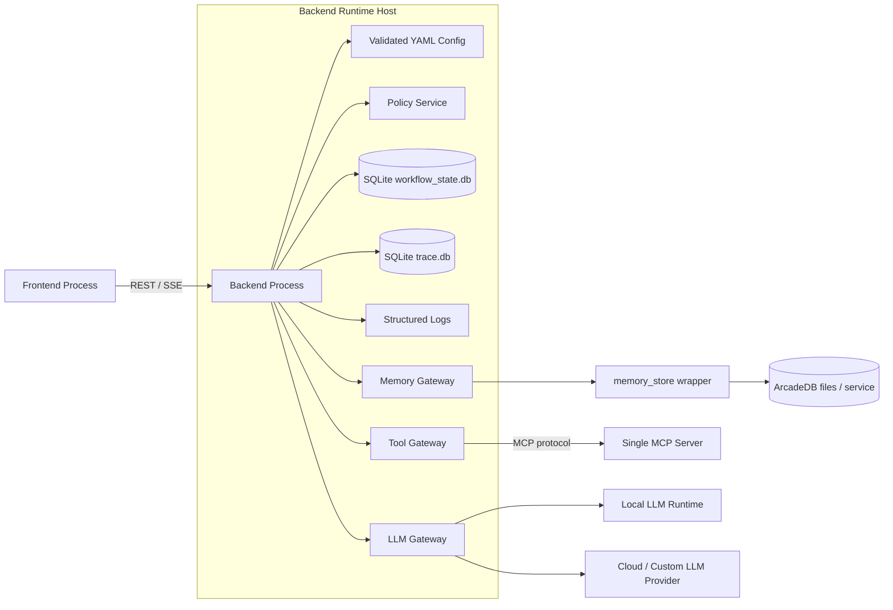

# Backend Deployment Architecture

**Document:** `backend-deployment-architecture.md`  
**Version:** 1.0  
**Source alignment:** `backend-application-architecture.md`, `backend-foundation-architecture.md`, `backend-core-contracts-architecture.md`, `backend-configuration-architecture.md`, `backend-observability-architecture.md`, `backend-persistence-architecture.md`, `backend-sqlite-workflow-state-architecture.md`, `backend-sqlite-trace-store-architecture.md`, `backend-api-architecture.md`, `backend-session-service-architecture.md`, `backend-llm-gateway-architecture.md`, `backend-memory-store-adapter-architecture.md`, `backend-tooling-mcp-client-architecture.md`, `backend-orchestration-architecture.md`, `backend-workflow-strategies-architecture.md`, `backend-agents-architecture.md`, and `backend-policy-architecture.md`  
**Scope:** V1 backend deployment topology, local runtime layout, process model, environment variables, configuration loading, filesystem layout, startup validation, health/readiness checks, policy-safe runtime profiles, secret boundaries, observability export, persistence deployment, MCP/LLM connectivity, packaging, container/systemd options, CI/CD gates, smoke tests, rollback expectations, and acceptance criteria for deployment readiness.

---

## 1. Purpose

This document defines the deployment architecture for the backend application tier.

It follows:

1. `backend-foundation-architecture.md`
2. `backend-core-contracts-architecture.md`
3. `backend-configuration-architecture.md`
4. `backend-observability-architecture.md`
5. `backend-persistence-architecture.md`
6. `backend-sqlite-workflow-state-architecture.md`
7. `backend-sqlite-trace-store-architecture.md`
8. `backend-api-architecture.md`
9. `backend-session-service-architecture.md`
10. `backend-llm-gateway-architecture.md`
11. `backend-memory-store-adapter-architecture.md`
12. `backend-tooling-mcp-client-architecture.md`
13. `backend-orchestration-architecture.md`
14. `backend-workflow-strategies-architecture.md`
15. `backend-agents-architecture.md`
16. `backend-policy-architecture.md`
17. `backend-deployment-architecture.md` ← this document

The previous document defined policy hardening. Policy is now the centralized authorization and exposure decision layer. Deployment must preserve that policy boundary by using safe environment defaults, explicit configuration profiles, secret isolation, predictable process topology, health checks, and startup validation.

The goal of this document is to make the backend application runnable as the V1 backend tier without collapsing module boundaries, leaking infrastructure details into agents, or mixing frontend, backend, and MCP server responsibilities.

The core deployment rule is:

> **Deployment wires the backend safely. It does not change architecture boundaries. The backend remains one deployable application tier in V1, the frontend remains separate, the MCP server remains separate, and provider, persistence, policy, memory, and tool details stay behind backend adapters and configuration.**

---

## 2. Source Architecture Alignment

This document follows the established backend architecture rules:

- Minimal V1 uses three deployable application pieces: `Frontend`, `Backend Application`, and `Single MCP Server`.
- Frontend communicates with the backend through REST / SSE.
- Backend communicates with the MCP tier through the backend-side `MCPClientAdapter` only.
- Backend does not contain the MCP server implementation.
- Backend is one deployable Python application in V1.
- API routes remain thin and delegate to `SessionService`.
- `SessionService` owns session lifecycle, workflow-state load/save/reset, and request handoff.
- `OrchestrationRuntime` owns turn lifecycle, strategy execution, context construction, cancellation, and normalized results.
- Agents receive controlled capabilities through `OrchestrationContext`.
- Agents do not import provider SDKs, MCP clients, SQLite clients, ArcadeDB clients, `memory_store`, or external API clients.
- LLM access remains behind `LLMGateway` and logical YAML model profiles.
- Tool access remains behind `ToolGateway` and the single MCP client adapter.
- Memory/document access remains behind `MemoryGateway` and `MemoryStoreAdapter`.
- SQLite workflow state and trace stores remain behind persistence adapters.
- ArcadeDB remains hidden behind the existing `memory_store` Python wrapper.
- Policy remains deny-by-default and gateway-enforced.
- Runtime, gateway, stream, health, trace, and error payloads must use policy-aware redaction and safe summaries.
- Deployment must not expose provider URLs, database paths, MCP endpoints, API keys, tokens, raw prompts, raw tool payloads, raw memory records, or stack traces through public endpoints by default.

---

## 3. Refined Position in the Backend Implementation Sequence

This document expands Phase 17 from the backend roadmap.

```text
Phase 1: Backend Foundation Skeleton
Phase 2: Core Contracts
Phase 3: Configuration Loader
Phase 4: Observability and Trace Foundation
Phase 5: Persistence Boundary and Store Foundations
Phase 6: SQLite Workflow State Store
Phase 7: SQLite Trace Store
Phase 8: API and Session Walking Skeleton
Phase 9: Session Service Deepening
Phase 10: LLM Gateway
Phase 11: Memory Gateway and Memory Store Adapter
Phase 12: Tool Gateway and MCP Client Adapter
Phase 13: Orchestration Runtime and Strategy Contract
Phase 14: Workflow Strategy Implementations
Phase 15: Agent Plugins
Phase 16: Policy Hardening
Phase 17: Deployment Readiness
```

The output of this phase is a backend application that can be started, configured, health-checked, traced, tested, upgraded, and rolled back in a predictable way.

Deployment readiness includes:

```text
Backend process entrypoint
Environment profile selection
YAML configuration file selection
Runtime directory layout
SQLite database path ownership
ArcadeDB / memory_store path ownership
MCP endpoint configuration
LLM provider/profile configuration
Policy-safe defaults
Health/readiness/liveness checks
Observability output configuration
Startup validation
Smoke tests
Packaging and run commands
Container and non-container deployment patterns
CI/CD validation gates
Operational runbooks
```

---

## 4. Architecture Goals

The deployment architecture should be:

1. **Boundary-preserving**  
   Deployment must keep frontend, backend, MCP server, LLM providers, SQLite stores, and ArcadeDB/memory store concerns separated.

2. **Configuration-driven**  
   Runtime behavior must be controlled through environment variables and validated YAML, not hard-coded values in agents or API routes.

3. **Policy-safe by default**  
   Production-like profiles should run policy enabled, default-deny, fail-closed, with raw traces and raw stream payloads disabled.

4. **Local-first but production-aware**  
   V1 should run cleanly on a developer workstation while using patterns that can later move to containers, systemd, VM, or cloud deployment.

5. **Observable**  
   Every deployment should expose safe health checks, structured logs, metrics hooks, and trace persistence.

6. **Recoverable**  
   SQLite stores, memory store data, config files, and logs should have clear backup, restore, and rollback expectations.

7. **Secret-safe**  
   Secrets should live in environment variables or a future secrets backend, not in source-controlled YAML, traces, logs, workflow state, or policy decisions.

8. **Deterministic at startup**  
   Invalid configuration, missing required directories, unreachable mandatory dependencies, and unsafe policy settings should fail startup or readiness.

9. **Testable in deployment form**  
   CI and local smoke tests should exercise the same entrypoints used by actual deployments.

10. **Composable**  
    Deployment should support different combinations of local LLM, cloud LLM, local MCP server, remote MCP server, SQLite data directories, and memory-store paths without code changes.

---

## 5. Non-Goals

This document does not implement:

- Frontend deployment architecture.
- MCP server internals.
- Kubernetes production architecture.
- Multi-region deployment.
- Multi-tenant enterprise isolation.
- Full OAuth/JWT identity-provider integration.
- Centralized secrets manager integration.
- External policy engine hosting.
- Full approval workflow lifecycle.
- Production-grade rate limiting.
- WAF, firewall, reverse proxy, TLS certificate automation, or DNS management.
- Cloud-specific infrastructure-as-code.
- Database migration framework for non-SQLite stores.
- Long-term trace retention/compliance policy.
- Administrative UI for deployment operations.
- Formal SRE on-call process.

Those concerns belong to future hardening, operations, infrastructure, secrets, approval, and admin documents.

---

## 6. Deployment Boundary

V1 has three deployable pieces:

```text
Frontend
   |
   | REST / SSE
   v
Backend Application
   |
   | MCP protocol through MCPClientAdapter
   v
Single MCP Server
```

The backend deployment owns:

- Python backend process.
- Backend app settings.
- Backend YAML configuration selection.
- Backend policy mode and safe defaults.
- Backend data directories for SQLite workflow state and traces.
- Backend memory-store configuration used by `MemoryStoreAdapter`.
- Backend logs and trace files.
- Backend health/readiness/liveness routes.
- Backend network binding and allowed frontend origin configuration.
- Backend outbound URLs for MCP and LLM providers.
- Backend startup validation and smoke tests.

The backend deployment does not own:

- Frontend static asset hosting.
- Frontend UI routing.
- MCP server tool implementation.
- LLM provider process lifecycle unless using a local dev profile that explicitly launches a local provider separately.
- ArcadeDB internals beyond the `memory_store` wrapper configuration.
- External API services used by MCP tools.
- Cloud secrets manager internals.

---

## 7. V1 Local Runtime Topology

Recommended local V1 topology:

```text
Developer machine or single host

  frontend process
    http://localhost:3000 or http://localhost:5000
          |
          | REST / SSE
          v
  backend process
    http://localhost:8000
    config: ./config/backend.local.yaml
    data:   ./data/backend/
          |
          | MCP protocol
          v
  mcp_server process
    http://localhost:9001/mcp

  optional local LLM runtime
    http://192.168.1.80:8081/v1 or http://localhost:8081/v1

  backend local stores
    ./data/backend/workflow_state.db
    ./data/backend/trace.db
    ./data/memory_store/...
```

### 7.1 Process Diagram



### 7.2 Runtime Contract

The backend process should be independently startable:

```bash
python -m backend.app.main
```

or through an ASGI server:

```bash
uvicorn backend.app.main:create_app --factory --host 0.0.0.0 --port 8000
```

The exact Python web framework can remain FastAPI-compatible with the previous API architecture unless the implementation explicitly chooses Flask or another framework behind the same REST/SSE contracts.

---

## 8. Deployment Profiles

Deployment should support explicit profiles.

Recommended profiles:

| Profile | Purpose | Policy | Provider Mode | Data Safety |
|---|---|---|---|---|
| `local` | Developer workstation. | Enabled; default-deny. | Local or cloud. | Raw diagnostics still disabled by default. |
| `test` | Automated tests and CI. | Enabled or fake policy fixtures. | Fake providers preferred. | Ephemeral test data. |
| `staging` | Production-like validation. | Enabled; fail-closed. | Real or staging providers. | Persistent data with backups. |
| `production` | Live runtime. | Enabled; fail-closed. | Real providers. | Persistent data, restricted diagnostics. |

### 8.1 Profile Selection

Recommended environment variables:

```env
APP_ENV=local
APP_CONFIG_PATH=./config/backend.local.yaml
APP_RUNTIME_DIR=./runtime/backend
APP_DATA_DIR=./data/backend
APP_LOG_DIR=./logs/backend
```

Profile names should be normalized and validated at startup.

Allowed values:

```text
local
test
staging
production
```

Unknown profile values should fail startup.

### 8.2 Safe Defaults by Profile

| Setting | local | test | staging | production |
|---|---:|---:|---:|---:|
| Policy enabled | yes | yes | yes | yes |
| Policy default decision | deny | deny | deny | deny |
| Policy fail closed | yes | yes | yes | yes |
| Raw prompt tracing | no | no | no | no |
| Raw tool payload tracing | no | no | no | no |
| Raw memory record tracing | no | no | no | no |
| Raw provider chunk streaming | no | no | no | no |
| Stack traces in API errors | no | no | no | no |
| Health exposes endpoints/secrets | no | no | no | no |
| Auto-reload | optional | no | no | no |
| Fake providers allowed | optional | preferred | no by default | no |

---

## 9. Environment Variable Contract

Deployment should use environment variables for process-level values, paths, secrets, and overrides.

YAML should define logical runtime behavior. Environment variables should provide host-specific values and secrets.

### 9.1 Required Variables

```env
APP_ENV=local
APP_CONFIG_PATH=./config/backend.local.yaml
APP_HOST=0.0.0.0
APP_PORT=8000
APP_DATA_DIR=./data/backend
APP_LOG_DIR=./logs/backend
APP_RUNTIME_DIR=./runtime/backend
```

### 9.2 Backend Network Variables

```env
APP_HOST=0.0.0.0
APP_PORT=8000
APP_PUBLIC_BASE_URL=http://localhost:8000
APP_ALLOWED_ORIGINS=http://localhost:3000,http://localhost:5000
APP_SSE_HEARTBEAT_SECONDS=15
APP_REQUEST_TIMEOUT_SECONDS=120
APP_GRACEFUL_SHUTDOWN_SECONDS=20
```

### 9.3 Configuration Variables

```env
APP_CONFIG_PATH=./config/backend.local.yaml
APP_CONFIG_STRICT=true
APP_CONFIG_ALLOW_ENV_OVERRIDES=true
APP_CONFIG_VERSION=local-dev
```

### 9.4 Persistence Variables

```env
WORKFLOW_STATE_DB_PATH=./data/backend/workflow_state.db
TRACE_DB_PATH=./data/backend/trace.db
MEMORY_STORE_CONFIG_PATH=./config/memory_store.local.yaml
MEMORY_STORE_DATA_DIR=./data/memory_store
```

### 9.5 MCP Variables

```env
MCP_MAIN_URL=http://localhost:9001/mcp
MCP_CONNECT_TIMEOUT_SECONDS=10
MCP_REQUEST_TIMEOUT_SECONDS=60
MCP_HEALTH_TIMEOUT_SECONDS=5
```

V1 should use one MCP endpoint only:

```env
MCP_MAIN_URL=http://localhost:9001/mcp
```

Do not reintroduce domain-specific MCP URLs unless a future architecture document explicitly changes the topology.

### 9.6 LLM Provider Variables

Local OpenAI-compatible runtime example:

```env
LOCAL_LLM_BASE_URL=http://192.168.1.80:8081/v1
LOCAL_LLM_API_KEY=local-dev-placeholder
```

Cloud/custom provider examples:

```env
OPENAI_API_KEY=...
GOOGLE_API_KEY=...
CUSTOM_LLM_BASE_URL=https://example.internal/v1
CUSTOM_LLM_API_KEY=...
```

Provider keys must not be stored in source-controlled YAML.

### 9.7 Policy Variables

```env
POLICY_ENABLED=true
POLICY_MODE=local_yaml
POLICY_FAIL_CLOSED=true
POLICY_AUDIT_DECISIONS=true
POLICY_CONFIG_PATH=./config/policy.local.yaml
```

Environment variables may select policy files or override non-secret safe flags, but they should not be used to create a hidden runtime `allow_all` mode.

### 9.8 Observability Variables

```env
LOG_LEVEL=INFO
LOG_FORMAT=json
TRACE_ENABLED=true
TRACE_DB_PATH=./data/backend/trace.db
METRICS_ENABLED=true
METRICS_BIND_HOST=127.0.0.1
METRICS_PORT=9102
```

### 9.9 Secret Safety Rule

Secrets may appear in:

```text
environment variables
local .env files excluded from source control
future secrets manager references
process manager secret injection
container runtime secret injection
```

Secrets must not appear in:

```text
source-controlled YAML
agent prompts
policy decisions
trace payloads
structured logs
workflow state
memory records
SSE events
health responses
capability responses
error responses
CI logs
```

---

## 10. Configuration File Layout

Recommended repository-level layout:

```text
project-root/
  frontend/
  backend/
  mcp_server/
  config/
    backend.local.yaml
    backend.test.yaml
    backend.staging.yaml
    backend.production.yaml
    policy.local.yaml
    policy.test.yaml
    policy.staging.yaml
    policy.production.yaml
    memory_store.local.yaml
    logging.local.yaml
  data/
    backend/
      workflow_state.db
      trace.db
    memory_store/
  logs/
    backend/
  runtime/
    backend/
  scripts/
    run_backend.sh
    smoke_backend.sh
    migrate_backend.sh
    backup_backend.sh
    restore_backend.sh
```

### 10.1 Backend Config Example

```yaml
app:
  name: pluggable-agentic-backend
  environment: ${APP_ENV}
  public_base_url: ${APP_PUBLIC_BASE_URL}
  request_timeout_seconds: ${APP_REQUEST_TIMEOUT_SECONDS:120}
  sse_heartbeat_seconds: ${APP_SSE_HEARTBEAT_SECONDS:15}

api:
  host: ${APP_HOST:0.0.0.0}
  port: ${APP_PORT:8000}
  allowed_origins: ${APP_ALLOWED_ORIGINS:http://localhost:3000}

persistence:
  workflow_state:
    provider: sqlite
    db_path: ${WORKFLOW_STATE_DB_PATH:./data/backend/workflow_state.db}
    wal_enabled: true
    busy_timeout_ms: 5000
  trace:
    provider: sqlite
    db_path: ${TRACE_DB_PATH:./data/backend/trace.db}
    wal_enabled: true
    busy_timeout_ms: 5000
  memory:
    provider: memory_store
    config_path: ${MEMORY_STORE_CONFIG_PATH:./config/memory_store.local.yaml}

tools:
  mcp:
    main_url: ${MCP_MAIN_URL:http://localhost:9001/mcp}
    connect_timeout_seconds: ${MCP_CONNECT_TIMEOUT_SECONDS:10}
    request_timeout_seconds: ${MCP_REQUEST_TIMEOUT_SECONDS:60}

llm:
  default_profile: local_fast
  providers:
    local_openai_compatible:
      type: openai_compatible
      base_url: ${LOCAL_LLM_BASE_URL}
      api_key_env: LOCAL_LLM_API_KEY
  profiles:
    local_fast:
      provider: local_openai_compatible
      model: qwen3.5-27b-claude-4.6-opus-reasoning-distilled-i1
      temperature: 0.7
      timeout_seconds: 120

policy:
  config_path: ${POLICY_CONFIG_PATH:./config/policy.local.yaml}
```

### 10.2 Configuration Rule

Config files may contain:

```text
logical profile names
logical tool names
feature flags
timeout values
path templates
provider types
secret environment variable names
```

Config files must not contain:

```text
API keys
OAuth tokens
JWT signing secrets
database passwords
private keys
raw prompts with secrets
personal data dumps
```

---

## 11. Runtime Filesystem Layout

Recommended local runtime layout:

```text
./data/backend/
  workflow_state.db
  workflow_state.db-wal
  workflow_state.db-shm
  trace.db
  trace.db-wal
  trace.db-shm

./data/memory_store/
  arcade/
  indexes/
  metadata/

./logs/backend/
  backend.log
  backend.error.log

./runtime/backend/
  backend.pid optional
  startup.lock optional
  readiness.json optional
```

### 11.1 Filesystem Ownership

The backend process user must have:

| Path | Required Permission | Notes |
|---|---|---|
| `APP_DATA_DIR` | read/write | SQLite state and trace files. |
| `MEMORY_STORE_DATA_DIR` | read/write | Used by `memory_store` / ArcadeDB wrapper. |
| `APP_LOG_DIR` | write | Structured logs if file logging is enabled. |
| `APP_RUNTIME_DIR` | read/write | PID/lock/readiness artifacts if used. |
| `APP_CONFIG_PATH` | read | Backend YAML config. |
| `POLICY_CONFIG_PATH` | read | Policy YAML config. |

### 11.2 Path Safety Rules

- Paths should be resolved at startup to absolute paths.
- Path traversal in config-derived paths should be denied.
- Runtime data paths should not point inside source package directories.
- Production runtime should not write under the application source tree.
- Health responses should not expose absolute filesystem paths by default.

---

## 12. Backend Process Model

V1 should run as one backend process with clear internal async boundaries.

```text
Backend Process
  ├── HTTP REST handlers
  ├── SSE stream handlers
  ├── SessionService
  ├── OrchestrationRuntime
  ├── LLMGateway
  ├── MemoryGateway
  ├── ToolGateway
  ├── PolicyService
  ├── WorkflowStateStore
  ├── TraceStore
  └── Observability facade
```

### 12.1 Worker Count

Recommended V1 default:

```text
1 backend process
1 ASGI worker
async request handling
bounded concurrency inside gateways
```

Reason:

- SQLite write behavior is simpler with a single process.
- In-memory per-turn policy caches remain process-local.
- Local development is easier to debug.
- SSE stream cancellation is simpler.

### 12.2 Future Worker Scaling

Multiple workers can be considered later only after confirming:

- SQLite stores are configured for WAL mode and busy timeouts.
- Trace writes remain safe under concurrent writers.
- Workflow state updates have optimistic concurrency or locking.
- Pending approval/session state is not stored only in process memory.
- Streaming cancellation and idempotency work across workers.
- Memory store concurrency is validated.

### 12.3 Background Task Rule

V1 deployment should not rely on hidden background workers for chat correctness.

The backend may perform short bounded tasks inside request execution, but long-running jobs, scheduled jobs, ingestion pipelines, and approval-resume workflows should be introduced by future documents.

---

## 13. Startup Sequence

Recommended startup sequence:

```text
1. Load .env / process environment.
2. Resolve APP_ENV and APP_CONFIG_PATH.
3. Load backend YAML configuration.
4. Resolve environment variable placeholders.
5. Validate typed configuration.
6. Resolve and validate runtime paths.
7. Initialize observability and redactor.
8. Initialize PolicyService from validated policy settings.
9. Validate policy safety for selected APP_ENV.
10. Initialize SQLite workflow state store.
11. Initialize SQLite trace store.
12. Initialize MemoryGateway and MemoryStoreAdapter.
13. Initialize LLMGateway and profile resolver.
14. Initialize ToolGateway and MCPClientAdapter.
15. Initialize agent registry.
16. Initialize strategy registry.
17. Initialize OrchestrationRuntime.
18. Initialize SessionService.
19. Register API routes.
20. Run optional dependency readiness probes.
21. Mark application ready.
22. Emit redacted startup summary.
```

### 13.1 Startup Validation Matrix

| Validation | Failure Behavior |
|---|---|
| Unknown `APP_ENV` | Fail startup. |
| Missing backend config | Fail startup. |
| Invalid YAML | Fail startup. |
| Unresolved required env var | Fail startup. |
| Invalid policy config | Fail startup. |
| Production policy disabled | Fail startup unless explicit break-glass override exists. |
| SQLite data dir missing and cannot be created | Fail startup. |
| SQLite schema migration fails | Fail startup. |
| Required LLM provider not configured | Fail startup or readiness failure based on profile. |
| Required MCP endpoint missing | Fail startup or readiness failure based on profile. |
| Memory store config missing | Fail startup when memory is required. |
| Unsafe trace/stream policy in production | Fail startup. |

### 13.2 Startup Summary

Safe startup summary:

```json
{
  "event": "backend_startup_complete",
  "environment": "local",
  "config_version": "local-dev",
  "policy_enabled": true,
  "policy_mode": "local_yaml",
  "workflow_state_configured": true,
  "trace_configured": true,
  "memory_configured": true,
  "mcp_configured": true,
  "llm_profiles_configured": 3,
  "agents_configured": 4,
  "strategies_configured": 3
}
```

Unsafe startup summary:

```json
{
  "raw_config_yaml": "...",
  "openai_api_key": "...",
  "mcp_url": "http://internal-host:9001/mcp",
  "sqlite_path": "/absolute/sensitive/path/workflow_state.db",
  "provider_base_url": "..."
}
```

---

## 14. Health, Readiness, and Liveness

The backend should expose separate health semantics even if implemented through one or two routes in V1.

Recommended routes:

```text
GET /health
GET /health/live
GET /health/ready
GET /capabilities
```

If the API architecture currently exposes only `GET /health`, the response can include safe subsections for live and ready status.

### 14.1 Liveness

Liveness answers:

```text
Is the backend process running and able to respond?
```

Liveness should not perform slow dependency checks.

Safe response:

```json
{
  "status": "ok",
  "service": "backend",
  "live": true
}
```

### 14.2 Readiness

Readiness answers:

```text
Can the backend safely serve traffic right now?
```

Recommended readiness checks:

| Check | Required? | Notes |
|---|---:|---|
| Config loaded and validated | yes | No raw config exposed. |
| Policy healthy | yes | Fail closed if not healthy. |
| Workflow SQLite store writable | yes | Lightweight check. |
| Trace SQLite store writable | yes | Lightweight check. |
| Memory gateway healthy | profile-dependent | Required for memory use cases. |
| MCP endpoint reachable | profile-dependent | Required for tool-assisted use cases. |
| LLM profile reachable | profile-dependent | Required for real LLM use cases. |
| Disk writable | yes | Data/log dirs. |
| Queue/backpressure below limit | optional | Future. |

Safe readiness response:

```json
{
  "status": "ok",
  "ready": true,
  "checks": {
    "config": "ok",
    "policy": "ok",
    "workflow_state": "ok",
    "trace": "ok",
    "memory": "ok",
    "mcp": "ok",
    "llm": "ok"
  }
}
```

### 14.3 Health Safety Rule

Health responses may expose:

```text
configured true/false
healthy true/false
safe check names
safe status labels
config version label
startup timestamp
```

Health responses must not expose:

```text
API keys
bearer tokens
provider URLs by default
MCP endpoint by default
absolute filesystem paths by default
raw policy YAML
raw provider payloads
stack traces
user/session data
```

### 14.4 Capabilities Route

`GET /capabilities` should be policy-filtered.

Safe capability fields:

```text
enabled use-case display names
streaming support
safe tool display names when configured
safe agent display names when configured
feature flags
```

Unsafe capability fields:

```text
provider URLs
provider model names if sensitive
MCP endpoint values
policy rule internals
raw tool schemas if sensitive
secrets
filesystem paths
```

---

## 15. REST and SSE Deployment Concerns

### 15.1 REST Routes

Minimum deployment routes:

```text
POST /chat
POST /chat/stream
POST /sessions/{session_id}/reset
GET  /sessions/{session_id}/history optional
GET  /health
GET  /capabilities
```

### 15.2 SSE Streaming

SSE must work through the selected runtime and proxy configuration.

Deployment requirements:

- Disable response buffering in any reverse proxy used later.
- Send heartbeat events at a configured interval.
- Support client disconnect detection.
- Propagate cancellation into the orchestration runtime.
- Ensure stream events pass through stream policy.
- Do not stream raw provider chunks directly.
- Do not stream raw prompts, raw tool payloads, raw memory records, credentials, stack traces, or hidden scratchpads.

### 15.3 SSE Event Safety

Allowed safe examples:

```text
request.accepted
strategy.started
agent.started
memory.search.completed
tool.completed
response.delta
response.metadata
strategy.completed
strategy.failed
```

Denied examples:

```text
raw_provider_delta
raw_tool_arguments
raw_mcp_response
raw_memory_record
raw_workflow_state
hidden_scratchpad
stack_trace
```

---

## 16. Persistence Deployment

Persistence deployment is split into three concerns.

| Concern | Backend Interface | V1 Store | Deployment Owner |
|---|---|---|---|
| Short-term workflow/session state | `WorkflowStateStore` | SQLite | Backend process. |
| Operational traces/audit events | `TraceStore` | SQLite | Backend process. |
| Long-term memory/document chunks | `MemoryGateway` -> `MemoryStoreAdapter` | `memory_store` -> ArcadeDB | Memory store config/data path. |

### 16.1 SQLite Workflow State

Recommended config:

```yaml
persistence:
  workflow_state:
    provider: sqlite
    db_path: ${WORKFLOW_STATE_DB_PATH}
    wal_enabled: true
    busy_timeout_ms: 5000
    schema_management: auto_for_local
```

Deployment rules:

- Store workflow state separately from trace state.
- Use WAL mode for local concurrent read/write behavior.
- Use bounded busy timeouts.
- Do not store long-term memory in workflow state.
- Session reset clears workflow state only.
- Back up workflow state before destructive migrations.

### 16.2 SQLite Trace Store

Recommended config:

```yaml
persistence:
  trace:
    provider: sqlite
    db_path: ${TRACE_DB_PATH}
    wal_enabled: true
    busy_timeout_ms: 5000
    retention_days: 30
```

Deployment rules:

- Trace data is operational data, not long-term memory.
- Raw prompts/tool payloads/memory records are denied by default.
- Trace retention should be bounded.
- Trace store can be rotated, compacted, or archived by operations scripts.

### 16.3 Memory Store / ArcadeDB

Recommended config:

```yaml
persistence:
  memory:
    provider: memory_store
    config_path: ${MEMORY_STORE_CONFIG_PATH}
```

Deployment rules:

- Backend uses `MemoryGateway` only.
- `MemoryGateway` uses `MemoryStoreAdapter` only.
- `MemoryStoreAdapter` wraps the `memory_store` service.
- Agents, strategies, API routes, and policy do not import `memory_store` or ArcadeDB directly.
- Memory data directories should be backed up separately from SQLite workflow state and trace stores.

### 16.4 Backup Targets

Recommended backup groups:

```text
config backups:
  config/*.yaml excluding secrets

state backups:
  data/backend/workflow_state.db*

trace backups:
  data/backend/trace.db*

memory backups:
  data/memory_store/**

log archives:
  logs/backend/** optional
```

### 16.5 Restore Order

Recommended restore order:

```text
1. Stop backend process.
2. Restore config files.
3. Restore memory store data if needed.
4. Restore workflow_state.db files if needed.
5. Restore trace.db files if needed.
6. Validate file ownership and permissions.
7. Start backend in readiness-disabled or maintenance mode if supported.
8. Run health/readiness checks.
9. Run smoke tests.
10. Re-enable traffic.
```

---

## 17. LLM Provider Deployment

The backend supports provider-neutral LLM deployment through logical profiles.

### 17.1 Local LLM Runtime

Example profile:

```yaml
llm:
  providers:
    local_openai_compatible:
      type: openai_compatible
      base_url: ${LOCAL_LLM_BASE_URL}
      api_key_env: LOCAL_LLM_API_KEY
  profiles:
    local_fast:
      provider: local_openai_compatible
      model: qwen3.5-27b-claude-4.6-opus-reasoning-distilled-i1
      temperature: 0.7
      timeout_seconds: 120
```

Runtime call shape remains hidden behind `LLMGateway`:

```text
Agent / Strategy
  -> LLMGateway
      -> ProfileResolver
          -> ProviderAdapter
              -> local/custom/cloud provider
```

### 17.2 Cloud or Custom LLM Provider

Cloud/custom provider config should follow the same profile contract:

```yaml
llm:
  providers:
    custom_openai_compatible:
      type: openai_compatible
      base_url: ${CUSTOM_LLM_BASE_URL}
      api_key_env: CUSTOM_LLM_API_KEY
  profiles:
    default_reasoning:
      provider: custom_openai_compatible
      model: ${CUSTOM_LLM_MODEL}
      temperature: 0.3
      timeout_seconds: 120
```

### 17.3 LLM Deployment Rules

- Agents use logical LLM profiles only.
- Users cannot directly select provider URLs or model names through request metadata.
- `LLMGateway` resolves profiles and enforces policy before provider calls.
- Provider timeouts must be configured.
- Fallback profiles must pass policy.
- Provider errors must be normalized and trace-safe.
- Raw provider responses must not leak through API, SSE, traces, or logs.

---

## 18. MCP Deployment

V1 uses one MCP endpoint:

```env
MCP_MAIN_URL=http://localhost:9001/mcp
```

### 18.1 MCP Topology

```text
Backend ToolGateway
  -> MCPClientAdapter
      -> MCP_MAIN_URL
          -> Single MCP Server
              -> external tools/context providers
```

### 18.2 MCP Deployment Rules

- Backend does not implement MCP tools.
- Agents do not call MCP directly.
- Strategies do not call MCP directly.
- Tool names exposed to agents are logical backend tool names.
- Raw MCP tool names remain inside the tool adapter boundary.
- Tool allowlists are enforced by policy and `ToolGateway`.
- Tool risk levels are defined in configuration.
- Write/destructive/external-side-effect tools are approval-required or denied by default.
- MCP tool results are untrusted data.
- Raw MCP payloads are not streamed or traced by default.

### 18.3 MCP Readiness

MCP readiness should check:

```text
endpoint configured
connection possible within timeout
basic protocol handshake or tool-list call works
required logical tools are available after normalization
policy can evaluate required tool rules
```

Readiness responses should not expose the MCP endpoint by default.

---

## 19. Policy Deployment

Policy deployment is required for V1 readiness.

### 19.1 Policy Mode

Recommended policy config:

```yaml
policy:
  enabled: true
  mode: local_yaml
  default_decision: deny
  fail_closed: true
  audit_decisions: true
  cache_decisions_per_turn: true
```

### 19.2 Environment-Specific Policy Rules

| Environment | Required Behavior |
|---|---|
| `local` | Policy enabled; unsafe diagnostics still disabled by default. |
| `test` | Policy enabled or explicit fake policy service in unit tests. |
| `staging` | Policy enabled; fail-closed; production-like denial behavior. |
| `production` | Policy enabled; fail-closed; no raw trace/stream payloads. |

### 19.3 Policy Startup Validation

Deployment startup should fail when:

- Policy is disabled in `staging` or `production`.
- Default decision is not `deny` for sensitive domains.
- Raw prompt tracing is enabled outside an explicitly isolated development diagnostics mode.
- Raw provider chunk streaming is enabled.
- Write/destructive/external-side-effect tools can execute without approval or denial.
- Fallback is allowed after policy denial.
- Memory writes are allowed without scope rules.
- Sensitive memory behavior is missing or permissive by default.

### 19.4 Break-Glass Rule

If a future deployment adds break-glass overrides, they must be:

```text
explicit
time-limited
audited
not source-controlled
not available to normal local/test profiles by accident
not allowed to expose raw secrets or hidden scratchpads
```

V1 should avoid break-glass policy bypasses.

---

## 20. Observability Deployment

Observability deployment should include logs, traces, metrics hooks, and safe diagnostic summaries.

### 20.1 Logs

Recommended logging configuration:

```yaml
observability:
  logging:
    enabled: true
    level: ${LOG_LEVEL:INFO}
    format: ${LOG_FORMAT:json}
    destination: stdout
    redact_secrets: true
```

Allowed log fields:

```text
timestamp
level
event_name
trace_id
request_id
safe error code
usecase
strategy_name
agent_name
policy decision summary
latency_ms
```

Avoid log fields:

```text
raw user message
raw prompt
raw provider response
raw tool arguments
raw tool result
raw memory record
credentials
JWTs
API keys
absolute sensitive paths
stack traces by default
```

### 20.2 Traces

Trace persistence remains behind `TraceStore`.

Deployment should ensure:

- Trace DB exists and is writable.
- Trace schemas are initialized.
- Trace payload policy is enforced.
- Trace retention/compaction scripts are available.
- Trace events are correlated by `trace_id`.

### 20.3 Metrics

Recommended metrics categories:

```text
request count
request latency
active SSE streams
LLM call count/latency/failures
memory search count/latency/failures
tool call count/latency/failures
policy decisions/denials/approvals
SQLite write failures
readiness check failures
```

Allowed metric labels:

```text
environment
route
method
status_code
usecase
strategy_name
agent_name
decision
reason_code
provider_kind
```

Avoid metric labels:

```text
user id
session id
trace id
message text
prompt text
tool arguments
memory text
API keys
provider URL
file path
```

---

## 21. Error and Failure Behavior

Deployment should preserve the backend error taxonomy.

### 21.1 Failure Categories

| Failure | Runtime Behavior | Readiness Impact |
|---|---|---|
| Invalid config | Fail startup. | Not ready. |
| Invalid policy | Fail startup. | Not ready. |
| SQLite workflow unavailable | Fail startup or fail requests. | Not ready. |
| SQLite trace unavailable | Fail startup if mandatory. | Not ready. |
| Memory unavailable | Use-case dependent fallback if policy allows. | Degraded or not ready. |
| LLM provider unavailable | Fail request or fallback if policy allows. | Degraded or not ready. |
| MCP unavailable | Tool use cases fail or readiness degraded. | Degraded or not ready. |
| Policy unavailable | Fail closed. | Not ready. |
| Disk full | Fail writes; mark not ready. | Not ready. |

### 21.2 Error Response Safety

API error responses may include:

```text
safe error code
safe reason
trace id
retryable true/false
request id
```

API error responses must not include:

```text
stack trace
raw provider error body
raw MCP payload
raw SQLite query
raw prompt
raw tool arguments
raw memory records
secrets
```

### 21.3 Graceful Shutdown

Backend shutdown should:

```text
1. Stop accepting new requests.
2. Allow in-flight non-streaming requests to finish within timeout.
3. Cancel or close SSE streams safely.
4. Flush trace/log buffers.
5. Close SQLite connections.
6. Close provider/MCP HTTP clients.
7. Release runtime locks if used.
```

Recommended variable:

```env
APP_GRACEFUL_SHUTDOWN_SECONDS=20
```

---

## 22. Local Development Deployment

### 22.1 Local Run Script

Recommended `scripts/run_backend.sh`:

```bash
#!/usr/bin/env bash
set -euo pipefail

export APP_ENV=${APP_ENV:-local}
export APP_CONFIG_PATH=${APP_CONFIG_PATH:-./config/backend.local.yaml}
export APP_DATA_DIR=${APP_DATA_DIR:-./data/backend}
export APP_LOG_DIR=${APP_LOG_DIR:-./logs/backend}
export APP_RUNTIME_DIR=${APP_RUNTIME_DIR:-./runtime/backend}

mkdir -p "$APP_DATA_DIR" "$APP_LOG_DIR" "$APP_RUNTIME_DIR"

uvicorn backend.app.main:create_app \
  --factory \
  --host "${APP_HOST:-0.0.0.0}" \
  --port "${APP_PORT:-8000}" \
  --reload
```

### 22.2 Local Startup Checklist

```text
1. Create virtual environment.
2. Install backend package and dependencies.
3. Create local .env file from .env.example.
4. Start local LLM provider if using local profile.
5. Start single MCP server.
6. Start backend.
7. Check /health.
8. Check /capabilities.
9. Run POST /chat smoke test.
10. Run POST /chat/stream smoke test.
```

### 22.3 Local Smoke Test Example

```bash
curl -s http://localhost:8000/health | jq .

curl -s http://localhost:8000/capabilities | jq .

curl -s -X POST http://localhost:8000/chat \
  -H 'Content-Type: application/json' \
  -d '{
    "session_id": "local-smoke-session",
    "message": "Say hello in one sentence.",
    "usecase": "default",
    "metadata": {}
  }' | jq .
```

### 22.4 Local SSE Smoke Test Example

```bash
curl -N -X POST http://localhost:8000/chat/stream \
  -H 'Content-Type: application/json' \
  -d '{
    "session_id": "local-smoke-stream",
    "message": "Stream a short hello.",
    "usecase": "default",
    "metadata": {}
  }'
```

---

## 23. Container Deployment Option

Containers are optional for V1, but the deployment design should support them.

### 23.1 Backend Dockerfile Pattern

```dockerfile
FROM python:3.12-slim

ENV PYTHONDONTWRITEBYTECODE=1
ENV PYTHONUNBUFFERED=1

WORKDIR /app

COPY backend/pyproject.toml backend/README.md /app/backend/
COPY backend/app /app/backend/app

RUN pip install --no-cache-dir -e /app/backend

EXPOSE 8000

CMD ["uvicorn", "backend.app.main:create_app", "--factory", "--host", "0.0.0.0", "--port", "8000"]
```

### 23.2 Compose Pattern

```yaml
services:
  backend:
    build:
      context: .
      dockerfile: backend/Dockerfile
    env_file:
      - .env.local
    environment:
      APP_ENV: local
      APP_CONFIG_PATH: /app/config/backend.local.yaml
      WORKFLOW_STATE_DB_PATH: /app/data/backend/workflow_state.db
      TRACE_DB_PATH: /app/data/backend/trace.db
      MCP_MAIN_URL: http://mcp-server:9001/mcp
    volumes:
      - ./config:/app/config:ro
      - ./data/backend:/app/data/backend
      - ./data/memory_store:/app/data/memory_store
      - ./logs/backend:/app/logs/backend
    ports:
      - "8000:8000"
    depends_on:
      - mcp-server

  mcp-server:
    build:
      context: ./mcp_server
    ports:
      - "9001:9001"
```

### 23.3 Container Rules

- Mount config read-only where possible.
- Mount data directories as persistent volumes.
- Do not bake secrets into the image.
- Do not bake environment-specific YAML into immutable images unless it contains no secrets and is intended for that environment.
- Run as a non-root user when feasible.
- Keep backend and MCP server as separate containers/services.
- Keep frontend as a separate container/service.

---

## 24. Systemd / Single-Host Deployment Option

A simple single-host deployment can use `systemd`.

### 24.1 Example Unit

```ini
[Unit]
Description=Pluggable Agentic AI Backend
After=network.target

[Service]
Type=simple
WorkingDirectory=/opt/pluggable-agentic-ai
EnvironmentFile=/etc/pluggable-agentic-ai/backend.env
ExecStart=/opt/pluggable-agentic-ai/.venv/bin/uvicorn backend.app.main:create_app --factory --host 0.0.0.0 --port 8000
Restart=on-failure
RestartSec=5
TimeoutStopSec=25
User=agentic-backend
Group=agentic-backend

[Install]
WantedBy=multi-user.target
```

### 24.2 Systemd Rules

- Use an environment file for host-specific values.
- Keep secrets out of the unit file when possible.
- Use a dedicated service user.
- Ensure service user owns data/log/runtime directories.
- Ensure config files are readable but not writable by the service process unless required.
- Keep MCP server as a separate service.
- Keep frontend as a separate service.

---

## 25. CI/CD Deployment Gates

Deployment readiness should be validated before runtime promotion.

### 25.1 Required CI Checks

```text
python syntax/import checks
unit tests
integration tests with fake providers
configuration schema validation
policy fixture validation
import boundary tests
dependency vulnerability scan optional
format/lint/type checks optional but recommended
Docker build optional if using containers
smoke tests against started backend with fake LLM/MCP optional
```

### 25.2 Configuration Validation Command

Recommended command:

```bash
python -m backend.app.config.validate --config ./config/backend.local.yaml
```

Validation should check:

```text
schema correctness
environment placeholder resolution
known use cases
known strategies
known agents
known LLM profiles
known logical tools
policy cross-references
persistence path validity
safe profile defaults
```

### 25.3 Policy Validation Command

Recommended command:

```bash
python -m backend.app.policy.validate --config ./config/policy.local.yaml --env local
```

Validation should check:

```text
default deny
fail closed
no unknown resources
approval rules for side-effect tools
memory scope rules
trace/stream safety
fallback denial after policy denial
health/capability exposure limits
```

### 25.4 Deployment Smoke Test Command

Recommended command:

```bash
python -m backend.app.deployment.smoke --base-url http://localhost:8000
```

Smoke tests should cover:

```text
/health live
/health ready
/capabilities safe response
POST /chat default use case
POST /chat/stream SSE event flow
session reset clears workflow state only
unknown tool denied
unknown LLM profile denied
trace event written
```

---

## 26. Release and Rollback Model

### 26.1 Release Artifact

A backend release should include:

```text
backend package version
configuration schema version
policy schema version
migration version
sample config files
smoke test script
release notes
rollback notes
```

### 26.2 Version Labels

Recommended labels:

```env
APP_VERSION=0.1.0
APP_CONFIG_VERSION=2026-06-28-local
POLICY_CONFIG_VERSION=2026-06-28-local
SCHEMA_VERSION=1
```

Expose only safe version labels in health responses.

### 26.3 Rollback Requirements

Rollback should be possible when:

- Previous backend package is available.
- Previous config files are available.
- Previous policy files are available.
- SQLite migrations are reversible or backup exists.
- Memory store schema changes are backward-compatible or backup exists.

### 26.4 Rollback Procedure

```text
1. Stop backend process.
2. Restore previous package/container image.
3. Restore previous backend config.
4. Restore previous policy config.
5. Restore database backup if schema changed incompatibly.
6. Start backend.
7. Run readiness checks.
8. Run smoke tests.
9. Re-enable traffic.
```

---

## 27. Migration and Schema Management

### 27.1 SQLite Migrations

SQLite stores should support explicit schema initialization and migration.

Recommended commands:

```bash
python -m backend.app.persistence.migrate --store workflow_state --config ./config/backend.local.yaml
python -m backend.app.persistence.migrate --store trace --config ./config/backend.local.yaml
```

### 27.2 Migration Rules

- Migrations must be idempotent.
- Migrations must be versioned.
- Destructive migrations require backup.
- Startup may auto-create schemas in `local` and `test`.
- Startup should be conservative in `staging` and `production`.
- Migration logs must not include raw data payloads.

### 27.3 Memory Store Migrations

Memory store migrations should be handled through the `memory_store` wrapper or a dedicated future memory operations process.

Backend deployment should not allow agents or strategies to trigger schema migrations.

---

## 28. Security and Secret Boundaries

This deployment document does not replace a full hardening architecture, but it defines V1 deployment safety rules.

### 28.1 Network Boundary Rules

- Backend binds to configured host/port only.
- CORS allowed origins are explicit.
- MCP endpoint is configured by environment/config only.
- LLM provider endpoints are configured by environment/config only.
- Backend should not expose direct proxy routes to MCP or provider APIs.
- Health/capability routes should not reveal internal endpoints.

### 28.2 Secret Boundary Rules

- Secrets come from environment or future secrets manager.
- Config references secret environment variable names, not secret values.
- Secrets are redacted from logs/traces/errors.
- Secrets are not passed to agents except through controlled gateway operations.
- Secrets are not written to workflow state, memory, or traces.
- Credential-access tools are denied in V1 unless a future secrets architecture says otherwise.

### 28.3 File Permission Rules

Recommended local permissions:

```text
config files: readable by backend process, writable by deploy/admin user
.env files: readable by backend process, restricted from broad access
data dirs: readable/writable by backend process
log dirs: writable by backend process
source dirs: read-only for runtime where practical
```

### 28.4 Diagnostic Mode Rule

A future secure diagnostics mode may permit additional detail for authorized operators, but V1 should default to:

```text
no raw prompts in traces
no raw completions in traces
no raw tool payloads in traces
no raw memory records in traces
no stack traces in API responses
no provider/MCP endpoints in public health
```

---

## 29. Deployment Package Layout

Recommended backend package layout after deployment readiness:

```text
backend/
  pyproject.toml
  README.md
  app/
    main.py
    deployment/
      __init__.py
      env.py
      paths.py
      startup.py
      health.py
      readiness.py
      smoke.py
      diagnostics.py
    api/
    session/
    orchestration/
    agents/
    llm/
    memory/ or persistence/
    tools/
    policy/
    observability/
    config/
  tests/
    unit/
    integration/
    deployment/
      test_config_validation.py
      test_policy_profile_safety.py
      test_health_responses_safe.py
      test_startup_sequence.py
      test_smoke_chat.py
  scripts/
    run_backend.sh
    smoke_backend.sh
    validate_config.sh
    backup_backend.sh
    restore_backend.sh
```

### 29.1 Deployment Module Responsibilities

| Module | Responsibility |
|---|---|
| `deployment/env.py` | Environment variable parsing and safe defaults. |
| `deployment/paths.py` | Runtime path resolution, creation, permission checks. |
| `deployment/startup.py` | Startup validation orchestration. |
| `deployment/health.py` | Health response model helpers. |
| `deployment/readiness.py` | Dependency readiness checks. |
| `deployment/smoke.py` | Local smoke test command implementation. |
| `deployment/diagnostics.py` | Safe diagnostics summaries only. |

### 29.2 Dependency Direction

Allowed:

```text
deployment/startup.py -> config loader
deployment/startup.py -> policy validator
deployment/startup.py -> persistence health checks
deployment/readiness.py -> gateway health interfaces
deployment/health.py -> safe status models
```

Avoid:

```text
deployment/* -> concrete agent business logic
deployment/* -> raw provider SDK calls except through gateway health interfaces
deployment/* -> raw MCP calls except through MCPClientAdapter health method
deployment/* -> direct ArcadeDB clients
deployment/* -> frontend DTOs
deployment/* -> raw prompt/tool/memory payloads
```

---

## 30. Composition Root Deployment Integration

The composition root should become deployment-aware without becoming business-logic-heavy.

Recommended pattern:

```python
def create_app():
    env = load_environment()
    paths = resolve_runtime_paths(env)
    settings = load_and_validate_settings(env, paths)

    observability = build_observability(settings, paths)
    redactor = build_redactor(settings)
    policy = build_policy_service(settings, observability, redactor)

    workflow_state = build_workflow_state_store(settings, paths)
    trace_store = build_trace_store(settings, paths)
    memory = build_memory_gateway(settings, policy, observability)
    llm = build_llm_gateway(settings, policy, observability)
    tools = build_tool_gateway(settings, policy, observability)

    agents = build_agent_registry(settings)
    strategies = build_strategy_registry(settings)

    orchestrator = OrchestrationRuntime(
        config=settings,
        llm=llm,
        memory=memory,
        state=workflow_state,
        tools=tools,
        trace=trace_store,
        policy=policy,
        agents=agents,
        strategies=strategies,
    )

    session_service = SessionService(
        state=workflow_state,
        orchestrator=orchestrator,
        policy=policy,
    )

    app = build_http_app(settings)
    register_routes(app, session_service, health=build_health_service(...))
    return app
```

### 30.1 Composition Rules

- Composition root may know concrete implementations.
- API routes should still receive service interfaces.
- Agents should still receive `OrchestrationContext` only.
- Gateways still enforce final policy checks.
- Deployment should not introduce alternate direct provider/tool/memory paths.

---

## 31. Readiness Service Contract

Recommended protocol:

```python
from typing import Protocol


class ReadinessCheck(Protocol):
    name: str
    required: bool

    async def check(self) -> "ReadinessCheckResult": ...
```

Recommended result model:

```python
from dataclasses import dataclass, field


@dataclass(frozen=True, slots=True)
class ReadinessCheckResult:
    name: str
    status: str  # ok, degraded, failed
    required: bool = True
    safe_reason: str | None = None
    latency_ms: float | None = None
    metadata: dict[str, object] = field(default_factory=dict)
```

### 31.1 Built-In Readiness Checks

```text
ConfigReadinessCheck
PolicyReadinessCheck
WorkflowStateReadinessCheck
TraceStoreReadinessCheck
MemoryGatewayReadinessCheck
LLMGatewayReadinessCheck
ToolGatewayReadinessCheck
MCPClientReadinessCheck
DiskReadinessCheck
```

### 31.2 Readiness Metadata Safety

Allowed metadata:

```text
status
latency_ms
required true/false
safe reason code
configured true/false
count summaries
```

Denied metadata:

```text
raw config values
secrets
provider URLs
MCP URLs
absolute paths by default
raw exception tracebacks
raw provider response bodies
```

---

## 32. Smoke Test Strategy

Smoke tests prove the deployed backend can exercise the real runtime path.

### 32.1 Smoke Test Categories

| Test | Purpose |
|---|---|
| Health live | Confirms process can respond. |
| Health ready | Confirms dependencies are ready. |
| Capabilities safe | Confirms policy-filtered capability exposure. |
| Chat default | Confirms API -> Session -> Runtime -> Agent -> LLM path. |
| Chat stream | Confirms SSE path and safe event exposure. |
| Session reset | Confirms workflow state reset only. |
| Denied tool | Confirms policy/gateway final enforcement. |
| Denied LLM profile | Confirms profile policy enforcement. |
| Trace write | Confirms operational trace persistence. |
| Safe errors | Confirms no stack trace or raw payload leak. |

### 32.2 Smoke Test Data Rule

Smoke tests should use:

```text
synthetic session ids
synthetic user ids
safe prompts
fake or local providers where possible
short timeouts
no real external side effects
```

Smoke tests should not use:

```text
real personal data
production API keys in logs
write/destructive tools
real emails/messages/posts
unbounded tool calls
```

---

## 33. Deployment Testing Strategy

### 33.1 Unit Tests

| Test | Purpose |
|---|---|
| Environment parser rejects unknown profile | Prevents unsafe profile typos. |
| Path resolver creates local dirs | Confirms local bootstrapping. |
| Path resolver rejects traversal | Prevents unsafe paths. |
| Config validator catches unresolved env | Prevents partial startup. |
| Policy production safety validator catches disabled policy | Enforces policy requirement. |
| Health response redacts paths/endpoints | Prevents health leaks. |
| Readiness result is safe | Prevents dependency leak. |
| Startup summary redacts secrets | Prevents log leaks. |

### 33.2 Integration Tests

| Test | Purpose |
|---|---|
| Full app starts with local config | Proves composition root. |
| Full app fails with invalid config | Proves fail-fast. |
| Full app fails with unsafe policy | Proves deployment safety. |
| Workflow SQLite initialized | Proves state store readiness. |
| Trace SQLite initialized | Proves trace readiness. |
| Fake LLM profile chat succeeds | Proves end-to-end request. |
| Fake MCP tool denied when not allowed | Proves policy/gateway path. |
| SSE stream produces safe events | Proves stream deployment. |
| Shutdown closes clients/stores | Proves graceful lifecycle. |

### 33.3 Deployment Boundary Tests

Add import-boundary tests:

```text
backend deployment modules must not import frontend modules
backend deployment modules must not import MCP server implementation
agents must not import deployment secrets helpers
agents must not import provider SDKs
agents must not import MCP clients
agents must not import SQLite clients
agents must not import ArcadeDB clients
policy must not import deployment process managers
health routes must not expose raw settings objects
readiness checks must not return raw exception payloads
```

---

## 34. Operational Runbooks

### 34.1 Start Backend

```text
1. Confirm environment file exists.
2. Confirm APP_ENV and APP_CONFIG_PATH are correct.
3. Confirm data/log/runtime directories exist.
4. Start MCP server if required.
5. Start LLM provider if local provider is used.
6. Start backend process.
7. Check /health/live.
8. Check /health/ready.
9. Run smoke tests.
```

### 34.2 Stop Backend

```text
1. Stop routing new traffic.
2. Send graceful shutdown signal.
3. Wait for configured shutdown timeout.
4. Confirm process exited.
5. Check logs for shutdown errors.
```

### 34.3 Rotate Logs

```text
1. Ensure logs do not contain secrets before archiving.
2. Rotate backend logs using host/container logging mechanism.
3. Restart only if file-based logger cannot reopen handles.
4. Confirm new logs are being written.
```

### 34.4 Back Up Runtime Data

```text
1. Stop backend or use SQLite online backup if implemented.
2. Back up workflow_state.db files.
3. Back up trace.db files if traces must be retained.
4. Back up memory_store data directory.
5. Back up config files separately.
6. Verify backup integrity.
```

### 34.5 Handle LLM Outage

```text
1. Check readiness LLM section.
2. Check provider process or provider service.
3. Verify environment variables for base URL and API key presence without printing values.
4. Confirm policy allows configured fallback profile.
5. Run safe chat smoke test.
6. Mark degraded if fallback is allowed; otherwise keep not ready for LLM-dependent use cases.
```

### 34.6 Handle MCP Outage

```text
1. Check readiness MCP section.
2. Confirm MCP server process is running.
3. Confirm MCP_MAIN_URL is configured without printing secrets.
4. Run MCP adapter health check.
5. Confirm logical tools normalize correctly.
6. Tool-assisted use cases remain degraded or unavailable until restored.
```

### 34.7 Handle SQLite Lock or Disk Full

```text
1. Check disk usage.
2. Stop high-volume traffic.
3. Confirm WAL files are not growing unexpectedly.
4. Run safe SQLite integrity checks if available.
5. Archive/compact traces if retention allows.
6. Restart backend only after storage pressure is resolved.
```

---

## 35. Anti-Patterns to Avoid

Avoid these during deployment:

- Deploying frontend, backend, and MCP server as one tangled process.
- Putting MCP server code inside the backend package.
- Letting agents call MCP or LLM providers directly because deployment made URLs available globally.
- Putting provider API keys in YAML files committed to source control.
- Putting `MCP_MAIN_URL`, provider base URLs, or database paths in public health output.
- Running with policy disabled in staging or production.
- Adding a broad `ALLOW_ALL=true` deployment shortcut.
- Enabling raw prompt, raw completion, raw tool payload, or raw memory tracing by default.
- Streaming raw provider chunks directly to the frontend.
- Using multiple backend workers with SQLite before concurrency controls are validated.
- Storing workflow state, traces, and long-term memory in the same database/table.
- Letting session reset delete long-term memory.
- Letting smoke tests call real external side-effect tools.
- Exposing stack traces in API responses.
- Baking secrets into container images.
- Writing runtime files into the installed Python package directory.
- Relying on manual startup steps that are not captured in scripts or runbooks.
- Treating readiness as healthy when required dependencies are missing.
- Allowing fallback after policy denial.

---

## 36. Recommended Implementation Order

### Step 1: Add Deployment Environment Models

Deliverables:

- `DeploymentEnvironment`
- environment parser
- allowed profile validation
- `.env.example`

Success criteria:

- Unknown environment fails fast.
- Required environment variables are validated.
- Secrets are referenced by name, not printed.

### Step 2: Add Runtime Path Resolver

Deliverables:

- path resolver
- directory creation helper
- permission checks
- traversal protection

Success criteria:

- Local data/log/runtime directories are created.
- Unsafe paths are denied.
- Health responses do not expose absolute sensitive paths.

### Step 3: Add Startup Validation Orchestrator

Deliverables:

- startup validation service
- config validation call
- policy safety validation call
- persistence initialization checks

Success criteria:

- Invalid config fails startup.
- Unsafe policy fails startup.
- SQLite stores initialize successfully.

### Step 4: Add Readiness Service

Deliverables:

- readiness check protocol
- built-in readiness checks
- safe readiness response model

Success criteria:

- `/health/ready` returns safe dependency status.
- Missing required dependencies mark not ready.
- Response leaks no secrets/endpoints by default.

### Step 5: Add Liveness and Health Routes

Deliverables:

- `/health/live`
- `/health/ready`
- updated `/health` aggregate if needed

Success criteria:

- Liveness is fast.
- Readiness checks dependencies.
- Health response is policy/data-exposure safe.

### Step 6: Add Local Run and Smoke Scripts

Deliverables:

- `scripts/run_backend.sh`
- `scripts/smoke_backend.sh`
- `python -m backend.app.deployment.smoke`

Success criteria:

- Local backend starts with one command.
- Smoke tests exercise REST and SSE.
- Smoke tests avoid real external side effects.

### Step 7: Add Deployment Config Fixtures

Deliverables:

- `backend.local.yaml`
- `backend.test.yaml`
- `policy.local.yaml`
- `policy.test.yaml`
- optional staging/production templates

Success criteria:

- Local config supports real local LLM and MCP.
- Test config supports fake providers.
- Staging/production templates fail closed by default.

### Step 8: Add Container/Systemd Examples

Deliverables:

- optional Dockerfile
- optional compose file
- optional systemd unit template

Success criteria:

- Backend can run as separate service.
- MCP remains separate.
- Config and data are mounted safely.
- Secrets are not baked into artifacts.

### Step 9: Add CI/CD Gates

Deliverables:

- config validation command
- policy validation command
- deployment smoke command
- test suite wiring

Success criteria:

- Bad config blocks deployment.
- Unsafe policy blocks deployment.
- Basic backend startup is validated in CI.

### Step 10: Add Backup/Restore Scripts

Deliverables:

- backup script
- restore script
- runtime data manifest

Success criteria:

- Workflow state, traces, memory store data, and config can be backed up separately.
- Restore procedure is documented and testable.

---

## 37. Acceptance Criteria

This architecture is complete when:

- `backend-deployment-architecture.md` defines the Phase 17 deployment-readiness layer after `backend-policy-architecture.md`.
- Backend remains one deployable application tier in V1.
- Frontend remains a separate deployable tier.
- MCP server remains a separate deployable tier.
- Backend communicates with frontend through REST / SSE only.
- Backend communicates with MCP through `MCPClientAdapter` only.
- V1 uses one configured MCP endpoint: `MCP_MAIN_URL`.
- Backend process startup is controlled by explicit environment variables and YAML config.
- Deployment profiles are explicit: `local`, `test`, `staging`, and `production`.
- Unknown deployment profiles fail startup.
- Runtime paths for data, logs, and runtime files are resolved and validated at startup.
- SQLite workflow state and trace stores use separate files and remain behind adapters.
- ArcadeDB/memory-store data remains behind `memory_store` and `MemoryGateway`.
- Local LLM, custom LLM, and cloud LLM providers are selected through logical profiles.
- Agents and strategies do not receive provider URLs, provider SDKs, MCP clients, SQLite clients, ArcadeDB clients, or `memory_store` directly.
- Policy is enabled, default-deny, and fail-closed in production-like profiles.
- Deployment startup validation rejects unsafe policy settings.
- Secrets are provided through environment variables or future secret stores, not committed YAML.
- Health/readiness/capability responses expose safe summaries only.
- `/health/live` is fast and does not perform slow dependency checks.
- `/health/ready` checks required runtime dependencies safely.
- SSE streaming supports heartbeat, cancellation, and stream-policy-safe payloads.
- Raw prompts, raw completions, raw provider chunks, raw MCP payloads, raw tool arguments, raw memory records, credentials, and stack traces are not emitted by default.
- Structured logs and traces use safe low-cardinality metadata.
- Startup and shutdown behavior is documented and testable.
- Local run scripts and smoke tests exist.
- CI/CD gates validate configuration, policy, import boundaries, and deployment smoke behavior.
- Backup and restore expectations are defined for config, workflow state, trace data, and memory store data.
- Container and systemd deployment options keep backend, frontend, and MCP server separate.
- The deployment is ready to support future approval workflow, prompt-context, hardening, evaluation, admin, and secrets architecture documents.

---

## 38. Future Documents That Depend on Deployment Readiness

| Future Document | Dependency |
|---|---|
| `backend-approval-workflow-architecture.md` | Uses deployment-safe pending approval state, policy mode, and SSE/API behavior. |
| `backend-prompt-context-architecture.md` | Uses deployment-safe context exposure, raw-payload denial, and profile config boundaries. |
| `backend-hardening-architecture.md` | Extends deployment with production auth, rate limits, secure diagnostics, network controls, and tenant isolation. |
| `backend-evaluation-architecture.md` | Uses deployment smoke tests, policy fixtures, trace-safe evaluation logs, and reproducible profiles. |
| `backend-admin-architecture.md` | Uses deployment health, capabilities, policy visibility controls, and future operator APIs. |
| `backend-secrets-architecture.md` | Replaces environment-only secrets with managed secret resolution and credential-access policy controls. |
| `backend-operations-architecture.md` | Extends runbooks, backups, restore, monitoring, alerting, and incident response. |

---

## 39. Summary

`backend-deployment-architecture.md` defines how to run the backend application tier safely after the architecture has introduced contracts, configuration, observability, persistence, API/session flow, LLM access, memory access, tool/MCP access, orchestration, strategies, agents, and policy hardening.

It preserves the V1 architecture boundaries:

```text
Frontend -> REST / SSE -> Backend Application -> MCPClientAdapter -> Single MCP Server
```

The deployment layer provides environment profiles, runtime paths, process startup, policy-safe defaults, health/readiness checks, persistence layout, LLM/MCP connectivity, observability, backup/restore expectations, smoke tests, and optional container/systemd patterns.

The most important implementation rule is:

> **Deployment must make the backend easy to run without making it easier to bypass architecture boundaries. Provider access still goes through `LLMGateway`, tools still go through `ToolGateway`, memory still goes through `MemoryGateway`, persistence still goes through adapters, and policy remains enabled, deny-by-default, and fail-closed for sensitive operations.**
