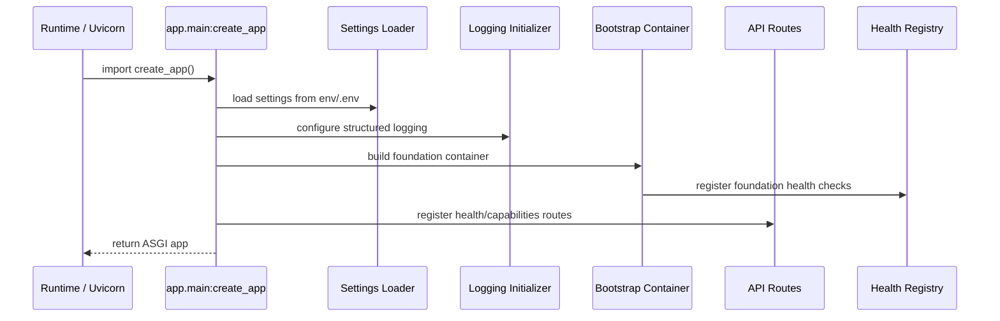

# Backend Foundation Architecture

**Document:** `backend-foundation-architecture.md`  
**Version:** 1.0  
**Source alignment:** `backend-application-architecture.md` and `pluggable_agentic_ai_overall_architecture.md`  
**Scope:** Backend foundation skeleton, bootstrapping, settings, startup flow, composition root, logging baseline, health route, local runtime layout, and test foundation.

---

## 1. Purpose

This document defines the first implementation-focused architecture document for the backend application tier.

It is the immediate follow-on document to `backend-application-architecture.md`. Its purpose is to describe the minimum backend foundation that should be built before implementing core contracts, configuration schemas, LLM gateways, persistence adapters, memory adapters, MCP tooling, orchestration strategies, or agents.

The foundation should produce a backend application that can start locally, expose basic health information, load minimal settings, initialize structured logging, and run unit tests.

The goal is not to implement business behavior yet. The goal is to create a stable backend shell that all later backend modules can plug into cleanly.

---

## 2. Source Architecture Alignment

This foundation architecture follows these already-established rules from the overall and backend application architecture documents:

- V1 has three deployable application pieces: `Frontend`, `Backend Application`, and `Single MCP Server`.
- The backend is one deployable application tier in V1.
- The frontend communicates with the backend through REST / SSE.
- The backend communicates with the external MCP tier only through a backend-side MCP client adapter.
- The backend does not contain the MCP server implementation.
- LLM provider access is hidden behind the future `LLMGateway`.
- Long-term memory access is hidden behind the future `MemoryGateway`, which wraps `memory_store`.
- Workflow state and trace persistence are hidden behind future SQLite-backed adapters.
- Agents should eventually receive controlled capabilities through `OrchestrationContext`, but agent implementation is outside this foundation phase.

Foundation work should avoid introducing shortcuts that violate these rules.

---

## 3. Foundation Architecture Goals

The backend foundation should be:

1. **Startable**  
   The backend process can start locally with minimal environment variables.

2. **Testable**  
   Unit tests can import the application factory and verify the health route.

3. **Configuration-ready**  
   Settings and configuration loading patterns exist before deeper modules depend on them.

4. **Observable from the beginning**  
   Structured logging and request trace IDs are available early.

5. **Dependency-aware**  
   Later modules are wired through a composition root instead of imported directly into API routes.

6. **Adapter-ready**  
   Placeholder health checks and bootstrap hooks exist for later LLM, MCP, memory, workflow state, and trace adapters.

7. **Minimal**  
   The foundation avoids premature implementation of orchestration, agents, storage, tool execution, and provider adapters.

---

## 4. Foundation Non-Goals

This document does not implement the following:

- Agent plugins.
- `OrchestrationContext` and core runtime contracts.
- Concrete LLM provider adapters.
- Concrete MCP client adapter.
- Concrete memory adapter.
- Concrete SQLite workflow state store.
- Concrete SQLite trace store.
- Full YAML use-case schema validation.
- Authentication and authorization.
- Streaming chat implementation.
- Production deployment topology.

These belong in later architecture documents and implementation phases.

---

## 5. Foundation Position in the Backend Implementation Sequence

The backend application architecture recommends the following first phase:

```text
Phase 1: Backend Foundation Skeleton
  - backend/ package
  - app/main.py
  - basic FastAPI app or chosen Python web framework
  - health route
  - config/settings loader stub
  - structured logging stub
  - test layout
```

This document expands that phase into an implementation-ready foundation architecture.

The next document after this one should be:

```text
backend-core-contracts-architecture.md
```

That next document should define `RequestContext`, `OrchestrationContext`, result objects, protocol interfaces, and fake implementations for tests.

---

## 6. Foundation Runtime Shape

The foundation runtime should start only the backend application process.

```text
Developer / Runtime
  ↓
Backend Application Process
  ├── FastAPI application factory
  ├── settings loader
  ├── logging initializer
  ├── health route
  ├── capabilities route
  └── testable bootstrap container
```

The external tiers are acknowledged by configuration placeholders but are not required to be live during the foundation phase.

```text
Frontend              optional/not required for foundation
Single MCP Server     optional/not required for foundation
LLM Providers         optional/not required for foundation
SQLite files          optional/not required until persistence phase
memory_store/ArcadeDB optional/not required until memory phase
```

---

## 7. Foundation Module Map

The foundation should create only the minimum backend modules required for clean startup, health, configuration, logging, and tests.

```text
backend/
  pyproject.toml
  README.md
  .env.example
  app/
    __init__.py
    main.py
    api/
      __init__.py
      routes_health.py
      routes_capabilities.py
      errors.py
    config/
      __init__.py
      settings.py
      loader.py
      bootstrap.py
    observability/
      __init__.py
      logging.py
      middleware.py
      models.py
    foundation/
      __init__.py
      container.py
      health.py
      capabilities.py
  tests/
    unit/
      test_health.py
      test_settings.py
      test_app_factory.py
    integration/
    fixtures/
```

This is intentionally smaller than the final backend package map. Later phases will add:

```text
session/
orchestration/
llm/
agents/
tools/
persistence/
policy/
```

The foundation should not create empty deep module trees unless the team wants the full folder layout visible from day one. If empty modules are created, they should not contain fake business behavior that will later need to be undone.

---

## 8. Recommended Initial Repository Layout

At the project root, the backend should remain separate from frontend and MCP server code.

```text
project-root/
  frontend/
    README.md

  backend/
    pyproject.toml
    README.md
    .env.example
    app/
      main.py
      api/
      config/
      observability/
      foundation/
    tests/

  mcp_server/
    README.md

  config/
    usecases/
      .gitkeep
    memory_store.yaml.example

  data/
    .gitkeep
```

Important boundary rule:

```text
backend/ must not contain mcp_server/app/* implementation code.
```

The backend can have a future `tools/mcp_adapter.py`, but the MCP server implementation itself belongs under `mcp_server/`.

---

## 9. Startup and Bootstrap Flow

The backend should use an application factory pattern.



The app factory should be deterministic and testable. Tests should be able to call `create_app()` without starting a real server, connecting to LLM providers, connecting to MCP, opening ArcadeDB, or creating SQLite files.

---

## 10. Composition Root Pattern

The foundation should establish the backend composition root early.

Recommended locations:

```text
backend/app/main.py
backend/app/config/bootstrap.py
```

The composition root is allowed to know concrete implementations. API routes should receive dependencies from the app container rather than building infrastructure directly.

### 10.1 Initial Composition Root Responsibilities

For the foundation phase, the composition root should:

1. Load settings.
2. Configure logging.
3. Create a foundation service container.
4. Register health checks.
5. Create the FastAPI app.
6. Attach the container to app state.
7. Register routes.
8. Register exception handlers.
9. Return the ASGI app.

### 10.2 Future Composition Root Responsibilities

Later phases will expand the composition root to build:

- `ConfigurationLoader`
- `PolicyService`
- `TraceStore`
- `WorkflowStateStore`
- `MemoryGateway`
- `LLMGateway`
- `ToolGateway`
- `AgentRegistry`
- `StrategyRegistry`
- `OrchestrationRuntime`
- `SessionService`

Those should be added incrementally, not during the foundation phase.

---

## 11. Application Factory

Recommended initial app factory:

```python
from fastapi import FastAPI

from app.api.routes_capabilities import router as capabilities_router
from app.api.routes_health import router as health_router
from app.config.bootstrap import build_container
from app.config.settings import Settings, load_settings
from app.observability.logging import configure_logging
from app.observability.middleware import TraceIdMiddleware


def create_app(settings: Settings | None = None) -> FastAPI:
    settings = settings or load_settings()
    configure_logging(settings)

    container = build_container(settings)

    app = FastAPI(
        title=settings.app_name,
        version=settings.app_version,
        docs_url=settings.docs_url,
        redoc_url=settings.redoc_url,
    )

    app.state.container = container
    app.add_middleware(TraceIdMiddleware)

    app.include_router(health_router)
    app.include_router(capabilities_router)

    return app


app = create_app()
```

The global `app = create_app()` is useful for `uvicorn app.main:app`, while tests can import and call `create_app(test_settings)` directly.

---

## 12. Settings Architecture

The foundation should define a small settings model that can grow without breaking later modules.

Recommended settings categories:

| Category | Purpose |
|---|---|
| Application | App name, version, environment, debug flag |
| Server | Host, port, reload flag for local runs |
| Config | Active config path, active use case |
| Logging | Log level, JSON logging flag |
| CORS | Allowed origins placeholder |
| Health | Whether dependency checks are enabled |
| External placeholders | MCP URL, LLM provider env names, SQLite paths, memory config path |

### 12.1 Minimal Settings Fields

```python
from pydantic import Field
from pydantic_settings import BaseSettings, SettingsConfigDict


class Settings(BaseSettings):
    model_config = SettingsConfigDict(
        env_file=".env",
        env_file_encoding="utf-8",
        extra="ignore",
    )

    app_name: str = "pluggable-agentic-ai-backend"
    app_version: str = "0.1.0"
    app_env: str = Field(default="local", alias="APP_ENV")
    debug: bool = Field(default=False, alias="APP_DEBUG")

    host: str = Field(default="127.0.0.1", alias="BACKEND_HOST")
    port: int = Field(default=8000, alias="BACKEND_PORT")

    app_usecase: str | None = Field(default=None, alias="APP_USECASE")
    app_config_path: str | None = Field(default=None, alias="APP_CONFIG_PATH")

    log_level: str = Field(default="INFO", alias="LOG_LEVEL")
    log_json: bool = Field(default=True, alias="LOG_JSON")

    docs_url: str | None = "/docs"
    redoc_url: str | None = "/redoc"

    mcp_main_url: str | None = Field(default=None, alias="MCP_MAIN_URL")
    memory_store_config: str | None = Field(default=None, alias="MEMORY_STORE_CONFIG")
    sqlite_workflow_state_url: str | None = Field(default=None, alias="SQLITE_WORKFLOW_STATE_URL")
    sqlite_trace_url: str | None = Field(default=None, alias="SQLITE_TRACE_URL")


def load_settings() -> Settings:
    return Settings()
```

### 12.2 Settings Rules

- Settings should read environment variables and `.env` files.
- Settings should not read full use-case YAML yet.
- Settings should not instantiate provider clients.
- Settings should not validate secrets by making network calls.
- Settings should not print secrets in logs or health responses.

---

## 13. Environment Variable Baseline

The foundation should provide a `.env.example` file.

```env
APP_ENV=local
APP_DEBUG=true
APP_USECASE=customer_support
APP_CONFIG_PATH=../config/usecases/customer_support.yaml

BACKEND_HOST=127.0.0.1
BACKEND_PORT=8000

LOG_LEVEL=INFO
LOG_JSON=true

# Future MCP integration. Foundation phase only checks whether this is configured.
MCP_MAIN_URL=http://localhost:9001/mcp

# Future persistence integration.
SQLITE_WORKFLOW_STATE_URL=sqlite+aiosqlite:///./data/workflow_state.db
SQLITE_TRACE_URL=sqlite+aiosqlite:///./data/trace.db

# Future memory integration.
MEMORY_STORE_CONFIG=../config/memory_store.yaml

# Future LLM provider variables. Do not require these during foundation startup.
LLM_LOCAL_QWEN_BASE_URL=http://192.168.1.80:8081/v1
LLM_LOCAL_QWEN_API_KEY=local-dev-key
OPENAI_API_KEY=replace-me
GOOGLE_API_KEY=replace-me
```

Foundation startup should not fail if future optional variables are absent, unless the selected environment explicitly requires strict validation.

---

## 14. Configuration Loader Stub

The foundation should create a configuration loader stub but should not implement full YAML schema validation yet.

Recommended behavior for Phase 1:

- Read `APP_CONFIG_PATH` when present.
- Confirm the file exists when strict config validation is enabled.
- Return a minimal dictionary with source path and active use case.
- Do not instantiate LLM, MCP, memory, or persistence providers.

Example:

```python
from pathlib import Path
from typing import Any

import yaml


class ConfigLoadError(RuntimeError):
    pass


def load_raw_config(path: str | None) -> dict[str, Any]:
    if not path:
        return {}

    config_path = Path(path)
    if not config_path.exists():
        raise ConfigLoadError(f"Config file does not exist: {config_path}")

    with config_path.open("r", encoding="utf-8") as f:
        data = yaml.safe_load(f) or {}

    if not isinstance(data, dict):
        raise ConfigLoadError("Config file must contain a YAML mapping at the root.")

    return data
```

The full configuration schema belongs in `configuration-architecture.md`.

---

## 15. Foundation Container

The foundation container is a lightweight object attached to `app.state.container`.

It gives routes and tests one stable place to find shared foundation services.

```python
from dataclasses import dataclass
from typing import Any

from app.config.settings import Settings
from app.foundation.health import HealthRegistry
from app.foundation.capabilities import CapabilitiesService


@dataclass(frozen=True)
class FoundationContainer:
    settings: Settings
    raw_config: dict[str, Any]
    health: HealthRegistry
    capabilities: CapabilitiesService
```

Recommended bootstrap:

```python
from app.config.loader import load_raw_config
from app.foundation.capabilities import CapabilitiesService
from app.foundation.container import FoundationContainer
from app.foundation.health import HealthRegistry, build_foundation_health_registry


def build_container(settings) -> FoundationContainer:
    raw_config = load_raw_config(settings.app_config_path)
    health = build_foundation_health_registry(settings=settings, raw_config=raw_config)
    capabilities = CapabilitiesService(settings=settings, raw_config=raw_config)

    return FoundationContainer(
        settings=settings,
        raw_config=raw_config,
        health=health,
        capabilities=capabilities,
    )
```

Later phases can replace or extend this with a richer application container, but this early pattern prevents ad-hoc globals.

---

## 16. Health Route Architecture

The foundation should expose:

```text
GET /health
```

The health route should be safe by default and should not leak secrets, API keys, database URLs with credentials, request payloads, or provider responses.

### 16.1 Foundation Health Response

Initial response shape:

```json
{
  "status": "ok",
  "service": "pluggable-agentic-ai-backend",
  "version": "0.1.0",
  "environment": "local",
  "checks": {
    "settings": {
      "status": "ok"
    },
    "config": {
      "status": "ok",
      "configured": true
    },
    "logging": {
      "status": "ok"
    },
    "mcp": {
      "status": "not_checked",
      "configured": true
    },
    "llm": {
      "status": "not_checked",
      "configured": false
    },
    "memory": {
      "status": "not_checked",
      "configured": false
    },
    "workflow_state": {
      "status": "not_checked",
      "configured": false
    },
    "trace": {
      "status": "not_checked",
      "configured": false
    }
  }
}
```

In the foundation phase, external dependencies should generally be reported as `not_checked`, not as failures.

### 16.2 Health Status Semantics

| Status | Meaning |
|---|---|
| `ok` | The check passed. |
| `degraded` | The app can run, but a non-critical dependency has an issue. |
| `failed` | A required startup dependency failed. |
| `not_configured` | The dependency is not configured yet. |
| `not_checked` | The dependency will be checked in a later phase or only in deep health mode. |

### 16.3 Health Check Interface

```python
from typing import Protocol


class HealthCheck(Protocol):
    name: str

    async def check(self) -> dict:
        ...
```

The foundation can use synchronous checks internally, but the interface should be async-compatible because later checks may call databases, MCP, or LLM providers.

---

## 17. Capabilities Route Architecture

The foundation may expose:

```text
GET /capabilities
```

This route tells the frontend what the backend currently supports without exposing implementation details.

Initial response:

```json
{
  "service": "pluggable-agentic-ai-backend",
  "capabilities": {
    "chat": false,
    "streaming": false,
    "session_reset": false,
    "mcp_tools": false,
    "memory": false,
    "llm_profiles": false,
    "trace": false
  }
}
```

As later modules are implemented, this response can change to:

```json
{
  "capabilities": {
    "chat": true,
    "streaming": true,
    "session_reset": true,
    "mcp_tools": true,
    "memory": true,
    "llm_profiles": true,
    "trace": true
  }
}
```

The frontend should treat this as feature discovery, not as business logic.

---

## 18. Structured Logging Foundation

Structured logging should be available before orchestration, LLM calls, tools, and persistence are implemented.

### 18.1 Logging Goals

- Emit consistent log records.
- Include app name, environment, log level, and trace ID when available.
- Avoid logging secrets.
- Support human-readable local logs and JSON logs.
- Make request lifecycle debugging possible.

### 18.2 Recommended Log Fields

```text
timestamp
level
logger
message
app_name
app_version
app_env
trace_id
request_id optional
session_id optional future
user_id optional future
component
```

### 18.3 Logging Rules

- Do not log full prompts by default.
- Do not log LLM API keys.
- Do not log MCP authorization tokens.
- Do not log database URLs with embedded credentials.
- Do not log full tool payloads unless explicitly enabled in a safe development mode.
- Keep payload tracing separate from normal logs.

---

## 19. Trace ID Middleware

The foundation should add request trace IDs early.

Recommended behavior:

- Accept an incoming `x-trace-id` header when present.
- Generate a new trace ID when absent.
- Store the trace ID in request state.
- Return the trace ID as `x-trace-id` response header.
- Make the trace ID available to logging context.

Example middleware behavior:

```text
Incoming request
  ↓
Read x-trace-id or generate UUID
  ↓
Attach request.state.trace_id
  ↓
Process route
  ↓
Add x-trace-id response header
```

This is not the same as the future SQLite `TraceStore`. The middleware only establishes the request correlation ID. The actual trace store comes in a later phase.

---

## 20. Error Handling Foundation

The foundation should define a small error model before deeper modules add their own error types.

### 20.1 Error Response Shape

```json
{
  "error": {
    "code": "CONFIG_LOAD_ERROR",
    "message": "Configuration could not be loaded.",
    "trace_id": "trace_123",
    "details": {}
  }
}
```

### 20.2 Initial Error Types

| Error Code | HTTP Status | Meaning |
|---|---:|---|
| `CONFIG_LOAD_ERROR` | 500 | Startup or runtime config could not be loaded. |
| `VALIDATION_ERROR` | 422 | Request schema is invalid. |
| `NOT_FOUND` | 404 | Route or resource not found. |
| `INTERNAL_ERROR` | 500 | Unhandled backend error. |

### 20.3 Error Rules

- API errors should include `trace_id` when available.
- Errors should not expose secrets, stack traces, raw provider payloads, or connection strings.
- Known errors should map to stable error codes.
- Unknown errors should map to `INTERNAL_ERROR`.

---

## 21. API Foundation Rules

During the foundation phase, API routes should remain minimal.

Recommended initial routes:

```text
GET /health
GET /capabilities
```

Routes that should not be implemented until later phases:

```text
POST /chat
POST /chat/stream
POST /sessions/{session_id}/reset
GET /sessions/{session_id}/history
```

Those routes require core contracts, session service, workflow state, trace store, and orchestration runtime.

The foundation can create route files for future routes, but the routes should either be absent or return a clear `501 Not Implemented` only if required for frontend contract testing.

---

## 22. Dependency Direction Rules

The foundation should establish dependency direction before complexity grows.

Allowed foundation dependencies:

```text
app.main
  -> config.settings
  -> config.bootstrap
  -> observability.logging
  -> observability.middleware
  -> api.routes_*

api.routes_*
  -> foundation.container through app.state
  -> foundation.health / capabilities

config.bootstrap
  -> config.loader
  -> foundation.health
  -> foundation.capabilities
```

Avoid:

```text
api.routes_* -> LLM provider SDK
api.routes_* -> SQLite client
api.routes_* -> MCP client
api.routes_* -> memory_store.MemoryService
foundation -> agent plugins
foundation -> orchestration runtime
```

This keeps the foundation light and prevents early coupling.

---

## 23. Python Project Configuration

Recommended `pyproject.toml` baseline:

```toml
[project]
name = "pluggable-agentic-ai-backend"
version = "0.1.0"
description = "Backend application tier for a pluggable agentic AI system"
requires-python = ">=3.12"
dependencies = [
  "fastapi",
  "uvicorn[standard]",
  "pydantic",
  "pydantic-settings",
  "PyYAML",
]

[project.optional-dependencies]
dev = [
  "pytest",
  "pytest-asyncio",
  "httpx",
  "ruff",
  "mypy",
]

[tool.pytest.ini_options]
testpaths = ["tests"]
asyncio_mode = "auto"

[tool.ruff]
line-length = 100
target-version = "py312"

[tool.mypy]
python_version = "3.12"
strict = true
```

Version pins should be finalized during implementation based on the project dependency policy. Provider-specific dependencies should not be added until their architecture/implementation phase.

Examples to defer:

```text
openai
google-genai
mcp client packages
aiosqlite
SQLAlchemy
memory_store
arcadedb-embedded
```

Add them only when implementing the corresponding adapter.

---

## 24. Local Developer Workflow

Recommended local commands:

```bash
cd backend
python -m venv .venv
source .venv/bin/activate
pip install -e ".[dev]"
cp .env.example .env
uvicorn app.main:app --reload --host 127.0.0.1 --port 8000
```

Health check:

```bash
curl http://127.0.0.1:8000/health
```

Capabilities check:

```bash
curl http://127.0.0.1:8000/capabilities
```

Run tests:

```bash
pytest
```

Run linting and type checks:

```bash
ruff check .
mypy app
```

---

## 25. Testing Foundation

The foundation should have tests from day one.

### 25.1 Unit Test Layout

```text
backend/tests/
  unit/
    test_settings.py
    test_app_factory.py
    test_health.py
    test_capabilities.py
  integration/
    .gitkeep
  fixtures/
    .gitkeep
```

### 25.2 Minimum Tests

| Test | Purpose |
|---|---|
| `test_settings_defaults` | Settings load with safe local defaults. |
| `test_settings_env_override` | Environment variables override defaults. |
| `test_create_app` | Application factory returns an ASGI app. |
| `test_health_route` | `GET /health` returns status and checks. |
| `test_capabilities_route` | `GET /capabilities` returns feature flags. |
| `test_trace_id_header` | Response includes `x-trace-id`. |
| `test_missing_config_allowed_in_foundation_mode` | Optional config does not break local startup. |

### 25.3 Example Health Test

```python
from fastapi.testclient import TestClient

from app.main import create_app


def test_health_route_returns_ok():
    app = create_app()
    client = TestClient(app)

    response = client.get("/health")

    assert response.status_code == 200
    body = response.json()
    assert body["status"] == "ok"
    assert "checks" in body
```

---

## 26. Foundation Security Rules

Even in the foundation phase, the backend should establish safe defaults.

- Do not log secrets.
- Do not return secrets from `/health`.
- Do not expose full environment variables through API responses.
- Do not enable permissive CORS by default in non-local environments.
- Do not enable debug stack traces in non-local environments.
- Do not make external network calls during app import.
- Do not instantiate provider SDK clients during app import.
- Do not create or modify persistent databases during app import.

Startup validation can be added later, but import-time side effects should remain minimal.

---

## 27. Foundation Health vs Deep Health

The foundation should distinguish shallow health from future deep health.

```text
GET /health
  -> Shallow, safe, no external calls by default.

GET /health/deep future optional
  -> Checks MCP, LLM providers, memory, SQLite stores, and other dependencies.
```

For V1 foundation, only `GET /health` is required.

Deep health should be added only when the adapters exist.

---

## 28. Placeholder Strategy for Future Modules

The foundation may expose placeholders, but placeholders should be honest and explicit.

Use statuses such as:

```text
not_configured
not_checked
not_implemented
```

Avoid fake success for dependencies that do not exist yet.

Bad foundation response:

```json
{
  "llm": {"status": "ok"}
}
```

Better foundation response:

```json
{
  "llm": {
    "status": "not_checked",
    "configured": false
  }
}
```

This avoids creating false confidence before real adapters are implemented.

---

## 29. Foundation Acceptance Criteria

The foundation is complete when:

- `backend/` package exists.
- Backend can start locally through `uvicorn app.main:app`.
- `create_app()` can be imported and called from tests.
- `GET /health` returns a safe response.
- `GET /capabilities` returns explicit feature flags.
- Settings load from environment variables and `.env`.
- `.env.example` documents expected local variables.
- Structured logging is initialized.
- Each request receives a trace ID.
- Health responses do not expose secrets.
- Test layout exists.
- Unit tests run successfully.
- No concrete LLM, MCP, memory, SQLite, or agent implementation is required to start the app.
- Backend code does not contain MCP server implementation.
- API routes do not import provider SDKs, database clients, `memory_store`, or MCP clients.

---

## 30. Implementation Checklist

### 30.1 Project Files

- [ ] Create `backend/pyproject.toml`.
- [ ] Create `backend/README.md`.
- [ ] Create `backend/.env.example`.
- [ ] Create `backend/app/__init__.py`.
- [ ] Create `backend/app/main.py`.

### 30.2 Config Foundation

- [ ] Create `backend/app/config/settings.py`.
- [ ] Create `backend/app/config/loader.py`.
- [ ] Create `backend/app/config/bootstrap.py`.
- [ ] Add minimal settings model.
- [ ] Add raw YAML loader stub.
- [ ] Add foundation container builder.

### 30.3 API Foundation

- [ ] Create `backend/app/api/routes_health.py`.
- [ ] Create `backend/app/api/routes_capabilities.py`.
- [ ] Create `backend/app/api/errors.py`.
- [ ] Register routes in `create_app()`.

### 30.4 Observability Foundation

- [ ] Create `backend/app/observability/logging.py`.
- [ ] Create `backend/app/observability/middleware.py`.
- [ ] Add trace ID middleware.
- [ ] Add structured logging setup.

### 30.5 Foundation Services

- [ ] Create `backend/app/foundation/container.py`.
- [ ] Create `backend/app/foundation/health.py`.
- [ ] Create `backend/app/foundation/capabilities.py`.
- [ ] Implement shallow health checks.
- [ ] Implement capabilities response.

### 30.6 Tests

- [ ] Create `backend/tests/unit/test_settings.py`.
- [ ] Create `backend/tests/unit/test_app_factory.py`.
- [ ] Create `backend/tests/unit/test_health.py`.
- [ ] Create `backend/tests/unit/test_capabilities.py`.
- [ ] Verify `pytest` passes.

---

## 31. Handoff to Backend Core Contracts

After the foundation is complete, the next architecture document should define the backend core contracts.

That document should add:

- `RequestContext`
- `OrchestrationContext`
- `OrchestrationResult`
- `AgentPlugin`
- `AgentResult`
- `OrchestrationStrategy`
- `LLMGateway` protocol
- `MemoryGateway` protocol
- `ToolGateway` protocol
- `WorkflowStateStore` protocol
- `TraceStore` protocol
- `PolicyService` protocol
- Fake implementations for unit tests

The foundation should remain stable while those contracts are added.

---

## 32. Summary

The backend foundation is the first implementation slice of the backend application tier.

It creates a startable, testable, observable backend shell without prematurely implementing agents, orchestration, LLM providers, memory, persistence, or MCP tooling.

The most important principle for this phase is:

> **Build the backend shell first, wire it through a composition root, expose safe health and capabilities routes, initialize settings and logging, and keep all future infrastructure behind placeholders until its dedicated architecture document is created.**
