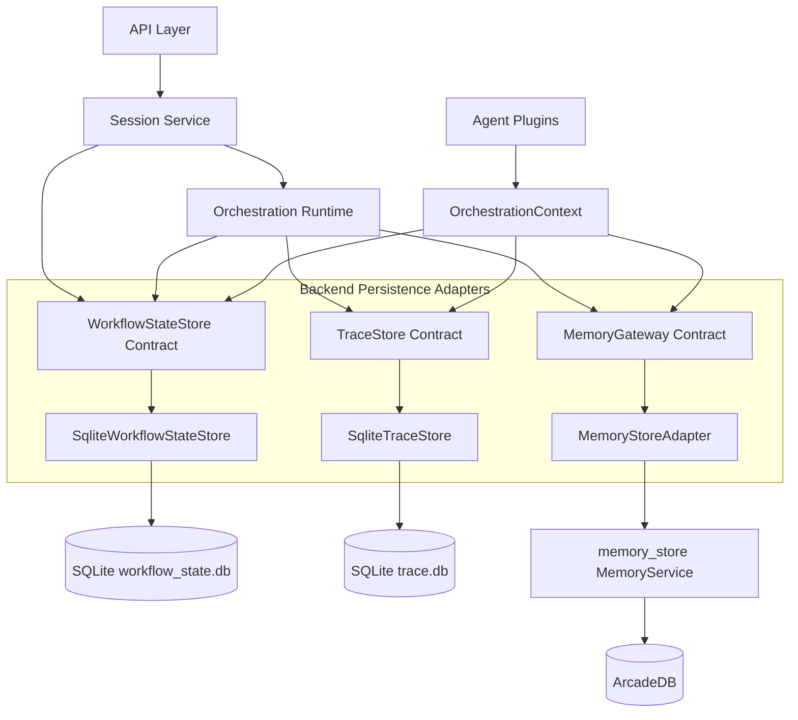

# Backend Persistence Architecture

**Document:** `backend-persistence-architecture.md`  
**Version:** 1.0  
**Source alignment:** `backend-application-architecture.md`, `backend-foundation-architecture.md`, `backend-core-contracts-architecture.md`, `backend-configuration-architecture.md`, and `backend-observability-architecture.md`  
**Scope:** Persistence boundaries, adapter contracts, storage responsibilities, lifecycle rules, configuration shape, health integration, observability integration, testing strategy, and acceptance criteria for backend memory, workflow state, and trace persistence.

---

## 1. Purpose

This document defines the fifth implementation-focused architecture document for the backend application tier.

It follows:

1. `backend-foundation-architecture.md`
2. `backend-core-contracts-architecture.md`
3. `backend-configuration-architecture.md`
4. `backend-observability-architecture.md`
5. `backend-persistence-architecture.md` ← this document

The foundation phase establishes the backend shell and application wiring pattern. The core contracts phase defines stable DTOs and gateway/store protocols. The configuration phase defines YAML-driven runtime wiring. The observability phase establishes trace IDs, structured logs, redaction, trace events, health aggregation, and lightweight metrics.

This document defines the persistence architecture that those modules depend on. It establishes how the backend separates long-term memory, short-term workflow state, and operational traces; how storage engines are hidden behind adapters; how configuration selects concrete implementations; and how later detailed documents should implement SQLite workflow state, SQLite trace storage, and the `memory_store` adapter without coupling agents, API routes, or orchestration code to storage internals.

The goal is to make persistence safe, testable, replaceable, and implementation-sequenced before concrete API/session/LLM/memory/tool/orchestration modules are added.

---

## 2. Source Architecture Alignment

This document follows the established backend architecture rules:

- The backend is one deployable application tier in V1.
- Frontend communicates with the backend over REST / SSE.
- Backend communicates with the external MCP tier only through a backend-side MCP client adapter.
- The backend does not implement the MCP server.
- Agents receive controlled capabilities through `OrchestrationContext`.
- Agents do not import SQLite clients, ArcadeDB clients, provider SDKs, MCP clients, external API clients, or `memory_store.service.MemoryService`.
- SQLite is used behind backend adapters for workflow state and traces.
- ArcadeDB is hidden behind the existing `memory_store` Python wrapper and backend `MemoryGateway`.
- Workflow state is not long-term memory.
- Trace events are operational records, not long-term memory.
- Session reset clears short-term workflow state only.
- Long-term memory and document chunks have separate lifecycle rules from workflow state.
- Trace payloads, persistence health, errors, logs, and diagnostics must not expose secrets or sensitive content.
- Persistence configuration is read through validated configuration views, not raw environment variables inside runtime modules.
- Detailed SQLite schemas and query/debug APIs are deferred to the focused SQLite documents.

---

## 3. Position in the Backend Implementation Sequence

The backend implementation sequence is:

```text
Phase 1: Backend Foundation Skeleton
Phase 2: Core Contracts
Phase 3: Configuration Loader
Phase 4: Observability and Trace Foundation
Phase 5: Persistence Boundary and Store Foundations
Phase 6: Workflow State Store
Phase 7: API and Session Walking Skeleton
Phase 8: LLM Gateway
Phase 9: Memory Gateway
Phase 10: Tool Gateway and MCP Client Adapter
Phase 11: Orchestration Runtime and Strategies
Phase 12: Agent Plugins
Phase 13: Hardening and Deployment Readiness
```

This document expands the persistence boundary that supports Phase 5 and prepares for the next focused implementation document:

```text
backend-sqlite-workflow-state-architecture.md
```

This document does not replace the later SQLite and memory adapter documents. It defines the shared persistence rules those documents must follow.

---

## 4. Persistence Architecture Goals

The persistence layer should be:

1. **Boundary-first**  
   Runtime modules depend on small persistence contracts, not concrete storage engines.

2. **Storage-purpose separated**  
   Long-term memory, workflow/session state, and operational traces are separate concerns with separate lifecycle rules.

3. **Adapter-isolated**  
   SQLite, ArcadeDB, and `memory_store` are hidden behind adapters and gateways.

4. **Configuration-driven**  
   File paths, providers, SQLite settings, memory provider settings, retention behavior, and health detail come from configuration.

5. **Safe by default**  
   Persistence code must avoid leaking secrets, raw prompts, raw completions, sensitive memory contents, full document chunks, or downstream tool payloads through logs, traces, errors, or health responses.

6. **Traceable**  
   Persistence operations emit trace-safe events and metrics so load/save/search/upsert failures are diagnosable.

7. **Testable with fakes**  
   API, session, orchestration, agents, LLM, tools, and policy tests can run with fake persistence implementations.

8. **Replaceable**  
   V1 uses SQLite and `memory_store`, but the architecture should allow future storage engines without changing agents or orchestration code.

9. **Deterministic where needed**  
   Workflow-state keys, document chunk IDs, and ingestion identifiers should be stable enough for repeatable tests and safe re-ingestion.

10. **Incremental**  
    This phase defines the common boundaries. Later documents add detailed schemas, query APIs, migrations, retention, and performance tuning.

---

## 5. Persistence Non-Goals

This phase should not implement:

- A full production database platform.
- Distributed transactions.
- Multi-writer cluster support.
- Complex database sharding.
- Advanced SQLite indexing and query optimization.
- Full trace search APIs.
- A trace/debug UI.
- Full audit/compliance event modeling.
- Full memory ontology or graph expansion design.
- Direct ArcadeDB access from backend runtime modules.
- Direct `memory_store.service.MemoryService` access from agents.
- Persistent frontend state.
- MCP server-side persistence.
- Provider-specific LLM cache storage.
- Long-term prompt/completion archival.

Those belong in later documents if needed.

---

## 6. Persistence Source Model

The backend has three persistence domains.

| Domain | Purpose | Backend Contract | V1 Adapter | Storage Engine |
|---|---|---|---|---|
| Long-term memory and document chunks | Durable knowledge, preferences, project facts, document chunks, search metadata | `MemoryGateway` | `MemoryStoreAdapter` | `memory_store` -> ArcadeDB |
| Short-term workflow/session state | Conversation history, scratch state, checkpoints, active session metadata | `WorkflowStateStore` | `SqliteWorkflowStateStore` | SQLite |
| Operational traces | Request timelines, event payload summaries, error diagnostics, operation metadata | `TraceStore` | `SqliteTraceStore` | SQLite |

### 6.1 Separation Rule

These stores must not be treated as interchangeable.

```text
Long-term memory        != workflow checkpoint store
Workflow/session state  != long-term memory
Trace events            != long-term memory
Trace events            != workflow state
```

### 6.2 Reset Rule

A session reset may clear:

- Conversation history stored in workflow state.
- Temporary scratch state.
- Pending tool context.
- Current workflow checkpoint.
- Session-scoped ephemeral routing state.

A session reset must not delete:

- User preference memories.
- Project facts.
- Document chunks.
- Global knowledge records.
- Trace events.
- LLM profile configuration.
- MCP tool configuration.
- Policy configuration.

---

## 7. Recommended Persistence Package Layout

Recommended layout:

```text
backend/
  app/
    persistence/
      __init__.py
      factory.py
      settings.py
      paths.py
      serialization.py
      errors.py
      health.py

      workflow_state_store.py
      sqlite_workflow_state_store.py       # detailed later
      sqlite_workflow_state_schema.py      # detailed later

      trace_store.py
      sqlite_trace_store.py                # expanded later
      sqlite_trace_schema.py               # expanded later

      memory_gateway.py
      memory_store_adapter.py              # detailed later
      memory_models.py
      memory_scope.py

      sqlite/
        __init__.py
        connection.py
        pragmas.py
        migrations.py
        transactions.py

    contracts/
      persistence.py
      workflow_state.py
      trace.py
      memory.py
      health.py
      errors.py
      config.py

    observability/
      tracing.py
      redaction.py
      metrics.py
      health.py

    testing/
      fakes/
        fake_workflow_state.py
        fake_trace.py
        fake_memory.py
        fake_persistence_factory.py

  tests/
    unit/
      persistence/
        test_path_resolution.py
        test_persistence_settings.py
        test_safe_json_serialization.py
        test_memory_scope.py
        test_fake_workflow_state_store.py
        test_fake_trace_store.py
        test_fake_memory_gateway.py
        test_persistence_health.py

    integration/
      persistence/
        test_sqlite_connection_smoke.py
        test_trace_store_sqlite_smoke.py
        test_workflow_state_store_sqlite_smoke.py
```

### 7.1 Why Persistence Has Shared Utilities

Shared persistence utilities should own only storage-neutral behavior:

```text
Data path resolution
Safe JSON serialization
SQLite connection helper primitives
Persistence health summary helpers
Common persistence error wrappers
Test fake implementations
```

They should not own business workflow logic, agent selection, LLM routing, MCP behavior, or memory ranking algorithms.

---

## 8. Dependency Direction Rules

Allowed:

```text
app/session/*         -> app/contracts/workflow_state.py
app/orchestration/*   -> app/contracts/workflow_state.py
app/orchestration/*   -> app/contracts/memory.py
app/orchestration/*   -> app/contracts/trace.py
app/agents/*          -> OrchestrationContext capabilities only
app/persistence/*     -> app/contracts/*
app/persistence/*     -> app/observability/redaction.py
app/persistence/*     -> app/observability/tracing.py optional helper use
app/persistence/*     -> standard library sqlite3/json/pathlib/datetime
app/persistence/*     -> memory_store only inside memory_store_adapter.py
```

Avoid:

```text
app/api/*             -> sqlite3
app/api/*             -> memory_store.service.MemoryService
app/session/*         -> sqlite3
app/orchestration/*   -> sqlite3
app/orchestration/*   -> ArcadeDB clients
app/orchestration/*   -> memory_store.service.MemoryService
app/agents/*          -> sqlite3
app/agents/*          -> ArcadeDB clients
app/agents/*          -> memory_store.service.MemoryService
app/agents/*          -> persistence/sqlite_*.py
app/persistence/*     -> app/agents/*
app/persistence/*     -> provider SDKs
app/persistence/*     -> MCP server implementation
```

### 8.1 Practical Meaning

Runtime code should depend on abstractions:

```python
await context.state.load(session_id=context.request.session_id)
await context.memory.search(request, context)
await context.trace.record_event(event)
```

Runtime code should not do this:

```python
sqlite3.connect("./data/workflow_state.db")
MemoryService(...).search(...)
arcadedb_client.query(...)
```

---

## 9. Persistence Configuration Integration

Persistence configuration should be loaded and validated by the configuration layer, then exposed to the composition root through typed settings or a `ConfigurationView`.

Recommended YAML shape:

```yaml
persistence:
  base_dir: ${env:APP_DATA_DIR:./data}

  workflow_state:
    provider: sqlite
    sqlite:
      path: ${env:WORKFLOW_STATE_DB:./data/workflow_state.db}
      create_parent_dirs: true
      initialize_schema: true
      journal_mode: WAL
      busy_timeout_ms: 5000
      foreign_keys: true
      required: true

  trace:
    provider: sqlite
    sqlite:
      path: ${env:TRACE_DB:./data/trace.db}
      create_parent_dirs: true
      initialize_schema: true
      journal_mode: WAL
      busy_timeout_ms: 5000
      foreign_keys: true
      required: true
      payload_max_chars: 8000

  memory:
    provider: memory_store
    required: false
    memory_store:
      config_path: ${env:MEMORY_STORE_CONFIG:./config/memory_store.yaml}
      default_scope: project
      search_limit_default: 10
      search_limit_max: 30
      allow_writes: true
```

### 9.1 Settings Objects

Recommended typed settings:

```python
from dataclasses import dataclass
from pathlib import Path


@dataclass(frozen=True, slots=True)
class SqliteStoreSettings:
    path: Path
    create_parent_dirs: bool
    initialize_schema: bool
    journal_mode: str
    busy_timeout_ms: int
    foreign_keys: bool
    required: bool


@dataclass(frozen=True, slots=True)
class WorkflowStatePersistenceSettings:
    provider: str
    sqlite: SqliteStoreSettings


@dataclass(frozen=True, slots=True)
class TracePersistenceSettings:
    provider: str
    sqlite: SqliteStoreSettings
    payload_max_chars: int


@dataclass(frozen=True, slots=True)
class MemoryStoreSettings:
    config_path: Path | None
    default_scope: str
    search_limit_default: int
    search_limit_max: int
    allow_writes: bool


@dataclass(frozen=True, slots=True)
class MemoryPersistenceSettings:
    provider: str
    required: bool
    memory_store: MemoryStoreSettings


@dataclass(frozen=True, slots=True)
class PersistenceSettings:
    base_dir: Path
    workflow_state: WorkflowStatePersistenceSettings
    trace: TracePersistenceSettings
    memory: MemoryPersistenceSettings
```

### 9.2 Configuration Access Rule

Adapters receive already-resolved settings.

Use:

```python
settings = config_view.persistence()
workflow_state = build_workflow_state_store(settings.workflow_state)
```

Avoid:

```python
path = os.getenv("WORKFLOW_STATE_DB")
```

inside session, orchestration, agents, or concrete runtime modules.

---

## 10. Composition Root Integration

The composition root is allowed to know concrete persistence implementations.

Recommended startup wiring:

```python
def build_persistence(config: ConfigurationView) -> PersistenceBundle:
    settings = config.persistence()

    trace_store = build_trace_store(settings.trace)
    workflow_state = build_workflow_state_store(settings.workflow_state)
    memory = build_memory_gateway(settings.memory)

    return PersistenceBundle(
        trace_store=trace_store,
        workflow_state=workflow_state,
        memory=memory,
    )
```

Recommended bundle:

```python
from dataclasses import dataclass


@dataclass(frozen=True, slots=True)
class PersistenceBundle:
    trace_store: "TraceStore"
    workflow_state: "WorkflowStateStore"
    memory: "MemoryGateway"
```

### 10.1 Startup Order

Recommended startup order after configuration and observability are available:

```text
1. Resolve persistence settings.
2. Validate configured providers.
3. Resolve and create parent directories for local data files.
4. Build trace store.
5. Initialize trace schema if configured.
6. Build workflow state store.
7. Initialize workflow state schema if configured.
8. Build memory gateway adapter.
9. Run shallow health checks.
10. Register persistence health checks with HealthAggregator.
11. Log redacted persistence summary.
```

### 10.2 Startup Failure Rule

If a store is configured as `required: true`, startup should fail fast when it cannot initialize safely.

If a store is configured as `required: false`, startup may continue with a degraded health status, but the degraded state must be visible through health and logs.

---

## 11. Persistence Boundary Map



### 11.1 Boundary Meaning

- API and session code can use `WorkflowStateStore`; they do not know SQLite schema.
- Orchestration can use memory, state, and trace contracts; it does not know storage engines.
- Agents access persistence only through `OrchestrationContext` capabilities.
- `MemoryStoreAdapter` is the only backend place that imports `memory_store.service.MemoryService`.
- `SqliteWorkflowStateStore` is the only backend place that owns workflow-state SQL.
- `SqliteTraceStore` is the only backend place that owns trace-event SQL.

---

## 12. Core Persistence Contracts

The core contracts document owns the canonical protocol definitions. This architecture refines expected behavior.

### 12.1 WorkflowStateStore

Recommended protocol:

```python
from typing import Any, Protocol


class WorkflowStateStore(Protocol):
    async def load(self, *, session_id: str) -> dict[str, Any]:
        ...

    async def save(self, *, session_id: str, state: dict[str, Any]) -> None:
        ...

    async def reset(self, *, session_id: str) -> None:
        ...

    async def health(self) -> dict[str, Any]:
        ...
```

Behavior rules:

- `load` returns an empty state object when no state exists.
- `save` persists a JSON-safe workflow-state document.
- `reset` clears short-term workflow state only.
- `reset` does not touch memory or trace storage.
- Store methods should raise known backend errors, not raw storage exceptions.

### 12.2 TraceStore

Recommended protocol:

```python
from typing import Protocol

from app.contracts.trace import TraceEvent


class TraceStore(Protocol):
    async def record_event(self, event: TraceEvent) -> None:
        ...

    async def health(self) -> dict[str, object]:
        ...
```

Behavior rules:

- `record_event` appends an event.
- Trace payloads must be JSON-safe, redacted, and bounded before storage.
- Trace query APIs are not part of this general persistence phase.
- Detailed query/debug behavior is deferred to `backend-sqlite-trace-store-architecture.md`.

### 12.3 MemoryGateway

Recommended gateway-level protocol:

```python
from typing import Protocol


class MemoryGateway(Protocol):
    async def search(self, request: "MemorySearchRequest") -> "MemorySearchResult":
        ...

    async def upsert(self, request: "MemoryUpsertRequest") -> "MemoryUpsertResult":
        ...

    async def forget(self, request: "MemoryForgetRequest") -> "MemoryForgetResult":
        ...

    async def health(self) -> dict[str, object]:
        ...
```

Behavior rules:

- Memory operations require an explicit scope.
- Memory search returns normalized result objects, not raw `memory_store` records.
- Memory upserts pass through policy checks before writing.
- Memory forget/delete operations require explicit scope and reason.
- Full memory contents and full document chunks are not written to traces by default.

### 12.4 Persistence Factory

Recommended interface:

```python
class PersistenceFactory:
    def build_trace_store(self) -> TraceStore:
        ...

    def build_workflow_state_store(self) -> WorkflowStateStore:
        ...

    def build_memory_gateway(self) -> MemoryGateway:
        ...
```

A factory is useful for local tests and composition root clarity, but runtime modules should receive already-built dependencies.

---

## 13. Persistence Data Classification

Persistence data should be classified before deciding where it belongs.

| Data Type | Store | TTL / Lifecycle | Reset Behavior | Trace Behavior |
|---|---|---|---|---|
| Current conversation history | Workflow state | Session-scoped / short-term | Cleared by session reset | Summarize counts only |
| Active workflow checkpoint | Workflow state | Session-scoped / short-term | Cleared by session reset | Summarize checkpoint name/status |
| Temporary tool context | Workflow state | Session-scoped / short-term | Cleared by session reset | Summarize keys/counts only |
| User preference | Memory | Long-lived | Not cleared by session reset | Trace operation summary only |
| Project fact | Memory | Long-lived | Not cleared by session reset | Trace operation summary only |
| Document chunk | Memory | Source-driven re-ingestion lifecycle | Not cleared by session reset | Trace result summary only |
| Trace event | Trace store | Operational retention | Not cleared by session reset | Is the trace record |
| Raw secret | Nowhere | Do not persist | Not applicable | Redacted |
| Raw authorization header | Nowhere | Do not persist | Not applicable | Redacted |
| Raw prompt/completion | Usually nowhere in V1 | Avoid archival by default | Not applicable | Redacted/summarized |

---

## 14. Workflow State Persistence Rules

Workflow state stores short-term session/runtime information.

### 14.1 Allowed Workflow State Content

Workflow state may contain:

- Conversation turns needed for current session continuity.
- Current workflow step.
- Pending action metadata.
- Temporary scratch variables.
- Tool call summaries needed for follow-up turns.
- Agent routing hints for the current session.
- Last activity timestamps.
- Safe response metadata.

### 14.2 Disallowed Workflow State Content

Workflow state should not contain:

- Long-term memories.
- Document corpus chunks.
- Raw API keys.
- Raw authorization headers.
- Provider credentials.
- Full provider SDK response objects.
- Permanent user profile facts.
- Durable project facts intended for future sessions.

### 14.3 Workflow State Shape

Recommended normalized state shape:

```json
{
  "version": 1,
  "session_id": "session_123",
  "conversation": {
    "messages": []
  },
  "workflow": {
    "current_step": null,
    "checkpoint": null,
    "scratch": {}
  },
  "last_result": {
    "agent_name": null,
    "strategy_name": null
  },
  "metadata": {}
}
```

Detailed table design belongs in `backend-sqlite-workflow-state-architecture.md`.

---

## 15. Trace Persistence Rules

Trace persistence stores operational event timelines.

### 15.1 Allowed Trace Content

Trace events may contain:

- Trace ID.
- Session ID.
- Event type.
- Component.
- Timestamp.
- Safe operation metadata.
- Durations.
- Counts.
- Provider/profile/model names when not secret.
- Tool names.
- Result counts.
- Error type and retryability.

### 15.2 Disallowed Trace Content

Trace events must not contain:

- API keys.
- Tokens.
- Raw authorization headers.
- Passwords.
- Sensitive connection strings.
- Raw prompts.
- Raw LLM completions.
- Full memory contents.
- Full document chunks.
- Full downstream tool responses.
- Full provider SDK response objects.

### 15.3 Trace Store Ownership

The trace store owns persistence. The observability layer owns event construction, redaction, and trace-context propagation.

```text
Runtime module
  -> TraceRecorder
      -> TraceStore
          -> SqliteTraceStore
              -> SQLite trace.db
```

Detailed trace storage and query behavior belongs in `backend-sqlite-trace-store-architecture.md`.

---

## 16. Memory Persistence Rules

Memory persistence stores durable knowledge through `memory_store`.

### 16.1 Memory Categories

Recommended V1 memory categories:

| Category | Example | Lifecycle |
|---|---|---|
| `user_preference` | User prefers lightweight Python frameworks. | Long-lived; supersede rather than duplicate. |
| `project_fact` | Project uses one external MCP server. | Long-lived; update when project changes. |
| `task_memory` | Last selected implementation path. | Medium-lived; expire or supersede. |
| `conversation_summary` | Summary of a completed session. | Medium-lived; optional. |
| `document_chunk` | Markdown section chunk from ingested docs. | Source-driven deterministic re-ingestion. |

### 16.2 Memory Store Adapter Responsibilities

`MemoryStoreAdapter` should:

- Wrap `memory_store.service.MemoryService`.
- Map backend request objects to `memory_store` calls.
- Normalize `memory_store` results into backend DTOs.
- Enforce scope before calls.
- Apply backend-level limits.
- Emit safe memory trace events.
- Expose a safe health check.
- Hide ArcadeDB details from the rest of the backend.

### 16.3 Memory Gateway Responsibilities

`MemoryGateway` should:

- Provide agent-safe memory operations.
- Enforce memory policy checks or call `PolicyService` before writes.
- Normalize search/upsert/forget behavior.
- Keep result contracts independent of `memory_store` internals.
- Avoid returning storage-specific handles to agents.

### 16.4 Document Chunk Lifecycle

Document chunks should follow source-driven lifecycle rules:

```text
Deterministic chunk ID
Source URI/path
Source hash
Chunk index
Chunk text hash
Embedding model/version
Ingested timestamp
Removed/deleted marker when source disappears
```

Detailed ingestion and `memory_store` integration belongs in `backend-memory-store-adapter-architecture.md`.

---

## 17. SQLite Usage Boundary

SQLite is the V1 storage engine for workflow state and traces.

### 17.1 SQLite Ownership Rule

Only concrete SQLite adapters should import `sqlite3`, `aiosqlite`, or a future SQLite helper library.

Allowed:

```text
app/persistence/sqlite_workflow_state_store.py -> sqlite helper
app/persistence/sqlite_trace_store.py          -> sqlite helper
app/persistence/sqlite/connection.py           -> sqlite3 or aiosqlite
```

Avoid:

```text
app/api/*             -> sqlite3
app/session/*         -> sqlite3
app/orchestration/*   -> sqlite3
app/agents/*          -> sqlite3
app/llm/*             -> sqlite3
app/tools/*           -> sqlite3
```

### 17.2 SQLite File Separation

Recommended V1 file separation:

```text
./data/workflow_state.db
./data/trace.db
```

Rationale:

- Workflow state and trace events have different access patterns.
- Workflow state uses load/save/reset by session.
- Trace store uses append-heavy event writes and later query/debug reads.
- Separate files reduce accidental coupling and simplify backup/retention policies.

### 17.3 SQLite Pragmas

Recommended startup pragmas:

```sql
PRAGMA journal_mode = WAL;
PRAGMA busy_timeout = 5000;
PRAGMA foreign_keys = ON;
```

The detailed SQLite documents may refine these settings.

---

## 18. Path Resolution and Data Directories

Data paths should be resolved once during startup.

### 18.1 Path Rules

- Relative paths are resolved relative to the backend process working directory or configured project root.
- Parent directories are created only when `create_parent_dirs: true`.
- Store paths are logged only in safe local diagnostics.
- Connection strings, if introduced later, are redacted in logs and health responses.
- Tests should use temporary directories.

### 18.2 Path Helper

Recommended helper:

```python
from pathlib import Path


def resolve_data_path(path: str | Path, *, base_dir: Path) -> Path:
    candidate = Path(path)
    if not candidate.is_absolute():
        candidate = base_dir / candidate
    return candidate.resolve()
```

### 18.3 Directory Layout

Recommended local layout:

```text
project-root/
  config/
    backend.yaml
    memory_store.yaml
  data/
    workflow_state.db
    trace.db
    memory/                  # optional memory_store-owned data path if needed
  backend/
  frontend/
  mcp_server/
```

---

## 19. Serialization Model

Persistence adapters should store JSON-safe data.

### 19.1 JSON-Safe Rule

Workflow state and trace payloads should support only:

```text
null
bool
int
float
str
list
object/dict with string keys
```

Unsupported values should be converted before persistence or rejected with a clear error.

### 19.2 Datetime Rule

Use timezone-aware UTC timestamps and serialize as ISO 8601 strings.

```python
from datetime import UTC, datetime

now = datetime.now(UTC).isoformat()
```

### 19.3 Safe Serialization Helper

Recommended helper:

```python
import json
from dataclasses import asdict, is_dataclass
from datetime import date, datetime
from enum import Enum
from typing import Any


def to_json_safe(value: Any) -> Any:
    if value is None or isinstance(value, (str, int, float, bool)):
        return value
    if isinstance(value, (datetime, date)):
        return value.isoformat()
    if isinstance(value, Enum):
        return value.value
    if is_dataclass(value):
        return to_json_safe(asdict(value))
    if isinstance(value, dict):
        return {str(k): to_json_safe(v) for k, v in value.items()}
    if isinstance(value, (list, tuple, set)):
        return [to_json_safe(v) for v in value]
    return str(value)


def dumps_json(value: Any) -> str:
    return json.dumps(to_json_safe(value), ensure_ascii=False, sort_keys=True)
```

### 19.4 Payload Boundaries

- Trace payloads should be bounded by observability settings.
- Workflow state size should be monitored and may be bounded later.
- Memory text size and chunking are owned by `memory_store` configuration and memory adapter rules.

---

## 20. Identifier Model

Persistence identifiers should be stable, bounded, and safe for logs.

### 20.1 Recommended Identifiers

| Identifier | Format | Owner |
|---|---|---|
| `trace_id` | `trace_<uuid4_hex>` or valid inbound ID | Observability/API boundary |
| `session_id` | `session_<uuid4_hex>` or frontend-provided safe ID | Session service/API boundary |
| `user_id` | Application identity value or synthetic local value | API/session boundary |
| `workflow_state_id` | Derived from session or generated by store | Workflow state store |
| `memory_id` | Returned by `memory_store` or deterministic adapter ID | Memory adapter |
| `document_chunk_id` | Deterministic source/chunk hash | Memory adapter/ingestion |
| `event_id` | Store-generated integer/UUID | Trace store |

### 20.2 Identifier Safety

Identifiers should be:

- Bounded in length.
- ASCII-safe where practical.
- Free of control characters.
- Safe to include in logs and traces.
- Validated before use in paths or SQL parameters.

---

## 21. Connection Lifecycle

Persistence connections should be owned by adapters and initialized during startup.

### 21.1 SQLite Connection Lifecycle

Recommended V1 pattern:

```text
Startup
  -> build SqliteWorkflowStateStore
  -> initialize schema if configured
  -> build SqliteTraceStore
  -> initialize schema if configured

Request
  -> adapter opens short-lived connection or uses controlled connection manager
  -> execute operation
  -> commit/rollback
  -> close/release connection

Shutdown
  -> close long-lived resources if any
```

For V1 simplicity, short-lived connections are acceptable. If high request volume requires pooling later, add it behind the adapter without changing contracts.

### 21.2 Memory Store Lifecycle

Recommended V1 pattern:

```text
Startup
  -> construct MemoryStoreAdapter
  -> construct or lazy-load MemoryService
  -> run shallow health check if required

Request
  -> MemoryGateway validates scope/policy
  -> MemoryStoreAdapter calls MemoryService
  -> adapter normalizes results

Shutdown
  -> close/release MemoryService resources if supported
```

---

## 22. Schema and Migration Strategy

Detailed schemas belong in the focused SQLite documents, but this architecture defines the migration pattern.

### 22.1 Schema Version Table

Each SQLite database should maintain a schema version table.

```sql
CREATE TABLE IF NOT EXISTS schema_version (
    name TEXT PRIMARY KEY,
    version INTEGER NOT NULL,
    applied_at TEXT NOT NULL
);
```

### 22.2 Migration Rules

- Schema initialization is idempotent.
- Migrations are ordered and deterministic.
- Startup validates expected schema version.
- Destructive migrations are not automatic in V1.
- Tests cover fresh database initialization.
- Tests cover opening an already-initialized database.

### 22.3 Phase Boundary

This document defines the migration pattern. The concrete migration files and table schemas are defined later in:

```text
backend-sqlite-workflow-state-architecture.md
backend-sqlite-trace-store-architecture.md
```

---

## 23. Transaction and Consistency Rules

### 23.1 Workflow State Transactions

Workflow state operations should be atomic per session operation.

```text
load(session_id)
  -> one consistent read

save(session_id, state)
  -> validate JSON-safe state
  -> write state and metadata in one transaction

reset(session_id)
  -> delete or mark reset in one transaction
```

### 23.2 Trace Store Transactions

Trace event writes should be append-only and atomic per event or small batch.

```text
record_event(event)
  -> validate event
  -> serialize payload
  -> insert row
  -> commit
```

Batching can be introduced later behind the same `TraceStore` contract.

### 23.3 Cross-Store Consistency

V1 should not require distributed transactions across memory, workflow state, and trace stores.

Recommended pattern:

```text
Perform business operation
  -> save workflow state if needed
  -> record trace event best-effort or required depending on config
  -> do not roll back memory based on trace write failure
```

If exact consistency is required later, design a specific outbox or transaction pattern in a future architecture document.

---

## 24. Concurrency Rules

V1 is local and lightweight, but persistence should still be safe under normal concurrent requests.

### 24.1 SQLite Concurrency

Recommended settings:

```text
WAL mode
busy_timeout_ms configured
short transactions
no long-running write locks
parameterized SQL
```

### 24.2 Session Concurrency

If two requests update the same session concurrently, the workflow state document may be vulnerable to last-write-wins behavior unless versioning is added.

Recommended V1 approach:

```text
Use updated_at and version fields.
Detect conflicting writes where practical.
Prefer last-write-wins only for early walking skeleton.
Refine optimistic concurrency in backend-sqlite-workflow-state-architecture.md.
```

### 24.3 Memory Concurrency

Memory writes should be scoped and idempotent where possible.

Recommended approach:

```text
Use deterministic IDs for document chunks.
Use supersede/contradict lifecycle for memory updates.
Avoid duplicate durable facts when the same evidence is re-ingested.
```

---

## 25. Persistence Error Model

Storage exceptions should be converted into known backend errors.

Recommended error types:

```text
PersistenceError
WorkflowStateError
TraceStoreError
MemoryGatewayError
MemoryScopeError
PersistenceConfigurationError
PersistenceSerializationError
PersistenceUnavailableError
```

### 25.1 Error Wrapping Rule

Use:

```python
try:
    ...
except sqlite3.Error as exc:
    raise WorkflowStateError(
        message="Workflow state operation failed.",
        retryable=True,
        details={"operation": "save"},
    ) from exc
```

Avoid returning raw database exceptions to API responses, health responses, trace payloads, or agent outputs.

### 25.2 Error Observability

Persistence errors should include trace-safe metadata:

```json
{
  "error_type": "WorkflowStateError",
  "component": "persistence.workflow_state",
  "operation": "save",
  "provider": "sqlite",
  "retryable": true
}
```

Do not include raw SQL, connection strings, secrets, raw state documents, memory contents, or full stack traces unless local debug settings allow stack traces in logs.

---

## 26. Observability Integration

Persistence operations should use the observability foundation established in the previous phase.

### 26.1 Recommended Trace Events

| Operation | Event |
|---|---|
| Workflow state load | `workflow_state_loaded` |
| Workflow state save | `workflow_state_saved` |
| Workflow state reset | `workflow_state_reset` |
| Trace store write failure | `error_occurred` |
| Memory search start | `memory_search_started` |
| Memory search complete | `memory_search_completed` |
| Memory upsert start | `memory_upsert_started` |
| Memory upsert complete | `memory_upsert_completed` |
| Memory upsert failure | `memory_upsert_failed` |

### 26.2 Persistence Metrics

Recommended metrics:

```text
backend.state.load.duration_ms
backend.state.save.duration_ms
backend.state.reset.duration_ms
backend.state.errors
backend.trace.events.total
backend.trace.events.errors
backend.memory.search.total
backend.memory.search.duration_ms
backend.memory.upsert.total
backend.memory.upsert.errors
backend.persistence.health.duration_ms
```

### 26.3 Safe Payload Examples

Workflow state save event:

```json
{
  "provider": "sqlite",
  "state_keys_count": 4,
  "history_message_count": 8,
  "duration_ms": 11,
  "success": true
}
```

Memory search completion event:

```json
{
  "provider": "memory_store",
  "scope_type": "project",
  "memory_types": ["project_fact", "document_chunk"],
  "result_count": 6,
  "top_score": 0.82,
  "duration_ms": 44
}
```

Trace store health event:

```json
{
  "provider": "sqlite",
  "configured": true,
  "status": "ok"
}
```

---

## 27. Health Integration

Persistence health should be reported through the shared health aggregator.

### 27.1 Health Sections

Recommended `/health` persistence output:

```json
{
  "persistence": {
    "status": "ok",
    "base_dir_configured": true
  },
  "workflow_state": {
    "status": "ok",
    "provider": "sqlite",
    "configured": true,
    "schema_initialized": true
  },
  "trace": {
    "status": "ok",
    "provider": "sqlite",
    "configured": true,
    "schema_initialized": true
  },
  "memory": {
    "status": "degraded",
    "provider": "memory_store",
    "configured": true,
    "required": false
  }
}
```

### 27.2 Health Safety Rule

Health responses must not include:

- API keys.
- Tokens.
- Passwords.
- Raw authorization headers.
- Sensitive connection strings.
- Raw SQL.
- Raw workflow state.
- Raw memory contents.
- Full document chunks.
- Full trace payloads.
- Full stack traces.

### 27.3 Required vs Optional Stores

Recommended behavior:

| Store | Recommended V1 Required? | Behavior If Unhealthy |
|---|---:|---|
| Workflow state | Yes | Service should be unhealthy because session continuity is broken. |
| Trace store | Yes for production-like V1, optional for local prototypes | Service unhealthy if required; degraded if optional. |
| Memory | Optional until memory gateway phase, then use-case dependent | Degraded if optional; unhealthy if required by active use case. |

---

## 28. Policy and Privacy Integration

Persistence actions should respect policy boundaries.

### 28.1 Policy Checks

Policy should cover:

- Memory scope access.
- Memory write permission.
- Memory forget/delete permission.
- Document chunk ingestion scope.
- Tool result persistence permission if a future tool wants to store results.
- Whether raw user message text may be stored in workflow state.
- Whether summaries may be promoted into memory.

### 28.2 Privacy Controls

Recommended V1 privacy operations:

```text
Export by scope future
Delete/forget by scope
Delete workflow state by session
Delete trace events by retention policy future
Delete document chunks by source
```

Full privacy/export implementation is not required in this general architecture document, but adapter boundaries should not prevent it.

### 28.3 Data Minimization Rule

Persist the minimum data needed for the store's purpose.

Examples:

- Store conversation history in workflow state only if required for session continuity.
- Store durable facts in memory only when promotion policy allows it.
- Store trace summaries, not raw payloads.
- Store document chunks through deterministic ingestion, not ad hoc session state.

---

## 29. Memory Scope Model

Memory calls must include explicit scope.

### 29.1 Recommended Scope Object

```python
from dataclasses import dataclass


@dataclass(frozen=True, slots=True)
class MemoryScope:
    user_id: str | None
    project_id: str | None
    tenant_id: str | None = None
    usecase: str | None = None
```

### 29.2 Scope Rules

- Search requires at least one approved scope dimension.
- Writes require policy approval for the target scope.
- Forget/delete requires explicit scope and reason.
- Document chunk ingestion should use a source/project scope.
- Cross-user or cross-project memory access is denied by default.

### 29.3 Scope Trace Safety

Trace events may include safe scope summaries:

```json
{
  "scope_type": "project",
  "project_id_present": true,
  "user_id_present": true
}
```

Avoid storing raw sensitive identifiers in trace payloads if they are not needed.

---

## 30. Data Lifecycle Rules

### 30.1 Workflow State Lifecycle

```text
create/resume session
load state
update state during request
save state after orchestration
reset state on explicit reset
optional TTL/cleanup later
```

### 30.2 Trace Lifecycle

```text
create trace ID at request boundary
record append-only events during request
retain for diagnostics
query/debug later through safe API
apply retention policy later
```

### 30.3 Memory Lifecycle

```text
upsert durable fact or preference
promote when confidence/policy allows
supersede outdated memory
contradict when conflicting evidence appears
expire medium-lived memories
forget by explicit request/scope
re-ingest document chunks deterministically
mark removed when source disappears
```

### 30.4 Lifecycle Ownership

| Lifecycle | Owner |
|---|---|
| Session reset | Session service + WorkflowStateStore |
| Trace retention | Trace store / deployment config future |
| Memory promotion | MemoryGateway + policy + orchestration rules |
| Memory forget | MemoryGateway + policy |
| Document re-ingestion | Memory adapter / ingestion service future |

---

## 31. Fakes and Test Implementations

Fakes are required so higher-level modules can be built before real adapters are complete.

### 31.1 Fake Workflow State Store

```python
class FakeWorkflowStateStore:
    def __init__(self) -> None:
        self._states: dict[str, dict[str, object]] = {}

    async def load(self, *, session_id: str) -> dict[str, object]:
        return dict(self._states.get(session_id, {}))

    async def save(self, *, session_id: str, state: dict[str, object]) -> None:
        self._states[session_id] = dict(state)

    async def reset(self, *, session_id: str) -> None:
        self._states.pop(session_id, None)

    async def health(self) -> dict[str, object]:
        return {"status": "ok", "provider": "fake"}
```

### 31.2 Fake Trace Store

```python
class FakeTraceStore:
    def __init__(self) -> None:
        self.events: list[TraceEvent] = []

    async def record_event(self, event: TraceEvent) -> None:
        self.events.append(event)

    async def health(self) -> dict[str, object]:
        return {"status": "ok", "provider": "fake"}
```

### 31.3 Fake Memory Gateway

```python
class FakeMemoryGateway:
    def __init__(self) -> None:
        self.records: list[object] = []

    async def search(self, request: MemorySearchRequest) -> MemorySearchResult:
        return MemorySearchResult(items=[])

    async def upsert(self, request: MemoryUpsertRequest) -> MemoryUpsertResult:
        self.records.append(request)
        return MemoryUpsertResult(success=True, memory_id="fake_memory_1")

    async def forget(self, request: MemoryForgetRequest) -> MemoryForgetResult:
        return MemoryForgetResult(success=True, deleted_count=0)

    async def health(self) -> dict[str, object]:
        return {"status": "ok", "provider": "fake"}
```

Actual DTO fields should match the core contracts document.

---

## 32. Implementation Order Inside This Phase

### Step 1: Add Persistence Settings Objects

Deliverables:

- `app/persistence/settings.py`
- `PersistenceSettings`
- `SqliteStoreSettings`
- `MemoryPersistenceSettings`
- Unit tests for defaults and invalid values

Success criteria:

- Configuration can provide typed persistence settings.
- Runtime modules do not read raw environment variables.

### Step 2: Add Path Resolution Helpers

Deliverables:

- `app/persistence/paths.py`
- Safe base directory resolution
- Parent directory creation helper
- Unit tests with temporary directories

Success criteria:

- SQLite paths are resolved consistently.
- Tests do not write to real application data directories.

### Step 3: Add Safe Serialization Helpers

Deliverables:

- `app/persistence/serialization.py`
- JSON-safe conversion
- Datetime serialization
- Payload size helper if not already centralized in observability
- Unit tests

Success criteria:

- Workflow state and trace payloads can be serialized predictably.
- Unsupported values do not crash diagnostics paths unexpectedly.

### Step 4: Add Persistence Error Types

Deliverables:

- `app/persistence/errors.py` or contract-level error classes
- Error wrappers for SQLite and memory adapter failures
- Unit tests for safe error metadata

Success criteria:

- Raw storage exceptions are not leaked beyond adapters.

### Step 5: Add SQLite Shared Helpers

Deliverables:

- `app/persistence/sqlite/connection.py`
- `app/persistence/sqlite/pragmas.py`
- `app/persistence/sqlite/migrations.py`
- Smoke tests

Success criteria:

- SQLite stores share path, connection, pragma, and schema-version behavior.
- Store-specific SQL remains in store-specific modules.

### Step 6: Finalize Store Interfaces and Fakes

Deliverables:

- `WorkflowStateStore` protocol alignment
- `TraceStore` protocol alignment
- `MemoryGateway` protocol alignment
- Fakes under `app/testing/fakes/`
- Unit tests

Success criteria:

- Session and orchestration tests can run without SQLite, ArcadeDB, or `memory_store`.

### Step 7: Add Persistence Factory

Deliverables:

- `app/persistence/factory.py`
- `PersistenceBundle`
- Provider selection for sqlite/fake/memory_store
- Tests for provider selection

Success criteria:

- Composition root can build persistence consistently from config.

### Step 8: Register Health Checks

Deliverables:

- `app/persistence/health.py`
- Health check registrations for workflow state, trace, memory
- Redacted health output
- Unit tests

Success criteria:

- `/health` can show persistence readiness without leaking sensitive data.

### Step 9: Add Initial Smoke Stores

Deliverables:

- Minimal `SqliteTraceStore` if not already created by observability phase
- Minimal `SqliteWorkflowStateStore` placeholder or smoke implementation
- `MemoryStoreAdapter` placeholder with health behavior
- Integration smoke tests

Success criteria:

- The next phase can deepen workflow-state schema without changing composition root.

### Step 10: Add Documentation and Examples

Deliverables:

- README section or developer notes for local data files
- Sample YAML persistence config
- Test fixture configs

Success criteria:

- Developers can run the backend locally with deterministic persistence paths.

---

## 33. Walking Skeleton Enabled by Persistence

After this phase, the backend should be ready for the next walking skeleton:

```text
Startup
  -> load config
  -> configure observability
  -> resolve persistence settings
  -> build trace store
  -> build workflow state store
  -> build memory gateway or fake memory gateway
  -> register health checks

Future POST /chat
  -> API resolves trace/session IDs
  -> SessionService loads workflow state
  -> OrchestrationRuntime receives state, trace, memory capabilities
  -> Agent runs through context capabilities
  -> SessionService saves workflow state
  -> Trace events are written
  -> Response returns trace ID
```

The important outcome is that the real storage boundaries exist before the API/session walking skeleton and before concrete LLM, memory, MCP, orchestration, and agent modules are implemented.

---

## 34. Testing Strategy

### 34.1 Unit Tests

| Test | Purpose |
|---|---|
| Persistence settings parse valid config | Proves config-to-settings mapping. |
| Invalid provider fails fast | Prevents silent fallback to wrong storage engine. |
| Path resolution uses temp base dir | Prevents tests from writing to real data. |
| Parent directories created only when enabled | Validates local startup behavior. |
| JSON-safe serializer handles dataclasses/datetime/enums | Prevents persistence serialization failures. |
| JSON-safe serializer rejects or stringifies unsupported values | Prevents raw object persistence. |
| Fake workflow state load/save/reset | Supports session/orchestration tests. |
| Fake trace store records events | Supports observability tests. |
| Fake memory gateway returns deterministic results | Supports agent tests. |
| Memory scope requires approved scope | Prevents accidental global memory access. |
| Persistence errors redact details | Prevents secrets/raw payloads in errors. |
| Health output is redacted | Prevents data leakage. |

### 34.2 Integration Tests

| Test | Purpose |
|---|---|
| SQLite connection smoke test | Proves local SQLite can open configured file. |
| SQLite pragmas are applied | Proves WAL/busy timeout/foreign keys setup. |
| Trace store smoke append | Proves trace persistence path works. |
| Workflow state smoke save/load/reset | Proves session state path works. |
| Startup builds persistence bundle | Proves composition root wiring. |
| Health reports degraded optional memory | Proves optional store behavior. |
| Required store failure fails startup | Proves fail-fast behavior. |

### 34.3 Fixture Configs

Recommended fixtures:

```text
tests/fixtures/config/persistence_sqlite_local.yaml
tests/fixtures/config/persistence_fake.yaml
tests/fixtures/config/persistence_memory_optional.yaml
tests/fixtures/config/persistence_required_store_failure.yaml
tests/fixtures/config/persistence_invalid_provider.yaml
```

---

## 35. Acceptance Criteria

This architecture is complete when:

- Persistence is split into long-term memory, workflow/session state, and operational trace domains.
- `MemoryGateway`, `WorkflowStateStore`, and `TraceStore` boundaries are clearly defined.
- SQLite workflow state is isolated behind `SqliteWorkflowStateStore`.
- SQLite trace persistence is isolated behind `SqliteTraceStore`.
- ArcadeDB is hidden behind `memory_store` and `MemoryStoreAdapter`.
- Agents do not import SQLite, ArcadeDB, or `memory_store.service.MemoryService`.
- API routes do not run SQL or call `memory_store` directly.
- Orchestration code uses context capabilities and contracts only.
- Session reset clears workflow state only and does not delete memory or traces.
- Persistence settings are resolved through configuration views or typed settings.
- Runtime modules do not read persistence environment variables directly.
- SQLite paths are configurable and local development defaults are clear.
- Parent directory creation is controlled by configuration.
- SQLite schema initialization is idempotent.
- A schema version/migration pattern is defined for SQLite stores.
- Workflow state and trace payloads are JSON-safe.
- Trace payloads remain redacted and bounded.
- Health checks exist for workflow state, trace, and memory stores.
- Health responses do not expose secrets, connection strings, raw workflow state, memory contents, document chunks, or trace payloads.
- Persistence operations emit safe trace events and metrics where appropriate.
- Storage exceptions are wrapped in known backend error types.
- Fake persistence implementations exist for tests.
- Integration smoke tests can create local SQLite databases in temporary directories.
- The backend is ready for the next document: `backend-sqlite-workflow-state-architecture.md`.

---

## 36. Anti-Patterns to Avoid

Avoid these during the persistence phase:

- Letting agents import SQLite or ArcadeDB clients.
- Letting agents import `memory_store.service.MemoryService`.
- Letting API routes run SQL.
- Letting orchestration code know SQLite table names.
- Storing workflow checkpoints as long-term memory.
- Storing durable user preferences only in workflow state.
- Storing trace events as memories.
- Deleting long-term memory during session reset.
- Logging raw workflow state.
- Logging raw memory text or full document chunks.
- Logging raw prompts or completions by default.
- Returning database paths, connection strings, SQL, or stack traces in `/health`.
- Using one SQLite database table for unrelated workflow and trace concerns without a clear reason.
- Adding trace query APIs before trace-store security/query rules are defined.
- Making `memory_store` result objects leak into agents.
- Making SQLite row objects leak into session or orchestration modules.
- Hard-coding persistence paths inside adapters.
- Silently continuing when a required store cannot initialize.
- Making tests depend on real local data files.

---

## 37. Future Documents That Depend on Persistence

| Future Document | Persistence Dependency |
|---|---|
| `backend-sqlite-workflow-state-architecture.md` | Uses workflow state boundary, SQLite helper rules, schema versioning pattern, reset semantics, and health behavior. |
| `backend-sqlite-trace-store-architecture.md` | Uses trace store boundary, append-only trace rules, JSON-safe payload behavior, and health/retention patterns. |
| `backend-api-architecture.md` | Uses persistence-backed session load/save/reset behavior and trace response headers. |
| `backend-session-service-architecture.md` | Uses workflow state lifecycle, reset rule, state DTO expectations, and store errors. |
| `backend-llm-gateway-architecture.md` | Uses trace persistence for LLM calls and avoids raw prompt/completion persistence. |
| `backend-memory-store-adapter-architecture.md` | Deepens `MemoryGateway`, `MemoryStoreAdapter`, memory scopes, document chunks, and ArcadeDB isolation. |
| `backend-tooling-mcp-client-architecture.md` | Uses workflow state for pending tool context and trace persistence for tool/MCP diagnostics. |
| `backend-orchestration-architecture.md` | Uses memory/state/trace capabilities through `OrchestrationContext`. |
| `backend-workflow-strategies-architecture.md` | Uses workflow state checkpoints and strategy trace events. |
| `backend-agents-architecture.md` | Uses persistence only through context capabilities and fake stores in tests. |
| `backend-policy-architecture.md` | Uses memory scope rules, write permissions, forget/delete controls, and data minimization rules. |
| `backend-deployment-architecture.md` | Uses local data paths, backup/retention decisions, startup health checks, and deployment volume mapping. |

---

## 38. Summary

The persistence architecture protects the backend from storage coupling.

The backend has three persistence domains: durable memory and document chunks through `MemoryGateway` and `memory_store`, short-term workflow/session state through `WorkflowStateStore` and SQLite, and operational traces through `TraceStore` and SQLite.

The most important implementation rule is:

> **Runtime modules should use persistence contracts and context capabilities only; concrete storage engines must remain isolated behind adapters.**

This keeps the backend modular enough to support the V1 walking skeleton while preserving a clean path for the next focused documents: SQLite workflow state, SQLite trace storage, memory-store integration, API/session flow, LLM gateway, tooling/MCP integration, orchestration, strategies, agents, policy, and deployment.
