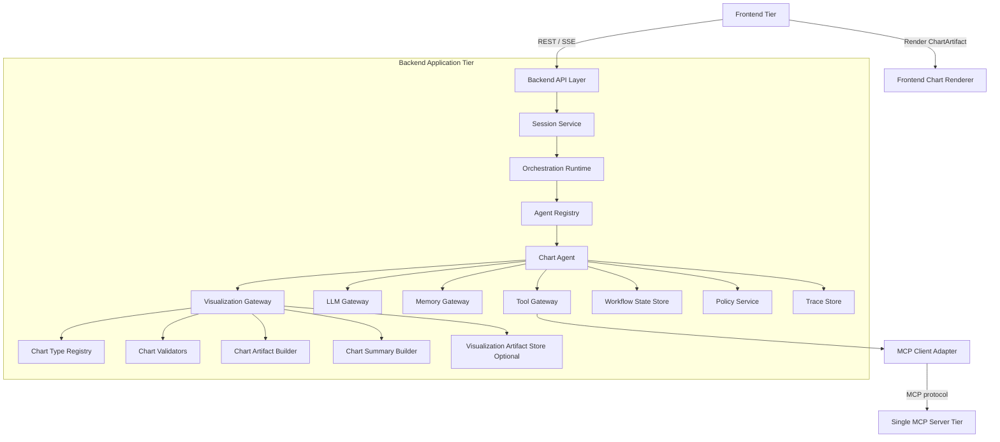
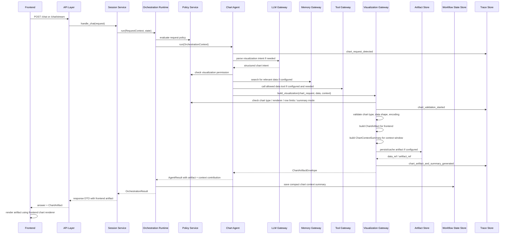
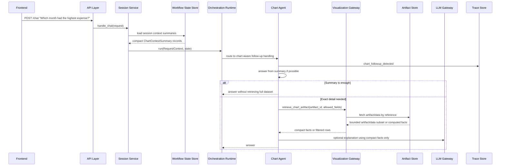

# Backend Visualization Architecture

**Document:** `backend-visualization-architecture.md`  
**Version:** 1.1  
**Source alignment:** `backend-application-architecture.md`  
**Previous version:** 1.0  
**Scope:** Backend chart and graph generation capability, frontend visualization delivery, chart artifact response model, compact chart context summaries, chart policy, validation, traceability, and follow-up question support without injecting full chart datasets into the LLM context window.

---

## 1. Purpose

This document defines the backend visualization architecture for adding chart and graph capabilities to the pluggable agentic AI backend.

The goal is to allow users to ask natural-language visualization requests such as:

```text
Generate a bar graph to show income and expense over the last 6 months.
```

The backend should understand the chart request, resolve or request the required data, validate that the graph type is supported, generate a structured chart artifact, send the visualization payload to the frontend, and add a compact summary of the generated chart to the conversation context so the user can ask follow-up questions about the chart.

The backend must not inject the entire chart dataset into the LLM context window by default. Full chart data can be sent to the frontend as a chart artifact or made available through an artifact/data reference, but only a bounded `ChartContextSummary` should be inserted into session context for future reasoning.

---

## 2. Source Architecture Alignment

This visualization architecture extends `backend-application-architecture.md` and follows its existing rules:

- Backend remains one deployable application tier in V1.
- Frontend communicates with backend through REST / SSE.
- Backend owns orchestration and does not render frontend UI.
- Agents receive controlled capabilities through `OrchestrationContext`.
- Agents do not import direct infrastructure clients.
- LLM access remains behind `LLMGateway`.
- Tool access remains behind `ToolGateway`.
- Memory access remains behind `MemoryGateway`.
- Workflow state remains behind `WorkflowStateStore`.
- Trace records remain behind `TraceStore`.
- Policy gates sensitive and capability-specific actions.
- Configuration wires runtime behavior through YAML.

This document adds one new backend capability boundary:

```text
VisualizationGateway
```

The `VisualizationGateway` owns chart request normalization, supported chart type enforcement, chart artifact creation, chart validation, chart context summary generation, and artifact metadata preparation. It does not render charts and does not directly call external APIs, databases, MCP clients, or LLM provider SDKs.

---

## 3. Key Version 1.1 Design Update

Version 1.1 adds a required separation between three different outputs of chart generation:

```text
1. Frontend Visualization Payload
   Full chart artifact or chart artifact reference used by the frontend renderer.

2. Compact Chart Context Summary
   Small, bounded summary inserted into the session context window for follow-up questions.

3. Artifact/Data Reference
   Stable ID or reference that lets the backend retrieve or recompute chart details later without putting the whole dataset into context.
```

The architecture must enforce this rule:

```text
The chart artifact may contain data for frontend rendering.
The LLM context window should receive only a compact chart summary, never the full chart dataset by default.
```

This allows users to ask follow-up questions such as:

```text
Which month had the highest expense?
Why does the graph show expenses rising in March?
What is the overall trend?
Compare income and expense in the last quarter.
```

without filling the LLM context window with every row, point, bin, or category from the chart dataset.

---

## 4. Visualization Architecture Goals

The visualization capability should be:

1. **Chart-type explicit**  
   Every supported chart type must be registered, validated, and mapped to a known frontend rendering capability.

2. **Renderer-neutral at the backend boundary**  
   The backend should return a stable `ChartArtifact` contract instead of frontend framework code.

3. **Frontend-renderable**  
   Returned chart artifacts must contain enough structured information for the frontend to render the chart using the configured renderer.

4. **Context-efficient**  
   The backend should insert only a compact chart summary into the LLM/session context, not the full chart dataset.

5. **Follow-up capable**  
   The backend should preserve enough chart metadata, summary facts, and artifact references for the user to ask questions about the generated chart.

6. **Policy-controlled**  
   Visualization generation should be allowed per use case, agent, chart type, data source, renderer, context-summary mode, and output mode.

7. **Traceable**  
   Chart detection, chart type resolution, data resolution, validation, artifact generation, summary generation, artifact delivery, and follow-up retrieval should emit trace events.

8. **Data-source isolated**  
   Chart agents should not read databases, files, MCP tools, or memory directly. Data access must use existing gateways.

9. **Gracefully bounded**  
   If a graph type cannot be produced, the agent must clearly say that the requested graph type cannot be produced and list supported alternatives.

10. **Testable**  
    Chart parsing, validation, artifact creation, summary creation, unsupported type handling, artifact delivery, and frontend response mapping should be testable with fake gateways and fixture data.

---

## 5. Visualization Non-Goals

The visualization backend should not:

- Render chart pixels, canvases, SVG, or frontend components directly.
- Return arbitrary JavaScript, JSX, React, HTML, or executable code as a chart response.
- Let agents bypass `VisualizationGateway` when producing chart artifacts.
- Let agents directly import chart rendering libraries.
- Let agents directly import SQLite, ArcadeDB, MCP clients, external API clients, or provider SDKs.
- Guess missing business data when exact chart data is required.
- Claim support for a chart type unless the configured frontend renderer can display it.
- Store chart artifacts as long-term memory unless explicitly requested and policy allows it.
- Store full chart datasets in the LLM context window.
- Treat workflow state as an unlimited reporting database.
- Treat chart generation as an unrestricted tool execution path.

---

## 6. Position in the Three-Tier System

The visualization capability remains inside the backend application tier. The frontend renders the returned artifact.



The backend returns structured chart artifacts to the frontend. Separately, the backend creates compact `ChartContextSummary` records for the context window and future follow-up question handling.

---

## 7. Backend Layering Pattern

Visualization should follow the same dependency direction as the rest of the backend.

```text
API Layer
  ↓
Session Service
  ↓
Orchestration Runtime
  ↓
Agent Plugin / Strategy
  ↓
VisualizationGateway Interface
  ↓
Chart Registry / Validators / Artifact Builder / Summary Builder
```

Allowed:

```text
ChartAgent -> VisualizationGateway -> ChartRegistry
ChartAgent -> MemoryGateway
ChartAgent -> ToolGateway
ChartAgent -> LLMGateway
OrchestrationRuntime -> ChartAgent
API -> SessionService
VisualizationGateway -> ChartSummaryBuilder
VisualizationGateway -> VisualizationArtifactStore interface
```

Avoid:

```text
API Route -> Chart Registry
API Route -> Chart Builder
ChartAgent -> ECharts directly
ChartAgent -> React component code
ChartAgent -> SQLite
ChartAgent -> ArcadeDB
ChartAgent -> MCP client
VisualizationGateway -> Frontend framework code
VisualizationGateway -> External database client
Context Window -> Full chart dataset
```

---

## 8. Backend Module Additions

Add a new `visualization/` module and one chart-focused agent.

```text
backend/app/
  visualization/
    __init__.py
    gateway.py
    models.py
    chart_registry.py
    chart_spec_builder.py
    chart_summary_builder.py
    chart_data.py
    artifact_store.py
    validators.py
    errors.py

  agents/
    chart_agent.py
```

Optional, if visualization routing becomes complex:

```text
backend/app/orchestration/strategies/
  chart_generation_strategy.py
```

### 8.1 Visualization Module Responsibility Table

| Module | Responsibility | Should Own | Should Not Own |
|---|---|---|---|
| `visualization/gateway.py` | Visualization boundary | `VisualizationGateway` interface and implementation | Frontend rendering, direct infrastructure access |
| `visualization/models.py` | Visualization DTOs | `ChartRequest`, `ChartArtifact`, `ChartContextSummary`, `ChartArtifactEnvelope` | Agent reasoning |
| `visualization/chart_registry.py` | Supported graph registry | Chart type definitions, renderer compatibility, aliases | Dynamic chart guessing without validation |
| `visualization/chart_spec_builder.py` | Artifact creation | Internal neutral chart artifact construction | Direct JavaScript, React, or HTML output |
| `visualization/chart_summary_builder.py` | Context summary creation | Bounded summaries, insights, aggregates, extrema, context-safe facts | Full raw data injection into context |
| `visualization/chart_data.py` | Data shape helpers | Data normalization helpers, field introspection, aggregate helpers | Database access |
| `visualization/artifact_store.py` | Optional artifact persistence/cache | Session-scoped chart artifact references, TTL, retrieval by artifact ID | Long-term memory by default |
| `visualization/validators.py` | Validation | Type checks, row limits, encoding checks, renderer checks, context-summary checks | Policy decisions outside visualization scope |
| `visualization/errors.py` | Error taxonomy | Unsupported chart type, invalid data, missing fields, context overflow | Generic unstructured exceptions |
| `agents/chart_agent.py` | User-facing chart behavior | Chart intent parsing, data-source selection through gateways, response wording, follow-up question handling | Direct renderer calls, direct database calls |

---

## 9. Runtime Flow

### 9.1 Initial Chart Generation Flow



### 9.2 Follow-Up Question Flow



The default follow-up behavior should prefer deterministic summary/fact computation over injecting full datasets into the LLM prompt.

---

## 10. Core Visualization Contracts

### 10.1 VisualizationGateway

```python
from typing import Protocol


class VisualizationGateway(Protocol):
    async def build_visualization(
        self,
        request: "ChartRequest",
        data: list[dict],
        context: "VisualizationContext",
    ) -> "ChartArtifactEnvelope":
        ...

    async def retrieve_chart_artifact(
        self,
        artifact_id: str,
        context: "VisualizationContext",
        fields: list[str] | None = None,
        max_rows: int | None = None,
    ) -> "ChartArtifact | ChartDataSlice | ChartComputedFacts":
        ...

    def supported_chart_types(self) -> list[str]:
        ...

    def renderer_capabilities(self) -> "RendererCapabilities":
        ...
```

### 10.2 VisualizationContext

```python
from dataclasses import dataclass
from typing import Any


@dataclass
class VisualizationContext:
    user_id: str
    session_id: str
    usecase: str | None
    agent_name: str
    trace_id: str | None
    policy_scope: dict[str, Any]
    config: dict[str, Any]
```

### 10.3 ChartRequest

```python
from dataclasses import dataclass, field
from typing import Any, Literal


@dataclass
class ChartRequest:
    chart_type: str
    title: str
    description: str | None = None
    x_field: str | None = None
    y_fields: list[str] = field(default_factory=list)
    category_field: str | None = None
    series_field: str | None = None
    value_field: str | None = None
    time_field: str | None = None
    filters: dict[str, Any] = field(default_factory=dict)
    options: dict[str, Any] = field(default_factory=dict)
    data_source: Literal[
        "user_provided",
        "workflow_state",
        "memory",
        "tool",
        "uploaded_file",
        "unknown",
    ] = "unknown"
```

### 10.4 ChartArtifact

`ChartArtifact` is the frontend-facing visualization object. It may include inline data or a data reference depending on size, renderer strategy, and policy.

```python
from dataclasses import dataclass, field
from typing import Any, Literal


@dataclass
class ChartArtifact:
    artifact_id: str
    type: str
    chart_type: str
    title: str
    description: str | None
    renderer: str
    spec_version: str
    data_mode: Literal["inline", "reference"]
    data: list[dict[str, Any]] | None
    data_ref: str | None
    encoding: dict[str, Any]
    options: dict[str, Any] = field(default_factory=dict)
    warnings: list[str] = field(default_factory=list)
    metadata: dict[str, Any] = field(default_factory=dict)
```

Rules:

```text
If data_mode is inline, data contains the frontend-renderable dataset.
If data_mode is reference, data_ref points to a session-scoped artifact/data endpoint or cache entry.
The context window must not receive ChartArtifact.data by default.
```

### 10.5 ChartContextSummary

`ChartContextSummary` is the context-window-safe representation of the generated chart.

```python
from dataclasses import dataclass, field
from typing import Any


@dataclass
class ChartContextSummary:
    artifact_id: str
    chart_type: str
    title: str
    description: str | None
    renderer: str
    data_source: str
    x_field: str | None
    y_fields: list[str]
    series_field: str | None
    row_count: int
    series_count: int
    category_count: int | None
    time_range: dict[str, Any] | None
    summary_text: str
    key_insights: list[str] = field(default_factory=list)
    aggregate_stats: dict[str, Any] = field(default_factory=dict)
    extrema: dict[str, Any] = field(default_factory=dict)
    trend_summary: dict[str, Any] = field(default_factory=dict)
    warnings: list[str] = field(default_factory=list)
    data_ref: str | None = None
    token_estimate: int | None = None
    metadata: dict[str, Any] = field(default_factory=dict)
```

Rules:

```text
ChartContextSummary must not contain the full row-level dataset.
ChartContextSummary may contain computed facts, aggregates, extrema, row count, field names, trends, and a data_ref.
ChartContextSummary should be small enough to fit within the configured chart context token budget.
```

### 10.6 ChartArtifactEnvelope

The visualization gateway should return both frontend and context outputs in one envelope.

```python
from dataclasses import dataclass


@dataclass
class ChartArtifactEnvelope:
    artifact: ChartArtifact
    context_summary: ChartContextSummary
```

The orchestration runtime should route each part differently:

```text
ChartArtifact -> API response / SSE artifact events -> Frontend
ChartContextSummary -> session context contribution -> future LLM context
```

### 10.7 ContextContribution

The orchestration layer should support explicit context contributions so large artifacts are not accidentally appended to prompt history.

```python
from dataclasses import dataclass
from typing import Any, Literal


@dataclass
class ContextContribution:
    contribution_id: str
    kind: Literal["chart_summary", "tool_summary", "memory_summary"]
    content: dict[str, Any]
    token_estimate: int
    source_artifact_id: str | None = None
    include_in_next_prompt: bool = True
```

A chart response should contribute only the `ChartContextSummary`, not the `ChartArtifact.data`.

### 10.8 AgentResult Extension

Existing agent results should be extended to allow structured artifacts and context contributions.

```python
from dataclasses import dataclass, field
from typing import Any


@dataclass
class AgentResult:
    answer: str
    artifacts: list[dict[str, Any]] = field(default_factory=list)
    context_contributions: list[ContextContribution] = field(default_factory=list)
    metadata: dict[str, Any] = field(default_factory=dict)
```

### 10.9 OrchestrationResult Extension

```python
from dataclasses import dataclass, field
from typing import Any


@dataclass
class OrchestrationResult:
    answer: str
    session_id: str
    agent_name: str | None = None
    strategy_name: str | None = None
    llm_profile: str | None = None
    tool_calls: list[dict[str, Any]] = field(default_factory=list)
    memory_updates: list[dict[str, Any]] = field(default_factory=list)
    artifacts: list[dict[str, Any]] = field(default_factory=list)
    context_contributions: list[ContextContribution] = field(default_factory=list)
    trace_id: str | None = None
    metadata: dict[str, Any] = field(default_factory=dict)
```

---

## 11. Frontend Payload vs Context Window Summary

The architecture must treat frontend visualization delivery and LLM context as separate channels.

| Concern | Destination | Contains Full Dataset? | Purpose |
|---|---|---:|---|
| `ChartArtifact` | Frontend API/SSE response | Yes, if inline mode and policy allows | Render the chart |
| `ChartArtifact.data_ref` | Frontend or backend artifact retrieval | No inline data in initial response | Retrieve chart data when needed |
| `ChartContextSummary` | Session context / future LLM prompt | No | Let the assistant understand and discuss the chart |
| `VisualizationArtifactStore` | Backend session-scoped artifact cache/store | Yes, if configured | Support follow-up questions and frontend reloads |
| Trace metadata | Trace store | No row-level data by default | Debug and audit chart lifecycle |

### 11.1 Required Invariant

```text
No raw chart dataset should be added to LLM prompt history by default.
```

The only default prompt contribution should be a compact summary like:

```text
Chart chart_01: grouped bar chart titled "Income vs Expense - Last 6 Months".
Dataset has 6 monthly rows, x=month, y=income and expense, source=user_provided.
Income total: 33,100. Expense total: 26,400. Highest income: May at 6,100. Highest expense: May at 4,700.
Overall income exceeds expense in all months. Expenses rise from Jan to Mar, fall in Apr, then rise in May and dip in Jun.
Use artifact_id=chart_01 for exact follow-up retrieval if needed.
```

This summary supports follow-up questions without putting all rows into context.

---

## 12. Context Summary Builder

The `ChartSummaryBuilder` creates a bounded `ChartContextSummary` from the chart artifact and validated data.

### 12.1 Summary Builder Responsibilities

The summary builder should compute:

```text
chart identity
chart type
title and description
source and row count
axis fields and series fields
series count
category count
time range, if applicable
basic totals, averages, min, max, start, end
highest and lowest categories or time periods
trend direction and notable changes
outlier hints, if applicable
warnings
artifact_id and data_ref for follow-up retrieval
```

The summary builder should not:

```text
include every row
include every data point
include every histogram bin unless the bin count is very small and policy allows it
include sensitive values not needed for chart reasoning
include raw uploaded-file contents
include raw tool responses
```

### 12.2 Summary Token Budget

Recommended defaults:

```yaml
visualization:
  context_summary:
    enabled: true
    mode: summary_only
    max_tokens_per_chart_summary: 600
    max_chart_summaries_per_session_context: 5
    include_data_ref: true
    include_aggregate_stats: true
    include_extrema: true
    include_trend_summary: true
    include_sample_rows: false
    max_sample_rows: 0
```

If a summary exceeds the configured token budget, the builder should compact it:

```text
1. Keep artifact ID, title, chart type, fields, row count, source, and data_ref.
2. Keep top 3 key insights.
3. Keep extrema and totals.
4. Drop lower-priority descriptive details.
5. Never add raw rows as a fallback.
```

### 12.3 Chart-Type-Specific Summaries

| Chart Type | Summary Should Include | Summary Should Avoid |
|---|---|---|
| `bar`, `grouped_bar`, `stacked_bar`, `horizontal_bar` | Top/bottom categories, totals by series, ranking highlights | Listing every category when many exist |
| `line`, `multi_line`, `area` | Start/end values, direction, peaks, troughs, biggest change, time range | Full time series rows |
| `pie`, `donut` | Total, largest/smallest slices, shares, concentration | Every slice if many categories |
| `scatter`, `bubble` | Relationship direction, correlation hint if computed, outliers, x/y ranges | Every point |
| `histogram` | Number of bins, range, distribution shape, most populated bins | Full bin list if many bins |
| `box_plot` | Median, quartiles, whiskers, outliers count | Raw observations |
| `heatmap` | Highest/lowest cells, row/column ranges, concentration | Full matrix when large |
| `treemap` | Largest groups, total, top contributors | Every leaf node |
| `waterfall` | Start, end, largest positive/negative contributors | Every step when many exist |
| `gantt` | Date range, task count, critical or longest tasks if known | Every task when many exist |
| `radar` | Highest/lowest dimensions, comparison summary | Raw category arrays when large |
| `table` | Row count, columns, key aggregations if numeric | Full table contents |

---

## 13. Artifact and Data Storage Strategy

To support follow-up questions without polluting context, the backend should keep a retrievable chart artifact or data reference.

### 13.1 V1 Storage Recommendation

For V1, use session-scoped workflow state or a lightweight visualization artifact cache to store:

```text
artifact_id
chart metadata
ChartContextSummary
data_ref
artifact_ref
created_at
expires_at
source information
```

Do not store large full datasets in workflow state unless bounded and explicitly configured.

Recommended V1 pattern:

```text
Small chart payload:
  - ChartArtifact.data sent inline to frontend.
  - ChartContextSummary stored in workflow state.
  - Optional copy of ChartArtifact stored in session-scoped artifact cache.

Large chart payload:
  - ChartArtifact.data omitted from initial response.
  - ChartArtifact.data_ref sent to frontend.
  - Frontend fetches or streams chart data by data_ref.
  - ChartContextSummary stored in workflow state.
  - Full data remains in source system, file cache, tool result cache, or artifact store with TTL.
```

### 13.2 VisualizationArtifactStore Interface

```python
from typing import Protocol


class VisualizationArtifactStore(Protocol):
    async def save_artifact(
        self,
        session_id: str,
        artifact: ChartArtifact,
        context_summary: ChartContextSummary,
        ttl_seconds: int | None = None,
    ) -> str:
        ...

    async def get_artifact(
        self,
        session_id: str,
        artifact_id: str,
    ) -> ChartArtifact | None:
        ...

    async def get_context_summary(
        self,
        session_id: str,
        artifact_id: str,
    ) -> ChartContextSummary | None:
        ...

    async def delete_session_artifacts(self, session_id: str) -> None:
        ...
```

### 13.3 Reset Rule

Session reset should clear:

```text
ChartContextSummary records in workflow state
session-scoped visualization artifacts
session-scoped data_refs
artifact cache entries
```

Session reset should not delete:

```text
long-term memory
source business data
uploaded files outside session scope, unless the file policy says otherwise
trace records
```

This follows the backend application rule that session reset clears short-term workflow state only.

---

## 14. Chart Type Registry

The backend must maintain an explicit registry of supported chart and graph types.

### 14.1 V1 Supported Chart Types

Recommended V1 support:

```text
bar
grouped_bar
stacked_bar
horizontal_bar
line
multi_line
area
pie
donut
scatter
bubble
histogram
box_plot
heatmap
treemap
waterfall
gantt
radar
table
```

### 14.2 V2 Candidate Chart Types

These should not be enabled until the frontend renderer supports them and validators exist.

```text
candlestick
funnel
sankey
choropleth_map
network_graph
timeline
violin_plot
contour
parallel_coordinates
sunburst
```

### 14.3 Chart Type Alias Mapping

Natural-language chart names should map to canonical registry keys.

```yaml
visualization:
  aliases:
    bar graph: bar
    bar chart: bar
    column chart: bar
    grouped bar graph: grouped_bar
    stacked bar graph: stacked_bar
    line graph: line
    trend chart: line
    pie graph: pie
    donut graph: donut
    scatter plot: scatter
    correlation plot: scatter
    gantt chart: gantt
```

Aliases must not bypass registry validation.

---

## 15. Unsupported Chart Type Behavior

If the user asks for a graph type that cannot be generated, the backend must return a clear natural-language response and no fake artifact.

Example:

```text
I can’t produce that graph type with the current chart renderer. Supported graph types are bar, grouped bar, stacked bar, horizontal bar, line, multi-line, area, pie, donut, scatter, bubble, histogram, box plot, heatmap, treemap, waterfall, gantt, radar, and table.
```

Implementation pattern:

```python
if canonical_chart_type not in chart_registry.supported_types:
    trace.record(
        "unsupported_chart_type",
        {
            "requested_chart_type": requested_chart_type,
            "canonical_chart_type": canonical_chart_type,
        },
    )
    raise UnsupportedChartTypeError(
        requested_type=requested_chart_type,
        supported_types=chart_registry.supported_types,
    )
```

The agent should catch `UnsupportedChartTypeError` and produce a helpful answer.

---

## 16. Chart Data Resolution

Chart generation requires data. The chart agent must resolve data through controlled backend gateways.

Allowed data sources:

| Data Source | Access Pattern | Notes |
|---|---|---|
| User-provided values | Request message parsing | Good for quick charts from inline tables or lists |
| Uploaded file | File ingestion path or tool-mediated parser | Must be validated and bounded |
| Workflow state | `WorkflowStateStore` through context | Only for data already produced in the session |
| Memory | `MemoryGateway.search(...)` | Useful for remembered project facts or document chunks |
| MCP tools | `ToolGateway.call_tool(...)` | Useful for external systems such as finance/reporting APIs |
| LLM extraction | `LLMGateway` | Only for structuring user-provided or retrieved data, not inventing facts |

The chart agent should ask for missing data when data is required and unavailable.

Example:

```text
I can generate that bar graph, but I need the income and expense values for each of the last 6 months.
```

The agent should not fabricate business metrics unless the user explicitly asks for sample/demo data.

---

## 17. Chart Artifact Response Model

The API response should support text plus structured artifacts. The frontend receives the visualization artifact. The context window receives only the compact chart summary through `context_contributions` or workflow state.

Example response:

```json
{
  "answer": "Here is a bar graph showing income and expense over the last 6 months.",
  "session_id": "session_123",
  "agent_name": "chart_agent",
  "artifacts": [
    {
      "artifact_id": "chart_01",
      "type": "chart",
      "chart_type": "grouped_bar",
      "title": "Income vs Expense - Last 6 Months",
      "description": "Monthly income and expense comparison.",
      "renderer": "echarts",
      "spec_version": "1.0",
      "data_mode": "inline",
      "data": [
        { "month": "Jan", "income": 5200, "expense": 4100 },
        { "month": "Feb", "income": 5400, "expense": 4300 },
        { "month": "Mar", "income": 5100, "expense": 4600 },
        { "month": "Apr", "income": 5800, "expense": 4200 },
        { "month": "May", "income": 6100, "expense": 4700 },
        { "month": "Jun", "income": 5900, "expense": 4500 }
      ],
      "data_ref": null,
      "encoding": {
        "x": "month",
        "y": ["income", "expense"]
      },
      "options": {
        "currency": "USD",
        "stacked": false
      },
      "warnings": [],
      "metadata": {
        "source": "user_provided"
      }
    }
  ],
  "metadata": {
    "trace_id": "trace_123",
    "context_summary_added": true,
    "context_summary_id": "ctx_chart_01"
  }
}
```

The response may include chart data for frontend rendering, but the orchestration runtime must not copy `artifacts[*].data` into prompt history.

---

## 18. Context Window Model

### 18.1 Context Summary Persistence

When a chart is generated, the orchestration runtime should store the compact `ChartContextSummary` in session-scoped workflow state.

Recommended workflow state shape:

```json
{
  "session_id": "session_123",
  "visualization_context": {
    "recent_charts": [
      {
        "artifact_id": "chart_01",
        "chart_type": "grouped_bar",
        "title": "Income vs Expense - Last 6 Months",
        "summary_text": "Grouped bar chart comparing monthly income and expense across 6 months. Income exceeded expense every month. Highest income was May at 6100. Highest expense was May at 4700. Total income was 33100 and total expense was 26400.",
        "row_count": 6,
        "x_field": "month",
        "y_fields": ["income", "expense"],
        "data_ref": "artifact://session_123/chart_01"
      }
    ]
  }
}
```

### 18.2 Prompt Assembly Rule

When building the next LLM prompt, the context assembler may include:

```text
- Recent relevant ChartContextSummary records.
- Artifact ID and title.
- Chart type and fields.
- High-level computed insights.
- Aggregates and extrema.
- Data reference for retrieval.
```

The context assembler must not include:

```text
- ChartArtifact.data
- Full row list
- Full point list
- Full uploaded file contents
- Raw tool result payloads
- Full renderer spec if it contains inline data
```

### 18.3 Context Eviction and Compaction

Configuration should limit how many chart summaries remain in prompt context.

Recommended defaults:

```yaml
visualization:
  context_summary:
    max_chart_summaries_per_session_context: 5
    max_tokens_per_chart_summary: 600
    max_total_visualization_context_tokens: 1800
    eviction_policy: most_recent_relevant
```

If more chart summaries exist than can fit:

```text
1. Prefer charts explicitly referenced by artifact ID, title, or recent user question.
2. Prefer most recent charts.
3. Prefer charts in the active use case.
4. Compact older chart summaries.
5. Drop older chart summaries from prompt context but keep them retrievable by artifact ID if still in artifact store.
```

---

## 19. Follow-Up Question Handling

Follow-up questions about charts should be handled by a chart-aware route, strategy, or chart agent behavior.

### 19.1 Follow-Up Types

| Follow-Up Type | Use Summary Only? | Retrieve Full Artifact/Data? |
|---|---:|---:|
| “What does this chart show?” | Yes | No |
| “What is the trend?” | Yes | No, if trend summary exists |
| “Which category is highest?” | Yes, if extrema included | No |
| “Which month had the highest expense?” | Yes, if extrema included | No |
| “What was the value in March?” | Maybe | Yes, if exact row not in summary |
| “List all values in the chart.” | No | Yes, if policy allows |
| “Make another chart from the same data.” | No | Yes |
| “Filter to only Q2.” | No | Yes or retrieve source data |

### 19.2 Deterministic Computation Preferred

When exact data is needed, the backend should retrieve the artifact or source data and compute the answer deterministically when possible.

Preferred:

```text
User asks exact chart question
  -> Retrieve artifact/data by artifact_id
  -> Compute answer in backend helper
  -> Optionally ask LLM to explain the computed answer using compact facts only
```

Avoid:

```text
User asks exact chart question
  -> Inject entire chart data into LLM prompt
  -> Ask LLM to calculate from raw rows
```

### 19.3 Referencing the Current Chart

The chart agent should resolve references like:

```text
this chart
that graph
the income chart
the bar graph
the last chart
chart_01
```

using recent `ChartContextSummary` records in workflow state.

If multiple charts match, the agent may use the most recent chart or ask a clarifying question when ambiguity would materially affect the answer.

---

## 20. Renderer Strategy

The backend should use an internal neutral artifact contract and expose the configured renderer name in the artifact.

Recommended backend contract:

```text
ChartArtifact
```

Recommended frontend renderer for broad graph support:

```text
Apache ECharts
```

Alternative renderers:

```text
Vega-Lite
Chart.js
Plotly
Recharts
```

### 20.1 Recommended Approach

Use:

```text
Backend internal neutral ChartArtifact
  -> Frontend adapter
      -> Apache ECharts option object
      -> Render chart
```

This avoids coupling the backend to a specific frontend library while still allowing the frontend to use a powerful chart renderer.

### 20.2 Backend Renderer Rules

The backend may:

- Include the renderer name.
- Include a renderer-compatible spec version.
- Include neutral chart data and encoding.
- Include warnings and metadata.
- Include a data reference if the chart payload is too large for inline response.

The backend must not:

- Return React components.
- Return arbitrary executable JavaScript.
- Return HTML snippets as the primary chart interface.
- Depend on browser-specific rendering behavior.
- Insert renderer specs containing raw data into the LLM context window.

---

## 21. Chart Agent Boundary

The chart agent is a task-specific agent plugin.

It may:

- Detect chart generation requests.
- Detect follow-up questions about prior charts.
- Use `LLMGateway` to parse natural-language chart intent into `ChartRequest`.
- Use `MemoryGateway` to search for relevant existing data.
- Use `ToolGateway` to call allowed data tools through MCP.
- Use `WorkflowStateStore` through context for session-scoped chart summaries.
- Use `VisualizationGateway` to build and validate chart artifacts.
- Use `VisualizationGateway` to retrieve chart artifacts or computed facts for follow-up questions.
- Emit trace events through `TraceStore`.
- Return natural-language explanation plus chart artifacts.

It must not:

- Render chart UI.
- Return arbitrary frontend code.
- Directly import ECharts, Chart.js, Vega, Plotly, or Recharts.
- Directly call MCP.
- Directly query SQLite or ArcadeDB.
- Directly instantiate external API clients.
- Invent missing values for real reports.
- Inject full chart datasets into LLM context.

---

## 22. LLM Usage in Visualization

The LLM may assist with:

- Chart intent extraction.
- Follow-up question classification.
- Chart type alias normalization.
- Field mapping suggestions.
- Title and description generation.
- Choosing a suitable chart type when the user did not specify one.
- Explaining the chart in natural language.
- Explaining backend-computed chart facts.

The LLM must not be the source of truth for numeric data unless the user explicitly requests sample data.

The LLM should receive:

```text
ChartContextSummary
small computed facts for exact answers
explicit chart metadata
artifact_id and chart title
```

The LLM should not receive:

```text
full raw chart rows
large renderer specs with inline data
raw uploaded-file data
raw tool responses
large tables pasted into context by the backend
```

Recommended LLM output contract for chart parsing:

```json
{
  "intent": "generate_chart",
  "chart_type": "bar",
  "title": "Income and Expense Over the Last 6 Months",
  "x_field": "month",
  "y_fields": ["income", "expense"],
  "requires_data": true,
  "data_source_hint": "user_provided_or_tool",
  "missing_information": []
}
```

Recommended LLM output contract for follow-up detection:

```json
{
  "intent": "chart_followup",
  "referenced_artifact_id": "chart_01",
  "question_type": "extrema_lookup",
  "requires_exact_data": false,
  "required_fields": ["expense", "month"]
}
```

The chart agent should validate LLM output before using it.

---

## 23. Tool and MCP Integration

Visualization may require external data. External data should flow through `ToolGateway` and the backend-side MCP client adapter.

Example:

```text
User asks for monthly income and expense chart
  ↓
ChartAgent detects missing data
  ↓
Policy allows finance/reporting tool
  ↓
ChartAgent calls ToolGateway
  ↓
ToolGateway calls MCP tool
  ↓
MCP returns normalized data
  ↓
ChartAgent builds ChartRequest
  ↓
VisualizationGateway validates and returns ChartArtifactEnvelope
  ↓
Frontend receives ChartArtifact
  ↓
Context receives ChartContextSummary only
```

The MCP server remains external. The backend does not implement MCP tools.

---

## 24. Policy Boundary

Policy should gate visualization behavior before chart artifacts are produced.

Policy should cover:

- Whether visualization is enabled for the use case.
- Whether the current agent can generate charts.
- Allowed chart types.
- Allowed renderers.
- Maximum inline data rows.
- Maximum data rows stored in session artifact cache.
- Maximum number of chart artifacts per response.
- Maximum chart summaries in context.
- Maximum tokens per chart context summary.
- Whether tool-based data retrieval is allowed.
- Whether uploaded-file data can be used.
- Whether memory data can be used.
- Whether export formats are allowed.
- Whether sensitive fields can be visualized.
- Whether exact data retrieval is allowed for follow-up questions.

Recommended policy defaults:

```text
Deny unknown chart types.
Deny unknown renderers.
Deny visualization unless enabled for the use case.
Allow chart generation per agent, not globally.
Limit inline chart rows.
Limit context summary token usage.
Do not inject full chart datasets into the context window.
Trace all chart generation attempts.
Do not allow executable frontend code as a chart artifact.
Do not allow chart data export unless explicitly enabled.
```

---

## 25. Configuration

Visualization should be configuration-driven.

Example YAML:

```yaml
visualization:
  enabled: true
  default_renderer: echarts
  artifact_spec_version: "1.0"
  max_artifacts_per_response: 3
  max_rows_inline: 5000
  max_rows_artifact_store: 50000
  max_series: 12
  max_categories: 100
  allow_sample_data: false
  allowed_renderers:
    - echarts
  allowed_chart_types:
    - bar
    - grouped_bar
    - stacked_bar
    - horizontal_bar
    - line
    - multi_line
    - area
    - pie
    - donut
    - scatter
    - bubble
    - histogram
    - box_plot
    - heatmap
    - treemap
    - waterfall
    - gantt
    - radar
    - table
  aliases:
    bar graph: bar
    bar chart: bar
    column chart: bar
    grouped bar graph: grouped_bar
    stacked bar graph: stacked_bar
    line graph: line
    trend chart: line
    pie graph: pie
    donut graph: donut
    scatter plot: scatter
    correlation plot: scatter
  context_summary:
    enabled: true
    mode: summary_only
    max_tokens_per_chart_summary: 600
    max_chart_summaries_per_session_context: 5
    max_total_visualization_context_tokens: 1800
    include_data_ref: true
    include_aggregate_stats: true
    include_extrema: true
    include_trend_summary: true
    include_sample_rows: false
    max_sample_rows: 0
    eviction_policy: most_recent_relevant
  artifact_store:
    enabled: true
    provider: workflow_state_cache
    ttl_seconds: 7200
    allow_large_data_reference: true

agents:
  chart_agent:
    enabled: true
    llm_profile: planning_reasoning
    capabilities:
      - chart_request_parse
      - chart_data_resolution
      - chart_artifact_generation
      - chart_context_summary_generation
      - chart_followup_answering
    allowed_chart_types:
      - bar
      - grouped_bar
      - stacked_bar
      - horizontal_bar
      - line
      - multi_line
      - area
      - pie
      - donut
      - scatter
      - histogram
      - heatmap
      - table
    allowed_tools:
      - finance.get_monthly_summary
      - reporting.query_metric_series

policy:
  visualization:
    enabled: true
    deny_unknown_chart_types: true
    deny_unknown_renderers: true
    require_data_source: true
    allow_memory_data: true
    allow_tool_data: true
    allow_uploaded_file_data: true
    allow_sample_data: false
    allow_exact_followup_retrieval: true
    allow_full_dataset_in_context: false
    max_rows_inline: 5000
    max_rows_artifact_store: 50000
    max_context_summary_tokens: 600
    max_artifacts_per_response: 3
```

---

## 26. API Boundary

No new route is required for V1 chart generation. Chart artifacts can be returned from existing chat routes:

```text
POST /chat
POST /chat/stream
```

Optional future routes:

```text
GET /capabilities/visualization
GET /artifacts/{artifact_id}
GET /artifacts/{artifact_id}/summary
POST /visualization/validate
POST /visualization/preview optional internal/dev route
```

### 26.1 Response Schema Addition

Add `artifacts` to the chat response DTO. Do not expose full `context_contributions` as user-facing content unless needed for debugging.

```python
from pydantic import BaseModel, Field
from typing import Any


class ChatResponse(BaseModel):
    answer: str
    session_id: str
    agent_name: str | None = None
    strategy_name: str | None = None
    trace_id: str | None = None
    artifacts: list[dict[str, Any]] = Field(default_factory=list)
    metadata: dict[str, Any] = Field(default_factory=dict)
```

### 26.2 Internal Response Mapping

The API layer should map:

```text
OrchestrationResult.artifacts -> ChatResponse.artifacts
OrchestrationResult.context_contributions -> WorkflowStateStore context summary persistence
```

Avoid:

```text
ChatResponse.artifacts -> prompt history
ChartArtifact.data -> prompt history
```

### 26.3 SSE Streaming Events

For streaming, emit artifact lifecycle events after the chart artifact is validated.

Recommended event names:

```text
message.delta
artifact.started
artifact.completed
artifact.failed
context_summary.created
message.completed
```

Example SSE artifact event:

```json
{
  "event": "artifact.completed",
  "data": {
    "artifact_id": "chart_01",
    "type": "chart",
    "chart_type": "grouped_bar",
    "title": "Income vs Expense - Last 6 Months",
    "data_mode": "inline"
  }
}
```

Example internal context summary event:

```json
{
  "event": "context_summary.created",
  "data": {
    "artifact_id": "chart_01",
    "summary_type": "chart_context_summary",
    "token_estimate": 180
  }
}
```

The frontend may ignore `context_summary.created` unless it wants to show debug or transparency metadata.

---

## 27. Observability

Add visualization-specific trace events.

```text
chart_request_detected
chart_intent_parse_started
chart_intent_parse_completed
chart_type_resolved
chart_data_resolution_started
chart_data_resolution_completed
chart_data_missing
chart_validation_started
chart_validation_completed
chart_validation_failed
chart_spec_generation_started
chart_spec_generated
chart_context_summary_generation_started
chart_context_summary_generated
chart_context_summary_compacted
chart_context_summary_saved
chart_artifact_saved
chart_artifact_returned
chart_followup_detected
chart_followup_answered_from_summary
chart_followup_artifact_retrieved
chart_followup_answered_from_retrieved_facts
unsupported_chart_type
unsupported_renderer
chart_policy_denied
```

Trace metadata should include:

```text
requested_chart_type
canonical_chart_type
renderer
row_count
series_count
data_source
artifact_id
data_mode
data_ref_present
context_summary_token_estimate
validation_status
policy_decision
```

Do not log sensitive row-level chart data by default. Store only metadata and compact summaries unless debug tracing is explicitly enabled and policy allows it.

---

## 28. Health and Capabilities

Update `GET /health` to include visualization configuration status.

Example:

```json
{
  "status": "ok",
  "visualization": {
    "configured": true,
    "enabled": true,
    "default_renderer": "echarts",
    "supported_chart_types_count": 19,
    "context_summary_enabled": true,
    "artifact_store_enabled": true
  }
}
```

Update `GET /capabilities` to include supported visualization capabilities.

Example:

```json
{
  "visualization": {
    "enabled": true,
    "default_renderer": "echarts",
    "context_summary_mode": "summary_only",
    "supported_chart_types": [
      "bar",
      "grouped_bar",
      "stacked_bar",
      "horizontal_bar",
      "line",
      "multi_line",
      "area",
      "pie",
      "donut",
      "scatter",
      "bubble",
      "histogram",
      "box_plot",
      "heatmap",
      "treemap",
      "waterfall",
      "gantt",
      "radar",
      "table"
    ]
  }
}
```

---

## 29. Error Taxonomy

Recommended visualization errors:

```text
UnsupportedChartTypeError
UnsupportedRendererError
ChartDataMissingError
ChartDataValidationError
ChartEncodingError
ChartPolicyDeniedError
ChartRowLimitExceededError
ChartSeriesLimitExceededError
ChartArtifactBuildError
ChartContextSummaryBuildError
ChartContextSummaryLimitExceededError
ChartArtifactNotFoundError
ChartFollowupAmbiguousError
```

Errors should map to natural-language assistant responses when they are user-correctable.

| Error | User-Facing Response Pattern |
|---|---|
| `UnsupportedChartTypeError` | “I can’t produce that graph type with the current chart renderer. Supported graph types are ...” |
| `ChartDataMissingError` | “I can generate that chart, but I need ...” |
| `ChartDataValidationError` | “The data does not match the requested chart. The field ... must be numeric.” |
| `ChartPolicyDeniedError` | “This chart cannot be generated because it is not allowed for this use case.” |
| `ChartRowLimitExceededError` | “The dataset is too large to return inline. Please filter or summarize it first.” |
| `ChartContextSummaryBuildError` | “The chart was generated, but I could not create a follow-up summary for it.” |
| `ChartArtifactNotFoundError` | “I no longer have access to the chart data for that graph. Please regenerate it or provide the data again.” |
| `ChartFollowupAmbiguousError` | “Which chart should I use: the income chart or the expense trend chart?” |

---

## 30. Validation Rules

### 30.1 Universal Validation

All chart artifacts must pass these checks:

```text
chart_type is registered
renderer is allowed
artifact type is chart
spec_version is supported
title is present
data or data_ref is present unless chart type explicitly supports empty state
row count is within policy limits
encoding references existing fields
field names are safe strings
metadata contains no secrets
context summary can be generated within token budget
```

### 30.2 Context Summary Validation

Every generated chart should produce a `ChartContextSummary` unless policy disables follow-up summaries.

Validate:

```text
summary contains artifact_id
summary contains chart_type and title
summary contains row_count
summary contains fields needed to identify axes/series
summary does not contain full row-level data
summary token estimate is within configured limit
summary includes data_ref when follow-up retrieval is enabled
summary metadata contains no secrets
```

### 30.3 Numeric Field Validation

Chart types that require numeric values must validate numeric fields:

```text
bar
grouped_bar
stacked_bar
line
multi_line
area
scatter
bubble
histogram
box_plot
heatmap
treemap
waterfall
radar
```

### 30.4 Part-to-Whole Validation

Pie and donut charts should only be used when values represent parts of a meaningful whole.

Validation should warn or reject when:

```text
more than configured category limit
negative values are present
all values are zero
categories do not represent a meaningful total
```

### 30.5 Time-Series Validation

Line and area charts should validate ordering fields when representing time.

Rules:

```text
time field exists
time labels are sortable or already ordered
y fields are numeric
series count is within limit
```

### 30.6 Scatter and Bubble Validation

Scatter and bubble charts require numeric x and y fields.

Bubble charts also require a numeric size field.

---

## 31. Example: Income and Expense Bar Graph

User request:

```text
Generate a bar graph to show income and expense over last 6 months.
```

Parsed chart request:

```json
{
  "chart_type": "grouped_bar",
  "title": "Income vs Expense - Last 6 Months",
  "description": "Monthly comparison of income and expenses.",
  "x_field": "month",
  "y_fields": ["income", "expense"],
  "data_source": "user_provided"
}
```

Generated frontend chart artifact:

```json
{
  "artifact_id": "chart_01",
  "type": "chart",
  "chart_type": "grouped_bar",
  "title": "Income vs Expense - Last 6 Months",
  "description": "Monthly comparison of income and expenses.",
  "renderer": "echarts",
  "spec_version": "1.0",
  "data_mode": "inline",
  "data": [
    { "month": "Jan", "income": 5200, "expense": 4100 },
    { "month": "Feb", "income": 5400, "expense": 4300 },
    { "month": "Mar", "income": 5100, "expense": 4600 },
    { "month": "Apr", "income": 5800, "expense": 4200 },
    { "month": "May", "income": 6100, "expense": 4700 },
    { "month": "Jun", "income": 5900, "expense": 4500 }
  ],
  "data_ref": "artifact://session_123/chart_01",
  "encoding": {
    "x": "month",
    "y": ["income", "expense"]
  },
  "options": {
    "currency": "USD",
    "stacked": false
  },
  "warnings": [],
  "metadata": {
    "source": "user_provided"
  }
}
```

Generated context-window summary:

```json
{
  "artifact_id": "chart_01",
  "chart_type": "grouped_bar",
  "title": "Income vs Expense - Last 6 Months",
  "description": "Monthly comparison of income and expenses.",
  "renderer": "echarts",
  "data_source": "user_provided",
  "x_field": "month",
  "y_fields": ["income", "expense"],
  "series_field": null,
  "row_count": 6,
  "series_count": 2,
  "category_count": 6,
  "time_range": {
    "start": "Jan",
    "end": "Jun",
    "granularity": "month"
  },
  "summary_text": "Grouped bar chart comparing income and expense across 6 months. Income is higher than expense in every month. Total income is 33100 and total expense is 26400. Highest income is May at 6100. Highest expense is May at 4700.",
  "key_insights": [
    "Income exceeds expense in every month shown.",
    "May has both the highest income and highest expense.",
    "Expenses rise from Jan to Mar, dip in Apr, rise in May, then dip in Jun."
  ],
  "aggregate_stats": {
    "income": { "total": 33100, "average": 5516.67 },
    "expense": { "total": 26400, "average": 4400 }
  },
  "extrema": {
    "income": { "max": { "month": "May", "value": 6100 }, "min": { "month": "Mar", "value": 5100 } },
    "expense": { "max": { "month": "May", "value": 4700 }, "min": { "month": "Jan", "value": 4100 } }
  },
  "trend_summary": {
    "income": "Income generally increases from Jan to May, then dips slightly in Jun.",
    "expense": "Expense rises from Jan to Mar, falls in Apr, rises in May, then falls in Jun."
  },
  "warnings": [],
  "data_ref": "artifact://session_123/chart_01",
  "token_estimate": 220
}
```

The frontend receives the chart artifact. The context window receives only the context summary.

---

## 32. Example: Missing Data

User request:

```text
Generate a bar graph to show income and expense over last 6 months.
```

If no usable data is available:

```text
I can generate that bar graph, but I need the income and expense values for each of the last 6 months.
```

No chart artifact should be returned. No chart context summary should be created.

Trace events should include:

```text
chart_request_detected
chart_type_resolved
chart_data_resolution_started
chart_data_missing
```

---

## 33. Example: Unsupported Graph Type

User request:

```text
Generate a 3D force-directed animated topology graph.
```

If unsupported:

```text
I can’t produce that graph type with the current chart renderer. Supported graph types are bar, grouped bar, stacked bar, horizontal bar, line, multi-line, area, pie, donut, scatter, bubble, histogram, box plot, heatmap, treemap, waterfall, gantt, radar, and table.
```

No chart artifact should be returned. No chart context summary should be created.

Trace events should include:

```text
chart_request_detected
unsupported_chart_type
response_returned
```

---

## 34. Testing Strategy

### 34.1 Unit Tests

Test:

```text
Chart type alias normalization
Supported chart type lookup
Unsupported chart type errors
ChartRequest validation
ChartArtifact validation
ChartContextSummary generation
ChartContextSummary token budget enforcement
ChartContextSummary excludes full row data
ChartArtifactEnvelope routing behavior
Numeric field validation
Pie/donut part-to-whole validation
Time-series validation
Row and series limits
Policy denial behavior
Natural-language missing-data response
```

### 34.2 Agent Tests

Use fake gateways to test `chart_agent`.

Test cases:

```text
User asks for bar graph with inline data
User asks for line chart with session data
User asks for pie chart with invalid non-total data
User asks for unsupported chart type
User asks for chart but no data is available
User asks for sample chart and sample data is disabled
User asks for sample chart and sample data is enabled
User asks a follow-up question answered from ChartContextSummary
User asks a follow-up question requiring artifact retrieval
User asks to list all chart rows and policy denies export
```

### 34.3 Integration Tests

Test the full path:

```text
POST /chat
  -> SessionService
  -> OrchestrationRuntime
  -> ChartAgent
  -> VisualizationGateway
  -> ChartArtifactEnvelope
  -> Response DTO with ChartArtifact
  -> WorkflowStateStore with ChartContextSummary
```

Follow-up path:

```text
POST /chat follow-up
  -> SessionService loads ChartContextSummary
  -> OrchestrationRuntime routes to ChartAgent
  -> ChartAgent answers from summary or retrieves artifact by data_ref
  -> Response does not include full dataset unless explicitly requested and policy allows
```

### 34.4 Golden Fixtures

Maintain chart artifact and context summary fixtures:

```text
tests/fixtures/visualization/bar_income_expense_artifact.json
tests/fixtures/visualization/bar_income_expense_context_summary.json
tests/fixtures/visualization/line_monthly_revenue_artifact.json
tests/fixtures/visualization/line_monthly_revenue_context_summary.json
tests/fixtures/visualization/pie_revenue_mix_artifact.json
tests/fixtures/visualization/pie_revenue_mix_context_summary.json
tests/fixtures/visualization/scatter_ad_spend_revenue_artifact.json
tests/fixtures/visualization/scatter_ad_spend_revenue_context_summary.json
tests/fixtures/visualization/unsupported_chart_type.json
```

---

## 35. Implementation Order

Visualization should be implemented after agents and policy are in place.

Recommended phases:

### Phase 1: Visualization Contracts

Deliverables:

- `ChartRequest`
- `ChartArtifact`
- `ChartContextSummary`
- `ChartArtifactEnvelope`
- `ContextContribution`
- `VisualizationContext`
- `VisualizationGateway` protocol
- Error classes

Success criteria:

- Contracts compile.
- Fake visualization gateway can be used in tests.
- Artifact and summary are separate objects.

### Phase 2: Chart Registry and Validation

Deliverables:

- Chart type registry.
- Alias mapping.
- Renderer capability model.
- Universal validators.
- Chart-specific validators.
- Context-summary validators.

Success criteria:

- Supported chart types are discoverable.
- Unsupported chart types fail cleanly.
- Invalid data fails before response artifact creation.
- Summary validation prevents full row data from entering context.

### Phase 3: Chart Artifact Builder

Deliverables:

- Neutral `ChartArtifact` builder.
- Artifact ID generation.
- Encoding normalization.
- Inline/reference data mode.
- Warnings and metadata support.

Success criteria:

- Known chart requests produce deterministic valid frontend artifacts.
- Large datasets can be represented with `data_ref`.

### Phase 4: Chart Context Summary Builder

Deliverables:

- `ChartContextSummary` builder.
- Chart-type-specific aggregate summaries.
- Token budget enforcement.
- Data-ref inclusion.
- Summary compaction.

Success criteria:

- Every successful chart generation can produce a compact context summary.
- Summary excludes full raw data.
- Summary is sufficient for common follow-up questions.

### Phase 5: Visualization Artifact Store

Deliverables:

- `VisualizationArtifactStore` interface.
- V1 session-scoped cache or workflow-state-backed implementation.
- TTL support.
- Artifact retrieval by ID.
- Summary retrieval by ID.

Success criteria:

- Follow-up questions can retrieve chart artifacts or computed facts without context-window data injection.
- Session reset clears session-scoped visualization artifacts.

### Phase 6: Chart Agent

Deliverables:

- `chart_agent` plugin.
- LLM-assisted chart intent parsing.
- Gateway-based data resolution.
- Unsupported chart and missing-data response handling.
- Follow-up question handling.

Success criteria:

- Chart agent can generate an artifact from inline data.
- Chart agent can refuse unsupported graph types.
- Chart agent asks for missing data when required.
- Chart agent can answer follow-ups from summaries or retrieved facts.

### Phase 7: API and SSE Artifact Support

Deliverables:

- Add `artifacts` to response DTOs.
- Add artifact SSE events.
- Add context summary internal events.
- Response mapping from `OrchestrationResult.artifacts`.
- Workflow-state mapping from `OrchestrationResult.context_contributions`.

Success criteria:

- `/chat` can return text plus chart artifacts to the frontend.
- `/chat/stream` can emit artifact lifecycle events.
- Context summaries are stored without exposing full data to the context window.

### Phase 8: Frontend Renderer Integration Contract

Deliverables:

- Document frontend chart artifact mapping.
- Add `/capabilities` visualization section.
- Add renderer compatibility tests or fixtures.
- Add artifact fetch behavior for `data_mode=reference` if used.

Success criteria:

- Frontend can render supported chart artifacts.
- Unsupported chart types never reach frontend as fake artifacts.
- Frontend can fetch referenced chart data when configured.

### Phase 9: Hardening

Deliverables:

- Policy rules.
- Trace events.
- Health checks.
- Row/series/category/context limits.
- Sensitive field redaction rules.
- Integration tests.

Success criteria:

- Visualization is safe, diagnosable, bounded, configuration-driven, and context-efficient.

---

## 36. Roadmap Placement

Update the follow-on architecture roadmap by adding visualization after policy and before deployment.

```text
16 | backend-policy-architecture.md | Hardens LLM/tool/memory access controls and approval gates.
17 | backend-visualization-architecture.md | Defines chart/graph artifact generation, supported chart registry, chart validation, chart policy, frontend-renderable visualization specs, and compact chart context summaries for follow-up questions.
18 | backend-deployment-architecture.md | Defines local runtime topology, environment variables, processes, and deployment layout.
```

Reason:

Visualization depends on existing contracts, configuration, observability, persistence boundaries, API/session flow, LLM gateway, memory gateway, tool gateway, orchestration, agents, strategies, and policy.

---

## 37. Acceptance Criteria

The visualization architecture is successful when:

- Users can ask for standard charts and graphs in natural language.
- Backend can detect chart intent.
- Backend can normalize chart type aliases.
- Backend can validate whether the requested chart type is supported.
- Backend clearly refuses unsupported graph types.
- Backend asks for missing data when chart data is unavailable.
- Backend does not fabricate real numeric data.
- Backend returns structured `ChartArtifact` objects to the frontend.
- Frontend renders chart artifacts.
- Backend creates compact `ChartContextSummary` records for future context.
- Full chart datasets are not injected into the context window by default.
- Follow-up questions can be answered from summary or artifact/data reference.
- Backend does not render UI components.
- Agents do not import chart renderers.
- Agents do not directly access databases, MCP clients, or provider SDKs.
- Visualization access is policy-controlled.
- Allowed chart types are YAML-configurable.
- Renderer capabilities are explicit.
- Row, category, series, and context token limits are enforced.
- Chart generation emits trace events.
- Chart follow-up retrieval emits trace events.
- Chart errors are diagnosable.
- Chart artifacts and summaries are testable with golden fixtures.
- New chart types can be added through registry, validation, policy, and frontend renderer support without changing API routes.

---

## 38. Key Design Rules

1. **Frontend renders charts.**  
   Backend returns structured artifacts, not UI components.

2. **VisualizationGateway owns chart artifacts and summaries.**  
   Agents request validated artifacts and compact summaries through a controlled gateway.

3. **Chart artifacts and chart summaries are separate.**  
   The frontend receives `ChartArtifact`; the context window receives `ChartContextSummary`.

4. **No full datasets in context by default.**  
   Raw chart rows, points, bins, and renderer specs with inline data must not be inserted into the LLM prompt history.

5. **Chart types are explicit.**  
   A chart type is supported only when it exists in the registry and the frontend renderer can display it.

6. **Unsupported graph types are refused clearly.**  
   The agent must say the requested graph type cannot be produced and list supported alternatives.

7. **Data is not invented.**  
   Real charts require real data from the user, memory, workflow state, uploaded files, or approved tools.

8. **Follow-up questions use summaries first.**  
   Retrieve chart artifacts or computed facts only when the summary is insufficient.

9. **Policy gates visualization.**  
   Chart generation, chart types, data sources, context-summary behavior, follow-up retrieval, and output modes are deny-by-default unless enabled.

10. **Rendering implementation is swappable.**  
    Use an internal `ChartArtifact` contract so the frontend can map to ECharts, Vega-Lite, Chart.js, Plotly, or another renderer.

11. **Trace every chart lifecycle.**  
    Chart intent, data resolution, validation, artifact creation, summary creation, delivery, and follow-up retrieval must be traceable.

---

## 39. Summary

This document extends the backend architecture with chart and graph generation capabilities while preserving the existing modular backend design.

The key addition is a `VisualizationGateway` that produces a `ChartArtifactEnvelope` containing two separate outputs:

```text
ChartArtifact -> sent to the frontend for rendering
ChartContextSummary -> added to session context for follow-up questions
```

The backend remains responsible for orchestration, policy, validation, traceability, structured output, compact context summaries, and follow-up question support. The frontend remains responsible for rendering.

The most important rule is that the full chart dataset should not be injected into the LLM context window by default. Instead, the backend stores or references the chart artifact and provides the model with a bounded summary containing chart identity, fields, row count, key insights, aggregate stats, extrema, trends, and a data reference.

This keeps visualization support aligned with the existing backend architecture while enabling user requests such as bar graphs, line charts, pie charts, scatter plots, histograms, heatmaps, gantt charts, treemaps, and other configured standard graph types without exhausting the context window.
