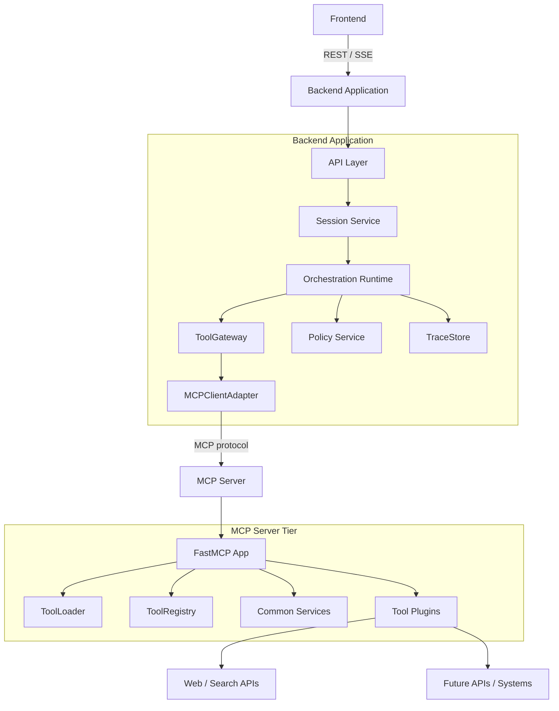
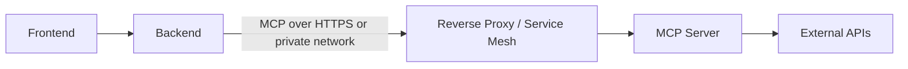

# MCP Server Architecture

**Document:** `mcp-architecture.md`  
**Version:** 1.0  
**Source alignment:** `pluggable_agentic_ai_overall_architecture.md`, `backend-application-architecture.md`, `backend-tooling-mcp-client-architecture.md`, `backend-tooling-mcp-client-plan.md`, `backend-policy-architecture.md`, and `backend-observability-plan.md`  
**Scope:** Separate MCP server tier, Python/FastMCP runtime, modular plugin-tool architecture, boot-time tool loading, tool/capability registry, per-tool configuration, shared MCP server capabilities, web search tool using DuckDuckGo/DDGS, security, observability, testing, deployment, and acceptance criteria.

---

## 1. Purpose

This document defines the architecture for the **Single MCP Server** tier in the three-tier pluggable agentic AI system.

The frontend and backend already exist and are working. This document focuses only on the MCP server deployable and how it exposes external capabilities to the backend through the Model Context Protocol.

The core architecture rule is:

> **The MCP server owns external tool exposure. The backend owns orchestration. The frontend owns user experience.**

The MCP server must be easy to extend. New capabilities should be added by creating a new plugin folder under `mcp/tools/`, adding local configuration when needed, and allowing the MCP server boot process to discover and register the tool automatically.

---

## 2. Source Architecture Alignment

This document follows the existing system rules:

- Minimal V1 has exactly three deployable application pieces:
  - `frontend/`
  - `backend/`
  - `mcp/`
- The frontend communicates with the backend over REST / SSE.
- The backend communicates with the MCP server through MCP only.
- The backend does not contain MCP server implementation code.
- Backend agents and strategies do not call MCP directly.
- Backend agents call tools only through backend `ToolGateway`.
- Backend `MCPClientAdapter` is the only backend component that speaks MCP protocol.
- MCP tools expose external APIs, utilities, and context providers.
- Tool access remains governed by backend policy and MCP server policy.
- Tool inputs and outputs must be structured, bounded, validated, and traceable.
- V1 uses one MCP server endpoint.

This document complements the backend tooling architecture. The backend document defines the client-side `ToolGateway` and `MCPClientAdapter`. This document defines the server-side MCP runtime that those backend components call.

---

## 3. MCP Tier Goals

The MCP server should be:

1. **Separate**  
   It must run as its own deployable tier, not inside the backend application.

2. **FastMCP-based**  
   It should use Python and FastMCP as the MCP server framework.

3. **Plugin-first**  
   Each MCP capability should live in its own folder under `mcp/tools/`.

4. **Auto-discovered**  
   On boot, the MCP server should scan `mcp/tools/`, load enabled tool plugins, validate metadata, and register them with FastMCP.

5. **Registry-backed**  
   The server should maintain a registry of loaded tools, capabilities, schemas, versions, health, and ownership metadata.

6. **Configuration-driven**  
   Global server configuration belongs in `mcp/config/app.yaml`. Each tool may include its own `config.yaml`.

7. **Secure by default**  
   Shared server capabilities should support inbound authentication, outbound token management, TLS-aware deployment, secret resolution, input validation, timeouts, and redaction.

8. **Operationally visible**  
   The server should provide health, readiness, startup diagnostics, structured logs, safe trace correlation, and tool-level metrics.

9. **Easy to extend**  
   Adding a tool should require minimal boilerplate and should not require editing the MCP server core unless adding a new common service.

10. **Safe for agents**  
   Tool results are data, not instructions. Tool output should be normalized and bounded before being returned to the backend.

---

## 4. Non-Goals

This document does not define:

- Frontend UI behavior.
- Backend orchestration behavior.
- Backend `ToolGateway` implementation internals.
- Backend `MCPClientAdapter` implementation internals.
- Backend LLM routing.
- Backend memory retrieval.
- Backend workflow state persistence.
- Backend trace store SQL schema.
- A full enterprise identity provider rollout.
- A full secrets vault implementation.
- A multi-MCP-server topology for V1.
- A tool marketplace.
- Browser automation.
- Human approval UI.
- Long-running distributed job orchestration.

Those concerns belong to frontend, backend, deployment, security, or future platform documents.

---

## 5. Runtime Position in the Three-Tier Architecture



The backend calls the MCP server as a protocol client. The MCP server does not know backend orchestration internals. It only receives tool calls, validates and executes them, and returns structured MCP results.

---

## 6. Recommended Repository Layout

Use `mcp/` as the MCP server root.

```text
project-root/
  frontend/
  backend/
  mcp/
    pyproject.toml
    README.md
    app/
      __init__.py
      main.py
      bootstrap.py
      server.py
      context.py
      registry.py
      loader.py
      config.py
      schemas.py
      errors.py
      health.py
      capabilities.py
      security/
        __init__.py
        auth.py
        jwt.py
        oauth.py
        tls.py
        secrets.py
        scopes.py
        redaction.py
      observability/
        __init__.py
        logging.py
        tracing.py
        metrics.py
        events.py
      services/
        __init__.py
        http_client.py
        rate_limit.py
        cache.py
        clock.py
      tools_base/
        __init__.py
        plugin.py
        models.py
        validation.py
        results.py
        decorators.py
    config/
      app.yaml
    tools/
      websearch/
        __init__.py
        manifest.yaml
        config.yaml
        plugin.py
        models.py
        service.py
        tests/
          test_websearch.py
      example_tool/
        __init__.py
        manifest.yaml
        config.yaml
        plugin.py
    tests/
      unit/
      integration/
      fixtures/
    data/
      cache/
    scripts/
      run_local.sh
      inspect_tools.py
```

### 6.1 Folder Naming Rule

Use this canonical folder path:

```text
mcp/tools/<tool_name>/
```

Avoid using both `mcp/tool/` and `mcp/tools/`. Use plural `tools` consistently.

---

## 7. MCP Server Package Responsibilities

| Module | Responsibility |
|---|---|
| `app/main.py` | Process entry point and FastMCP startup. |
| `app/bootstrap.py` | Composition root for config, registry, loader, common services, and FastMCP app. |
| `app/server.py` | Builds the FastMCP server instance and registers internal health/capability tools if enabled. |
| `app/context.py` | Shared `ToolRuntimeContext` passed to every plugin. |
| `app/registry.py` | Registry of loaded tools, capabilities, schemas, metadata, and health status. |
| `app/loader.py` | Discovers tool folders, reads manifests/config, imports plugins, and registers them. |
| `app/config.py` | Loads and validates `mcp/config/app.yaml` plus tool-level config. |
| `app/schemas.py` | Typed settings models and schema validation. |
| `app/errors.py` | MCP-server-owned error taxonomy. |
| `app/health.py` | Health/readiness/liveness checks. |
| `app/capabilities.py` | Safe capability summaries. |
| `app/security/*` | Shared auth, token, TLS, secret, scope, and redaction helpers. |
| `app/observability/*` | Structured logs, trace correlation, metrics, and event names. |
| `app/services/*` | Common reusable services for plugins, such as HTTP client, cache, and rate limiting. |
| `app/tools_base/*` | Base plugin contracts and reusable plugin utilities. |
| `tools/<name>/` | One isolated tool plugin package per capability group. |

---

## 8. Dependency Direction Rules

Allowed:

```text
app/main.py -> app/bootstrap.py
app/bootstrap.py -> app/config.py
app/bootstrap.py -> app/server.py
app/bootstrap.py -> app/loader.py
app/bootstrap.py -> app/registry.py
app/bootstrap.py -> app/security/*
app/bootstrap.py -> app/observability/*
app/bootstrap.py -> app/services/*
app/loader.py -> mcp/tools/<tool>/plugin.py
mcp/tools/<tool> -> app/tools_base/*
mcp/tools/<tool> -> app/context.py interfaces
mcp/tools/<tool> -> app/services/* interfaces
```

Avoid:

```text
mcp/tools/<tool> -> backend/*
mcp/tools/<tool> -> frontend/*
mcp/tools/<tool> -> backend ToolGateway
mcp/tools/<tool> -> backend MemoryGateway
mcp/tools/<tool> -> backend TraceStore
mcp/tools/<tool> -> backend LLMGateway
mcp/tools/<tool> -> raw environment variables directly
mcp/tools/<tool> -> direct secret files
mcp/tools/<tool> -> unbounded network clients
backend/* -> mcp/tools/<tool> direct import
frontend/* -> mcp/tools/<tool> direct import
```

### 8.1 Practical Rule

Tool plugins may use common MCP server services through `ToolRuntimeContext`. They should not build their own global configuration loader, secret loader, logger, auth client, or unbounded HTTP client.

---

## 9. FastMCP Runtime Approach

The MCP server should use FastMCP as the server framework.

Recommended runtime shape:

```python
from fastmcp import FastMCP


def build_server() -> FastMCP:
    mcp = FastMCP("main_mcp")
    # bootstrap loads config, common services, tool registry, and tools
    return mcp


if __name__ == "__main__":
    server = build_server()
    server.run(transport="http", host="0.0.0.0", port=9001, path="/mcp")
```

Depending on the locked MCP dependency, the project may use either:

```python
from fastmcp import FastMCP
```

or the official SDK-style import:

```python
from mcp.server.fastmcp import FastMCP
```

The project should pick one dependency path in `mcp/pyproject.toml` and keep it consistent. The architecture recommendation is to use the actively maintained FastMCP package unless repository constraints require the official SDK import path.

---

## 10. Boot Sequence

On startup, the MCP server should perform a deterministic boot sequence.

```text
1. Start process.
2. Load environment variables needed for bootstrap only.
3. Load `mcp/config/app.yaml`.
4. Resolve environment placeholders.
5. Validate server configuration.
6. Initialize structured logging.
7. Initialize redactor.
8. Initialize secret resolver.
9. Initialize inbound auth verifier.
10. Initialize outbound OAuth/JWT/token providers.
11. Initialize shared HTTP client factory.
12. Initialize rate limiter and cache.
13. Initialize ToolRegistry.
14. Scan `mcp/tools/` for tool folders.
15. For each tool folder:
    a. read `manifest.yaml`
    b. read optional `config.yaml`
    c. merge server defaults, global tool settings, and tool config
    d. validate tool metadata
    e. import plugin module
    f. instantiate/register plugin
    g. register tool metadata and capabilities in ToolRegistry
    h. register FastMCP tool handlers
16. Register optional internal health/capability tools.
17. Run startup self-checks.
18. Start FastMCP transport.
```

### 10.1 Boot Failure Rule

Fail fast when:

- `app.yaml` is missing or invalid.
- A required secret is missing.
- A tool is enabled but its manifest is invalid.
- Two tools register the same MCP tool name.
- A plugin import fails for an enabled required tool.
- A plugin declares an invalid input or output schema.
- The transport configuration is invalid.

Allow degraded boot only when explicitly configured:

```yaml
mcp_server:
  startup:
    fail_on_optional_tool_error: false
```

Optional tools that fail to load should be marked unhealthy and unavailable, not silently ignored.

---

## 11. Global MCP Server Configuration

The global configuration file is:

```text
mcp/config/app.yaml
```

Recommended shape:

```yaml
server:
  name: main_mcp
  version: 1.0.0
  environment: ${env:MCP_ENV:local}
  host: ${env:MCP_HOST:0.0.0.0}
  port: ${env:MCP_PORT:9001}
  path: /mcp
  transport: http
  public_base_url: ${env:MCP_PUBLIC_BASE_URL:http://localhost:9001}

runtime:
  tools_dir: mcp/tools
  discovery_on_startup: true
  fail_on_required_tool_error: true
  fail_on_optional_tool_error: false
  reload_tools_in_dev: false

security:
  inbound_auth:
    enabled: false
    mode: none              # none | bearer | jwt | oauth_introspection
    bearer_token_env: MCP_BEARER_TOKEN
    jwt:
      issuer: ${env:MCP_JWT_ISSUER:}
      audience: ${env:MCP_JWT_AUDIENCE:}
      jwks_url: ${env:MCP_JWT_JWKS_URL:}
      allowed_algorithms: [RS256]
    oauth_introspection:
      introspection_url: ${env:MCP_OAUTH_INTROSPECTION_URL:}
      client_id_env: MCP_OAUTH_INTROSPECTION_CLIENT_ID
      client_secret_env: MCP_OAUTH_INTROSPECTION_CLIENT_SECRET

  outbound_auth:
    default_mode: none
    oauth_clients: {}
    jwt_clients: {}

  tls:
    mode: terminate_upstream  # off | terminate_here | terminate_upstream
    cert_file: ${env:MCP_TLS_CERT_FILE:}
    key_file: ${env:MCP_TLS_KEY_FILE:}
    behind_proxy: true

  secrets:
    provider: env            # env | file | future_vault
    allow_tool_env_prefixes:
      - MCP_TOOL_
      - WEBSEARCH_

policy:
  default_tool_enabled: false
  expose_internal_tools: true
  expose_health_tool: true
  expose_capabilities_tool: true
  require_tool_manifest: true
  require_tool_config_validation: true
  reject_secret_like_arguments: true

observability:
  log_level: ${env:MCP_LOG_LEVEL:INFO}
  json_logs: true
  trace_headers:
    inbound_trace_id: x-trace-id
    inbound_request_id: x-request-id
  redact_secrets: true
  metrics_enabled: true
  max_log_payload_chars: 2000

defaults:
  timeout_seconds: 30
  max_result_bytes: 262144
  max_argument_bytes: 65536
  max_results: 10
  rate_limit:
    enabled: true
    per_tool_per_minute: 60

tools:
  websearch:
    enabled: true
    required: true
    config_file: config.yaml
```

### 11.1 Configuration Authority Rule

The MCP server should read server configuration from `mcp/config/app.yaml`. Tool plugins should read their local settings from the merged runtime context, not from raw YAML files directly.

---

## 12. Per-Tool Folder Contract

Each tool capability lives in one folder:

```text
mcp/tools/<tool_name>/
```

Minimum required files:

```text
mcp/tools/<tool_name>/
  __init__.py
  manifest.yaml
  plugin.py
```

Optional files:

```text
mcp/tools/<tool_name>/
  config.yaml
  models.py
  service.py
  README.md
  tests/
```

### 12.1 Tool Manifest

Each tool must include `manifest.yaml`.

Example:

```yaml
name: websearch
package: mcp.tools.websearch
version: 1.0.0
status: stable
owner: platform
required: true

description: Search the web through DuckDuckGo/DDGS and return bounded structured results.

capabilities:
  - name: web.search
    type: tool
    risk_level: read_only
    description: Search public web results.

tools:
  - name: websearch.search
    function: search
    capability: web.search
    description: Search public web results using DuckDuckGo/DDGS.
    risk_level: read_only
    input_schema: auto
    output_schema: structured_results
    timeout_seconds: 20
    max_result_bytes: 65536
    tags: [web, search, read_only]

config_schema:
  type: object
  required: [provider, max_results]
  properties:
    provider:
      type: string
      enum: [ddgs]
    max_results:
      type: integer
      minimum: 1
      maximum: 25
    region:
      type: string
    safesearch:
      type: string
      enum: [off, moderate, strict]
```

### 12.2 Tool Config

Each tool may include `config.yaml`.

Example:

```yaml
provider: ddgs
max_results: 10
region: us-en
safesearch: moderate
time_limit: null
backend: duckduckgo
cache_seconds: 300
timeout_seconds: 15
result_fields:
  - title
  - href
  - body
```

### 12.3 Plugin Module

Each tool must expose a plugin registration entry point.

Recommended contract:

```python
# mcp/tools/<tool_name>/plugin.py

from app.context import ToolRuntimeContext
from app.tools_base.plugin import ToolPlugin


def create_plugin(context: ToolRuntimeContext) -> ToolPlugin:
    return MyToolPlugin(context)
```

The loader calls `create_plugin(context)`, validates the plugin descriptor, and asks the plugin to register FastMCP tools.

---

## 13. Tool Plugin Contract

Recommended plugin protocol:

```python
from typing import Protocol
from fastmcp import FastMCP


class ToolPlugin(Protocol):
    name: str
    version: str
    capabilities: list["CapabilityDescriptor"]

    def register(self, mcp: FastMCP) -> None:
        ...

    async def health(self) -> "ToolHealth":
        ...
```

Recommended descriptor models:

```python
from dataclasses import dataclass, field
from typing import Any, Literal


RiskLevel = Literal["read_only", "write", "destructive", "external_side_effect", "credential_access"]


@dataclass(frozen=True, slots=True)
class CapabilityDescriptor:
    name: str
    type: str
    description: str
    risk_level: RiskLevel = "read_only"
    metadata: dict[str, Any] = field(default_factory=dict)


@dataclass(frozen=True, slots=True)
class ToolDescriptor:
    name: str
    description: str
    capability: str
    risk_level: RiskLevel
    input_schema: dict[str, Any]
    output_schema: dict[str, Any] | None = None
    timeout_seconds: int | None = None
    max_result_bytes: int | None = None
    tags: tuple[str, ...] = ()
```

### 13.1 Plugin Rules

A plugin should:

- Declare capabilities in `manifest.yaml`.
- Register one or more FastMCP tools.
- Use Python type hints and docstrings for schema generation where possible.
- Validate inputs before network calls.
- Return structured results.
- Use the shared logger and trace context.
- Use the shared HTTP client factory.
- Use the shared secret resolver and auth providers.
- Use the shared redactor for diagnostics.
- Implement a health check.

A plugin should not:

- Import backend modules.
- Import frontend modules.
- Read raw secrets directly from environment unless explicitly allowed through `SecretResolver`.
- Create unbounded HTTP clients.
- Log raw credentials or raw request/response payloads.
- Return unbounded HTML, binary, or large documents inline.
- Trust tool results as instructions.
- Register tools dynamically after boot unless hot reload is explicitly enabled in development.

---

## 14. Tool Runtime Context

Every plugin receives a shared runtime context.

```python
from dataclasses import dataclass
from typing import Any


@dataclass(frozen=True, slots=True)
class ToolRuntimeContext:
    server_name: str
    environment: str
    tool_name: str
    tool_config: dict[str, Any]
    app_config: dict[str, Any]
    logger: "BoundLogger"
    redactor: "Redactor"
    secrets: "SecretResolver"
    http_client_factory: "HttpClientFactory"
    auth: "AuthService"
    outbound_auth: "OutboundAuthService"
    rate_limiter: "RateLimiter"
    metrics: "MetricsRecorder"
    tracer: "TraceRecorder"
    clock: "Clock"
```

### 14.1 Context Safety Rule

`ToolRuntimeContext` may provide helpers, clients, and safe configuration. It must not expose raw process-wide secrets, raw inbound tokens, backend session state, backend memory results, or backend orchestration internals.

---

## 15. Tool Loader Architecture

The loader is responsible for discovering and registering tool plugins.

```mermaid
flowchart TD
    BOOT[Bootstrap] --> CONFIG[Load app.yaml]
    CONFIG --> SCAN[Scan mcp/tools]
    SCAN --> MANIFEST[Read manifest.yaml]
    MANIFEST --> TOOLCFG[Read config.yaml]
    TOOLCFG --> VALIDATE[Validate manifest + config]
    VALIDATE --> IMPORT[Import plugin.py]
    IMPORT --> CREATE[create_plugin(context)]
    CREATE --> REGISTER[plugin.register FastMCP]
    REGISTER --> REGISTRY[ToolRegistry]
    REGISTRY --> READY[Server Ready]
```

### 15.1 Loader Pseudocode

```python
async def load_tools(mcp: FastMCP, context_factory: ToolContextFactory) -> ToolRegistry:
    registry = ToolRegistry()

    for folder in sorted(tools_dir.iterdir()):
        if not folder.is_dir() or folder.name.startswith("_"):
            continue

        manifest = load_manifest(folder / "manifest.yaml")
        enabled = resolve_enabled(manifest.name, app_config)

        if not enabled:
            registry.register_disabled(manifest)
            continue

        tool_config = load_optional_yaml(folder / "config.yaml")
        merged_config = merge_tool_config(app_config, manifest, tool_config)
        validate_tool_config(manifest, merged_config)

        module = importlib.import_module(f"mcp.tools.{folder.name}.plugin")
        plugin = module.create_plugin(context_factory.for_tool(manifest.name, merged_config))

        plugin.register(mcp)
        registry.register_plugin(plugin, manifest, merged_config)

    return registry
```

### 15.2 Determinism Rule

Tool loading order should be deterministic. Sort folder names before loading so startup behavior is stable across platforms.

---

## 16. Tool Registry Architecture

The MCP server keeps an internal registry of all discovered and loaded tools.

The registry owns:

- Tool folder name.
- Tool package name.
- Tool version.
- Tool enabled/disabled status.
- Required/optional status.
- FastMCP tool names.
- Capability descriptors.
- Risk level.
- Input schema.
- Output schema.
- Owner metadata.
- Tags.
- Health status.
- Last load error.
- Last health-check time.

Recommended registry interface:

```python
class ToolRegistry:
    def register_plugin(self, plugin: ToolPlugin, manifest: ToolManifest, config: dict) -> None: ...
    def register_disabled(self, manifest: ToolManifest) -> None: ...
    def get_tool(self, tool_name: str) -> RegisteredTool | None: ...
    def list_tools(self) -> list[RegisteredTool]: ...
    def list_capabilities(self) -> list[CapabilityDescriptor]: ...
    def mark_unhealthy(self, tool_name: str, reason: str) -> None: ...
    def health_summary(self) -> ToolRegistryHealth: ...
```

### 16.1 Registry Visibility

The registry is internal to the MCP server. The backend may discover tool schemas through MCP protocol, but it should not depend on the registry's internal Python objects.

---

## 17. Capability Naming Convention

Use dot-separated capability names.

Recommended examples:

```text
web.search
web.news_search
documents.retrieve
support.ticket_lookup
ops.runbook_search
filesystem.project_read
calendar.event_create
email.draft
```

Tool names should be similarly scoped:

```text
websearch.search
websearch.news
support.lookup_ticket
filesystem.read_project_file
```

### 17.1 Naming Rule

Use stable logical names. Do not encode implementation details in tool names.

Allowed:

```text
websearch.search
```

Avoid:

```text
ddgs_python_duckduckgo_text_search_v9
```

---

## 18. Common MCP Server Capabilities

It is beneficial for the MCP server to provide common capabilities that plugin tools can leverage.

The MCP server should centralize these cross-cutting concerns:

| Capability | Recommendation | Why It Belongs in MCP Server Core |
|---|---|---|
| Inbound authentication | Yes | All tool calls should have a consistent authentication boundary. |
| JWT verification | Yes | Many deployments will use service-to-service JWTs from the backend to MCP. |
| OAuth token handling | Yes | Tools frequently need outbound OAuth tokens for downstream APIs. |
| TLS support | Yes, but deployment-aware | Local dev may use HTTP; production should terminate TLS at proxy or server. |
| Secret resolution | Yes | Plugins should not read secrets directly. |
| Redaction | Yes | Logs, traces, errors, and health output need consistent secret handling. |
| Shared HTTP client | Yes | Enforces timeout, retry, proxy, headers, and TLS verification consistently. |
| Rate limiting | Yes | Protects downstream APIs and the MCP process. |
| Input validation | Yes | Blocks invalid or unsafe arguments before tool execution. |
| Output bounding | Yes | Prevents large results from overwhelming backend or LLM context. |
| Structured logging | Yes | Makes tools diagnosable without leaking data. |
| Trace correlation | Yes | Allows backend trace IDs to follow MCP calls. |
| Metrics | Yes | Provides per-tool latency, error count, and call count. |
| Health checks | Yes | Backend and operators need safe MCP readiness status. |
| Capability summaries | Yes | Backend can show safe feature discovery. |
| Cache service | Optional | Useful for web search and read-only integrations. |
| Approval workflow | No for V1 core | Approval should be owned primarily by backend policy/orchestration; MCP can mark risk. |
| LLM calls | No by default | LLM routing belongs to backend `LLMGateway`, not MCP tools. |
| Long-term memory | No by default | Memory belongs behind backend `MemoryGateway`. |

### 18.1 Security Boundary Recommendation

Use layered security:

```text
Frontend auth/session
  -> Backend API auth/session/policy
    -> Backend ToolGateway policy
      -> Backend MCPClientAdapter service auth
        -> MCP inbound auth
          -> MCP tool-specific validation/scope checks
            -> Downstream API auth
```

This prevents a single missed check from exposing sensitive tools.

---

## 19. JWT, OAuth, and TLS Review

### 19.1 JWT

JWT support is beneficial when the backend and MCP server communicate as separate services.

Recommended V1 modes:

```yaml
security:
  inbound_auth:
    enabled: true
    mode: jwt
    jwt:
      issuer: ${env:MCP_JWT_ISSUER}
      audience: ${env:MCP_JWT_AUDIENCE}
      jwks_url: ${env:MCP_JWT_JWKS_URL}
      allowed_algorithms: [RS256]
```

JWT claims should be used for service identity and coarse authorization only. Tool-level permission remains primarily controlled by backend policy and MCP tool configuration.

### 19.2 OAuth

OAuth is beneficial for outbound downstream APIs.

Recommended V1 support:

```yaml
security:
  outbound_auth:
    oauth_clients:
      example_api:
        token_url: ${env:EXAMPLE_OAUTH_TOKEN_URL}
        client_id_env: EXAMPLE_OAUTH_CLIENT_ID
        client_secret_env: EXAMPLE_OAUTH_CLIENT_SECRET
        scopes: [read:data]
```

Plugins should request tokens by logical client name:

```python
token = await context.outbound_auth.get_access_token("example_api")
```

Plugins should not construct OAuth requests themselves unless implementing a new reusable auth provider.

### 19.3 TLS

TLS is beneficial and should be required outside local development.

Recommended deployment choices:

| Mode | Use Case |
|---|---|
| `off` | Local-only development. |
| `terminate_here` | MCP process owns certificate files directly. |
| `terminate_upstream` | Reverse proxy, ingress, or gateway terminates TLS. Recommended for most deployments. |

For production, prefer TLS termination at a reverse proxy or ingress with mTLS or service-token authentication between backend and MCP when available.

### 19.4 Recommendation Summary

The MCP server should provide common JWT, OAuth, TLS-aware, secret, redaction, and HTTP-client capabilities because plugin tools should not each implement security differently. Tool authors should focus on domain logic while platform-level security remains centralized.

---

## 20. Inbound Request Context

The MCP server should capture safe context from inbound requests.

Recommended fields:

```python
@dataclass(frozen=True, slots=True)
class InboundRequestContext:
    trace_id: str | None
    request_id: str | None
    caller_service: str | None
    authenticated: bool
    auth_subject: str | None
    auth_scopes: tuple[str, ...]
    client_ip_summary: str | None = None
```

### 20.1 Header Handling

The backend MCP client should forward a trace ID header, such as:

```text
x-trace-id: trace_abc123
```

The MCP server should propagate that trace ID into logs and metrics, but should not trust arbitrary user-supplied headers unless they come through the authenticated backend path.

---

## 21. Tool Input Validation

Every tool should validate input before execution.

Validation should include:

- Required fields.
- Type checks.
- String length limits.
- Array size limits.
- Enum constraints.
- Numeric min/max constraints.
- Serialized argument byte limit.
- Secret-like key rejection.
- URL allowlist/denylist when tools fetch URLs.
- Safe default values.

Secret-like argument keys should be rejected or redacted:

```text
api_key
authorization
bearer
client_secret
cookie
credential
jwt
password
refresh_token
secret
token
```

### 21.1 Validation Ownership

Validation happens at two layers:

```text
Backend ToolGateway validates logical request before MCP call.
MCP server validates actual MCP tool arguments before downstream execution.
```

Both are necessary. Backend validation protects orchestration; MCP validation protects the integration tier.

---

## 22. Tool Result Contract

Tool results should be structured, bounded, and safe.

Recommended normalized result shape:

```python
@dataclass(frozen=True, slots=True)
class ToolResultEnvelope:
    status: str
    tool_name: str
    data: dict | list | str | None
    summary: dict
    citations: list[dict] | None = None
    metadata: dict | None = None
    error: dict | None = None
```

Result rules:

- Return structured JSON where possible.
- Include safe summary metadata.
- Include citations/provenance for search-like tools.
- Truncate or reject oversized results.
- Never return credentials.
- Never return raw HTTP response objects.
- Never return unbounded HTML by default.
- Mark truncated results explicitly.

---

## 23. Web Search Tool Architecture

V1 should include one web search tool using DuckDuckGo/DDGS.

Tool folder:

```text
mcp/tools/websearch/
  __init__.py
  manifest.yaml
  config.yaml
  plugin.py
  models.py
  service.py
  tests/
    test_websearch.py
```

### 23.1 Web Search Capability

Capability:

```text
web.search
```

MCP tool name:

```text
websearch.search
```

Risk level:

```text
read_only
```

Primary purpose:

```text
Search public web results and return bounded result summaries with URLs, titles, snippets, and source metadata.
```

### 23.2 Web Search Tool Config

```yaml
provider: ddgs
backend: duckduckgo
region: us-en
safesearch: moderate
time_limit: null
max_results: 10
max_query_chars: 500
timeout_seconds: 15
cache_seconds: 300
allowed_result_fields:
  - title
  - href
  - body
result_limits:
  max_title_chars: 200
  max_url_chars: 1000
  max_snippet_chars: 500
  max_results: 10
```

### 23.3 Web Search Input Model

```python
from pydantic import BaseModel, Field


class WebSearchRequest(BaseModel):
    query: str = Field(min_length=1, max_length=500)
    max_results: int = Field(default=5, ge=1, le=10)
    region: str = Field(default="us-en", max_length=20)
    safesearch: str = Field(default="moderate", pattern="^(off|moderate|strict)$")
    time_limit: str | None = Field(default=None, description="Optional provider-supported time filter.")
```

### 23.4 Web Search Result Model

```python
from pydantic import BaseModel, Field, HttpUrl


class WebSearchResult(BaseModel):
    title: str = Field(max_length=200)
    url: HttpUrl
    snippet: str = Field(max_length=500)
    rank: int
    source: str = "duckduckgo"


class WebSearchResponse(BaseModel):
    query: str
    provider: str
    results: list[WebSearchResult]
    result_count: int
    truncated: bool = False
```

### 23.5 Web Search Plugin Example

```python
# mcp/tools/websearch/plugin.py

from fastmcp import FastMCP
from app.context import ToolRuntimeContext
from app.tools_base.plugin import ToolPlugin
from .models import WebSearchRequest, WebSearchResponse
from .service import WebSearchService


class WebSearchPlugin(ToolPlugin):
    name = "websearch"
    version = "1.0.0"

    def __init__(self, context: ToolRuntimeContext) -> None:
        self.context = context
        self.service = WebSearchService(context)

    def register(self, mcp: FastMCP) -> None:
        @mcp.tool(name="websearch.search")
        async def search(
            query: str,
            max_results: int = 5,
            region: str = "us-en",
            safesearch: str = "moderate",
            time_limit: str | None = None,
        ) -> dict:
            """Search public web results using DuckDuckGo/DDGS."""
            request = WebSearchRequest(
                query=query,
                max_results=max_results,
                region=region,
                safesearch=safesearch,
                time_limit=time_limit,
            )
            response: WebSearchResponse = await self.service.search(request)
            return response.model_dump(mode="json")

    async def health(self):
        return await self.service.health()


def create_plugin(context: ToolRuntimeContext) -> ToolPlugin:
    return WebSearchPlugin(context)
```

### 23.6 Web Search Service Example

```python
# mcp/tools/websearch/service.py

import asyncio
from ddgs import DDGS
from .models import WebSearchRequest, WebSearchResponse, WebSearchResult


class WebSearchService:
    def __init__(self, context):
        self.context = context

    async def search(self, request: WebSearchRequest) -> WebSearchResponse:
        await self.context.rate_limiter.check("websearch.search")

        results = await asyncio.to_thread(self._search_sync, request)
        bounded = [self._to_result(item, i + 1) for i, item in enumerate(results)]

        return WebSearchResponse(
            query=request.query,
            provider="ddgs",
            results=bounded,
            result_count=len(bounded),
            truncated=len(bounded) >= request.max_results,
        )

    def _search_sync(self, request: WebSearchRequest) -> list[dict]:
        with DDGS(timeout=self.context.tool_config.get("timeout_seconds", 15)) as ddgs:
            return list(ddgs.text(
                request.query,
                region=request.region,
                safesearch=request.safesearch,
                timelimit=request.time_limit,
                max_results=request.max_results,
                backend=self.context.tool_config.get("backend", "duckduckgo"),
            ))

    def _to_result(self, item: dict, rank: int) -> WebSearchResult:
        return WebSearchResult(
            title=str(item.get("title", ""))[:200],
            url=item.get("href") or item.get("url"),
            snippet=str(item.get("body", ""))[:500],
            rank=rank,
            source="duckduckgo",
        )

    async def health(self) -> dict:
        return {"status": "ok", "provider": "ddgs"}
```

### 23.7 Web Search Safety Rules

The web search tool should:

- Limit query length.
- Limit result count.
- Limit title, URL, and snippet lengths.
- Return URLs as citations/provenance, not raw pages.
- Avoid fetching full pages in V1.
- Avoid returning raw HTML.
- Cache identical read-only queries for a short period if configured.
- Respect provider rate limits.
- Treat search snippets as untrusted data.
- Include clear error messages when provider calls fail.

The web search tool should not:

- Execute JavaScript.
- Crawl arbitrary sites recursively.
- Download files.
- Bypass robots or provider rate limits.
- Return credentials from URLs or query parameters if detected.
- Store search results as long-term memory.
- Call backend memory or LLM services directly.

---

## 24. FastMCP Tool Registration Pattern

Tool functions should be small wrappers around service classes.

Recommended pattern:

```text
FastMCP tool function
  -> Pydantic input model validation
  -> shared rate limiter
  -> tool service call
  -> result normalization
  -> response model dump
```

Avoid large tool functions that contain all business logic, network handling, auth, validation, and formatting in one place.

---

## 25. Internal Health and Capabilities

The MCP server should expose health and capability information in two ways:

1. Process-level HTTP health route if the chosen deployment stack supports it.
2. Optional MCP tools/resources for backend discovery.

Recommended internal tools:

```text
mcp.health
mcp.capabilities
mcp.tools.list
```

Enable them through config:

```yaml
policy:
  expose_internal_tools: true
  expose_health_tool: true
  expose_capabilities_tool: true
```

### 25.1 Health Output

Safe health response:

```json
{
  "status": "ok",
  "server": {
    "name": "main_mcp",
    "version": "1.0.0",
    "environment": "local"
  },
  "tools": {
    "loaded": 1,
    "enabled": 1,
    "disabled": 0,
    "unhealthy": 0
  },
  "security": {
    "inbound_auth_enabled": false,
    "tls_mode": "terminate_upstream"
  }
}
```

Do not expose:

- API keys.
- Bearer tokens.
- JWTs.
- OAuth client secrets.
- Private endpoint URLs when configured as sensitive.
- Raw tool configs.
- Raw error stack traces in production.

### 25.2 Capabilities Output

Safe capabilities response:

```json
{
  "server": "main_mcp",
  "capabilities": [
    {
      "name": "web.search",
      "type": "tool",
      "tool_name": "websearch.search",
      "risk_level": "read_only",
      "enabled": true
    }
  ]
}
```

---

## 26. Observability Architecture

The MCP server should emit structured observability events.

Recommended event names:

```text
mcp_startup_started
mcp_config_loaded
mcp_config_invalid
mcp_tool_discovery_started
mcp_tool_manifest_loaded
mcp_tool_config_loaded
mcp_tool_registered
mcp_tool_registration_failed
mcp_tool_call_started
mcp_tool_call_completed
mcp_tool_call_failed
mcp_tool_call_timeout
mcp_tool_call_cancelled
mcp_health_checked
mcp_shutdown_started
mcp_shutdown_completed
```

### 26.1 Trace Correlation

The MCP server should accept trace headers from the backend MCP client and include trace ID in logs and metrics.

Recommended safe trace fields:

```text
trace_id
request_id
server_name
tool_name
capability_name
status
duration_ms
error_code
truncated
result_count
```

Do not trace raw arguments or raw results by default.

---

## 27. Error Taxonomy

Recommended MCP server error classes:

```text
MCPServerConfigError
ToolDiscoveryError
ToolManifestError
ToolConfigError
ToolImportError
ToolRegistrationError
ToolNotFoundError
ToolDisabledError
ToolInputValidationError
ToolPolicyError
ToolAuthError
ToolRateLimitError
ToolTimeoutError
ToolDownstreamError
ToolResultTooLargeError
ToolExecutionError
```

### 27.1 Error Response Rule

Return safe errors to MCP clients:

```json
{
  "error": {
    "code": "tool_timeout",
    "message": "The websearch.search tool timed out.",
    "retryable": true,
    "tool_name": "websearch.search"
  }
}
```

Avoid returning raw downstream stack traces or provider error payloads.

---

## 28. Plugin Security Model

Every plugin runs in the same Python MCP process in V1, so trust boundaries must be enforced by code review, configuration, tests, and shared services.

V1 plugin security controls:

- Deny tools by default unless enabled in `app.yaml`.
- Require manifest metadata.
- Validate tool config at boot.
- Validate tool arguments at call time.
- Use shared timeout and result bounds.
- Use shared redaction.
- Use shared secret resolver.
- Use shared outbound auth provider.
- Use shared rate limiter.
- Emit trace events for every tool call.
- Treat tool output as untrusted data.

Future hardening options:

- Per-tool process isolation.
- Containerized tool workers.
- Network egress policy per tool.
- Filesystem sandboxing.
- OPA/Cedar policy integration.
- mTLS between backend and MCP.
- Secret vault integration.

---

## 29. Tool Configuration Merge Rules

Tool configuration should be merged in this order:

```text
1. Server defaults from `mcp/config/app.yaml`
2. Global tool settings from `mcp/config/app.yaml tools.<tool_name>`
3. Tool-local `mcp/tools/<tool_name>/config.yaml`
4. Environment variable substitutions
5. Runtime-safe computed defaults
```

Precedence should be explicit and tested.

### 29.1 Environment Variable Rule

Environment variables should be resolved only by the configuration layer or secret resolver. Plugins should not call `os.environ` directly except in test-only code.

---

## 30. Testing Strategy

### 30.1 Unit Tests

Each tool should include unit tests for:

- Manifest validation.
- Config validation.
- Input validation.
- Result normalization.
- Error handling.
- Health checks.
- Timeout handling where practical.

### 30.2 Loader Tests

The MCP server should include tests for:

- Loading all enabled tools.
- Skipping disabled tools.
- Failing on required tool load failure.
- Degrading on optional tool load failure when configured.
- Detecting duplicate tool names.
- Validating capability registry output.

### 30.3 FastMCP Tests

Use in-memory or local FastMCP testing when possible.

Test cases:

```text
- websearch.search appears in tool list
- websearch.search validates inputs
- websearch.search returns bounded structured results
- invalid tool arguments fail safely
- health/capability tools return safe summaries
```

### 30.4 Integration Tests

Optional integration tests can call real DDGS/DuckDuckGo search, but they should be isolated from normal CI because external search can be rate-limited or unstable.

Recommended markers:

```text
@pytest.mark.integration
@pytest.mark.external_network
```

---

## 31. Local Development Commands

Recommended commands:

```bash
cd mcp
python -m venv .venv
source .venv/bin/activate
pip install -e .
python -m app.main
```

Recommended local endpoint:

```text
http://localhost:9001/mcp
```

Backend should point to:

```env
MCP_MAIN_URL=http://localhost:9001/mcp
```

---

## 32. Recommended `pyproject.toml`

```toml
[project]
name = "pluggable-agentic-ai-mcp"
version = "1.0.0"
description = "MCP server for pluggable agentic AI tools"
requires-python = ">=3.12"
dependencies = [
  "fastmcp>=2.0",
  "pydantic>=2.0",
  "PyYAML>=6.0",
  "httpx>=0.27",
  "ddgs>=9.0",
]

[project.optional-dependencies]
dev = [
  "pytest>=8.0",
  "pytest-asyncio>=0.23",
  "ruff>=0.6",
  "mypy>=1.10",
]

[tool.ruff]
line-length = 100

[tool.pytest.ini_options]
asyncio_mode = "auto"
markers = [
  "integration: integration tests",
  "external_network: tests requiring external network access",
]
```

If the project chooses the official MCP Python SDK import path instead, replace `fastmcp>=2.0` with the pinned official SDK dependency used by the repository.

---

## 33. Deployment Architecture

Recommended local runtime:

```text
Frontend process
Backend process
MCP server process
```

Recommended local startup order:

```text
1. Start MCP server on http://localhost:9001/mcp
2. Start backend with MCP_MAIN_URL=http://localhost:9001/mcp
3. Start frontend pointing to backend
```

Recommended production topology:



### 33.1 Production Controls

Production should include:

- TLS or private service mesh transport.
- Backend-to-MCP service authentication.
- Inbound JWT or bearer token validation.
- Least-privilege outbound API credentials.
- Structured logs.
- Health/readiness checks.
- Rate limits.
- Timeout defaults.
- Tool result bounds.
- Secret redaction.
- Safe startup diagnostics.

---

## 34. Implementation Phases

### Phase 1: MCP Foundation Skeleton

Deliverables:

- `mcp/` package.
- `mcp/pyproject.toml`.
- `mcp/app/main.py`.
- Basic FastMCP server.
- `mcp/config/app.yaml`.
- Basic health tool.

Success criteria:

- MCP server starts locally.
- MCP endpoint is reachable.
- Health returns safe status.

### Phase 2: Configuration and Common Services

Deliverables:

- Config loader.
- Typed settings.
- Environment interpolation.
- Redactor.
- Logger.
- Secret resolver.
- Shared HTTP client factory.
- Rate limiter stub.

Success criteria:

- Valid config loads.
- Invalid config fails fast.
- Secrets are redacted in logs and health output.

### Phase 3: Tool Plugin Contract

Deliverables:

- `ToolPlugin` protocol.
- Manifest schema.
- Tool config schema.
- Runtime context.
- Plugin validation helpers.

Success criteria:

- A fake example plugin can be loaded and registered.
- Invalid manifests fail with clear errors.

### Phase 4: Tool Loader and Registry

Deliverables:

- Tool folder scanner.
- Manifest/config reader.
- Dynamic plugin importer.
- Tool registry.
- Capability registry.

Success criteria:

- Enabled tools are loaded on boot.
- Disabled tools are skipped.
- Duplicate tool names fail startup.
- Capabilities list is accurate.

### Phase 5: Web Search Tool

Deliverables:

- `mcp/tools/websearch/`.
- Manifest and config.
- DDGS-backed service.
- FastMCP tool registration.
- Unit tests.
- Optional external integration test.

Success criteria:

- `websearch.search` is available.
- Search returns bounded structured results.
- Invalid input fails safely.
- External failures return normalized errors.

### Phase 6: Security Hardening

Deliverables:

- Inbound bearer/JWT support.
- Outbound OAuth provider interface.
- TLS-aware config.
- Secret resolver hardening.
- Argument secret detection.

Success criteria:

- MCP can run locally with no auth.
- MCP can run in secured mode with JWT or bearer auth.
- Credentials never appear in logs, traces, health, or tool output.

### Phase 7: Observability and Operations

Deliverables:

- Trace correlation.
- Tool call events.
- Metrics recorder.
- Readiness checks.
- Startup diagnostics.

Success criteria:

- Every tool call has safe trace-correlated logs.
- Health shows loaded/unhealthy tool counts.
- Metrics include call count, error count, and duration.

### Phase 8: Backend Integration Smoke Test

Deliverables:

- Backend `MCP_MAIN_URL` points to local MCP.
- Backend discovers `websearch.search` through MCP.
- Backend tool gateway can call web search tool.

Success criteria:

- Chat request can trigger backend tool call to MCP web search.
- API/session/orchestration boundaries remain unchanged.
- Tool result is normalized back to backend.

---

## 35. Acceptance Criteria

This MCP architecture is complete when:

- The MCP server is a separate deployable under `mcp/`.
- The MCP server uses Python and FastMCP.
- Global MCP configuration is stored in `mcp/config/app.yaml`.
- Each tool capability lives in its own folder under `mcp/tools/<tool_name>/`.
- Each tool may provide its own `config.yaml`.
- The server scans `mcp/tools/` on boot.
- The server loads enabled tools automatically.
- The server validates every enabled tool manifest.
- The server validates every enabled tool config.
- The server registers loaded tools with FastMCP.
- The server maintains a `ToolRegistry` of tools and capabilities.
- The registry exposes safe health and capability summaries.
- Tool names and capability names are stable and logical.
- Duplicate tool names fail startup.
- Disabled tools do not register with FastMCP.
- Optional failed tools are marked unhealthy when configured to degrade.
- Required failed tools fail startup.
- Common services are available to plugins through `ToolRuntimeContext`.
- Plugins do not read raw secrets directly.
- Plugins do not import backend or frontend modules.
- JWT support is available for secured backend-to-MCP calls.
- OAuth client credentials support is available for downstream API integrations.
- TLS is supported directly or through upstream termination.
- Logs, traces, health, and capability outputs are secret-safe.
- Tool arguments are validated before execution.
- Tool results are bounded before returning to backend.
- Web search tool exists at `mcp/tools/websearch/`.
- Web search uses DDGS/DuckDuckGo.
- Web search returns structured result summaries with source URLs.
- Web search does not return raw HTML or crawl full pages in V1.
- Backend can call the MCP server through its existing MCP client adapter without importing MCP server code.

---

## 36. Anti-Patterns to Avoid

Avoid these during implementation:

- Placing MCP server implementation inside `backend/`.
- Placing tool plugins inside backend agent folders.
- Letting backend agents import MCP plugin code.
- Letting MCP tools call backend memory, LLM, state, or trace internals directly.
- Requiring developers to edit `app/main.py` for every new tool.
- Loading tools in nondeterministic order.
- Allowing duplicate tool names.
- Allowing enabled tools without manifests.
- Letting every discovered folder become callable without config review.
- Logging raw tool arguments.
- Logging raw tool results.
- Returning raw downstream API errors.
- Passing credentials through tool arguments.
- Having each tool implement its own OAuth flow.
- Having each tool implement its own JWT validation.
- Returning unbounded search results.
- Fetching and returning full web pages in the V1 search tool.
- Using multiple MCP endpoints in V1 without a concrete operational requirement.

---

## 37. Future Extension Points

After V1, the MCP server can be extended with:

- Multiple MCP server processes by domain.
- Hot-reload in development.
- Plugin templates and generator commands.
- Tool marketplace metadata.
- Per-tool process isolation.
- Per-tool network egress rules.
- Secret vault integration.
- mTLS.
- OPA/Cedar policy engine.
- Admin UI for MCP tool status.
- Tool-level RBAC.
- Tool-level audit log export.
- Resource and prompt plugins, not only tools.
- Browser-safe content extraction tool.
- Document ingestion tools.
- Support/DevOps/business-system integrations.
- Synthetic tool evaluation harness.

---

## 38. Developer Workflow for Adding a New Tool

Recommended workflow:

```text
1. Create folder `mcp/tools/<new_tool>/`.
2. Add `manifest.yaml`.
3. Add optional `config.yaml`.
4. Implement `plugin.py` with `create_plugin(context)`.
5. Implement service and models.
6. Add unit tests under the tool folder or `mcp/tests/`.
7. Enable the tool in `mcp/config/app.yaml`.
8. Run MCP server locally.
9. Inspect tool list with MCP inspector or backend discovery.
10. Add backend tool allowlist/policy mapping if backend should call it.
```

### 38.1 Tool Template

```text
mcp/tools/mytool/
  __init__.py
  manifest.yaml
  config.yaml
  plugin.py
  models.py
  service.py
  tests/
    test_mytool.py
```

Minimal `plugin.py`:

```python
from fastmcp import FastMCP
from app.context import ToolRuntimeContext
from app.tools_base.plugin import ToolPlugin


class MyToolPlugin(ToolPlugin):
    name = "mytool"
    version = "1.0.0"

    def __init__(self, context: ToolRuntimeContext) -> None:
        self.context = context

    def register(self, mcp: FastMCP) -> None:
        @mcp.tool(name="mytool.run")
        async def run(input_text: str) -> dict:
            """Run my tool."""
            return {"status": "ok", "input_text": input_text}

    async def health(self) -> dict:
        return {"status": "ok"}


def create_plugin(context: ToolRuntimeContext) -> ToolPlugin:
    return MyToolPlugin(context)
```

---

## 39. Summary

This architecture creates a clean MCP server tier that fits the existing three-tier pluggable agentic AI system.

The MCP server remains separate from the backend, uses Python and FastMCP, discovers modular tools from `mcp/tools/`, maintains a registry of tools and capabilities, centralizes common security and operational services, and includes a first V1 `websearch` tool backed by DuckDuckGo/DDGS.

The result is a reusable integration tier where new external capabilities can be added quickly without changing frontend code, backend API routes, backend orchestration infrastructure, or backend agent infrastructure.

---

## 40. External References

These references should be used when locking exact package versions and final import paths during implementation:

- FastMCP documentation: https://gofastmcp.com/getting-started/welcome
- Model Context Protocol Python SDK documentation: https://py.sdk.modelcontextprotocol.io/
- MCP build-server guide: https://modelcontextprotocol.io/docs/develop/build-server
- DDGS package on PyPI: https://pypi.org/project/ddgs/
