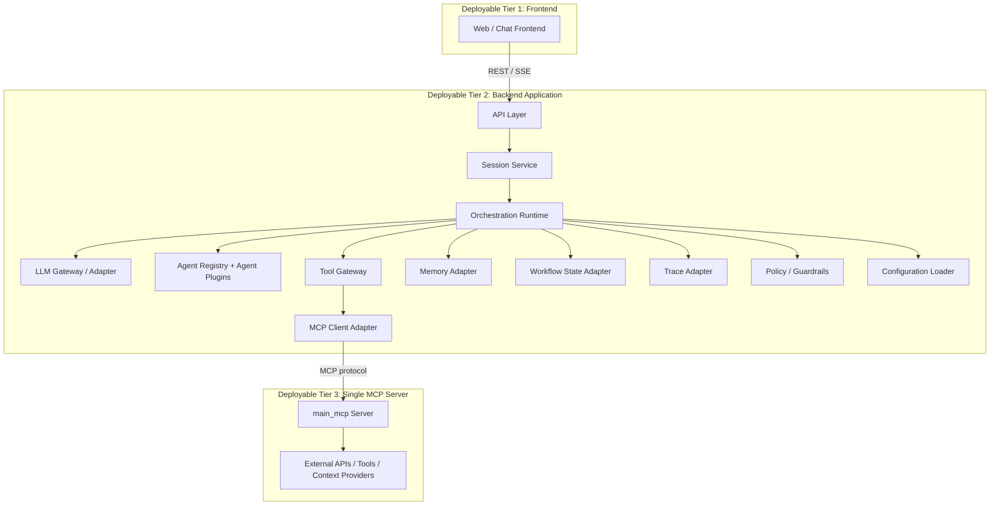
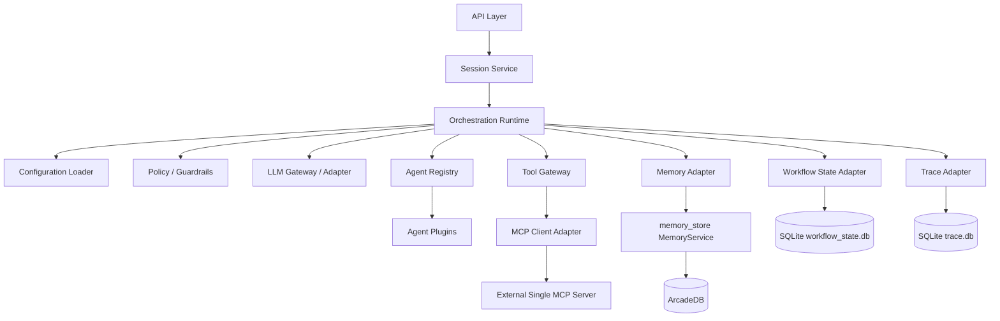
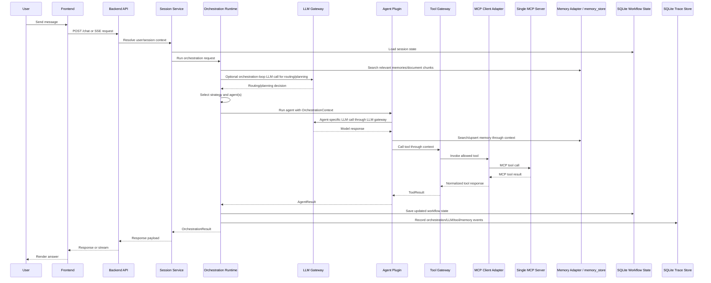
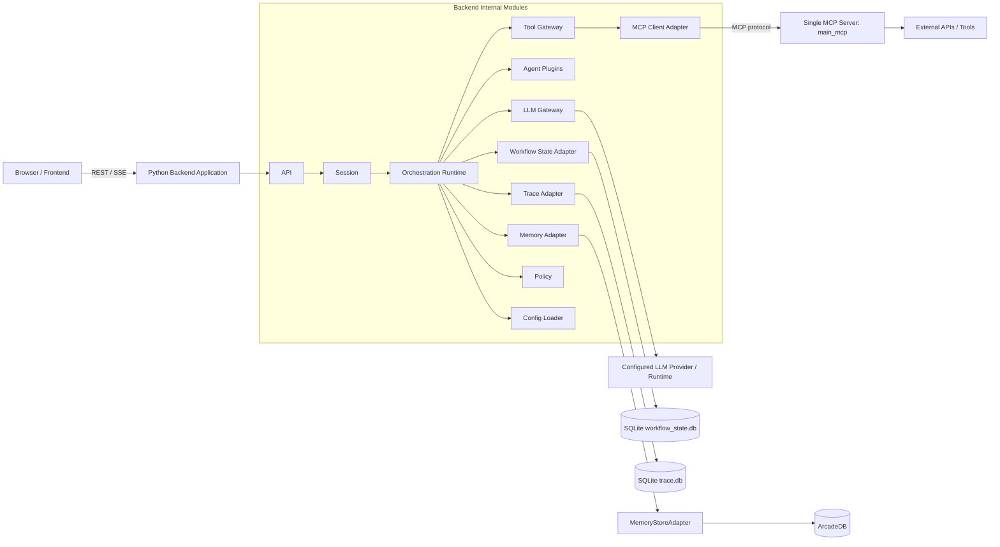

# Pluggable Agentic AI Overall Architecture

**Version:** 4.0  
**Updated scope:** Clear 3-tier deployable design, backend modular layers, single separate MCP server, provider-neutral LLM gateway/adapter with YAML-driven model selection, local/custom/cloud LLM support, OpenAI-compatible local endpoint support, SQLite-backed workflow state, SQLite-backed trace store, and ArcadeDB-backed long-term memory through the existing `memory_store` Python wrapper.

---

## 1. Executive Summary

This architecture defines a minimal, reusable, pluggable Agentic AI system with three clearly separated deployable tiers:

```text
Frontend
   |
   | REST / SSE
   v
Backend Application
   |
   | MCP protocol through MCP client adapter
   v
Single MCP Server
```

The backend is the main application tier. It contains the API layer, session service, orchestration runtime, agent registry, agent plugins, LLM gateway, tool gateway, MCP client adapter, memory adapter, workflow state adapter, trace adapter, policy/guardrails, observability, and configuration loader.

The backend **does not contain the MCP server implementation**. MCP is a separate integration tier. The backend only contains an MCP client adapter that knows how to call the external MCP server.

Storage engines are not separate application tiers in V1. SQLite and ArcadeDB sit behind backend adapters:

- SQLite is used by the backend workflow state adapter.
- SQLite is used by the backend trace adapter.
- ArcadeDB is used behind the existing `memory_store` wrapper and accessed through the backend memory adapter.

The central design rules are:

> **The frontend owns user experience. The backend owns orchestration. The MCP server owns external tool exposure.**

> **Agents do not directly import MCP clients, database clients, ArcadeDB clients, SQLite clients, LLM provider clients, or external APIs. Agents receive controlled capabilities through an `OrchestrationContext`.**

---

## 2. What Changed from V3

V3 established the clear three-tier deployment model, single MCP endpoint, SQLite workflow state, SQLite trace store, `memory_store` / ArcadeDB-backed memory direction, and the first-class LLM gateway.

V4 adds the following LLM integration clarifications:

1. **Provider-neutral LLM integration**
   - LLMs can be local, custom, OpenAI, Google, Anthropic-compatible through custom adapters, or any future provider.
   - The backend uses logical LLM profiles instead of hard-coded provider or model names.
   - Provider-specific details stay inside provider adapters.

2. **Local OpenAI-compatible endpoint support**
   - Local runtimes that expose `/v1/chat/completions` can be used through the same OpenAI-compatible adapter pattern.
   - The local endpoint can be configured with `base_url`, model name, timeouts, retries, and defaults in YAML.
   - Example local endpoint: `http://192.168.1.80:8081/v1`.

3. **Custom LLM support**
   - Custom providers can be added by implementing `LLMProviderAdapter`.
   - Custom HTTP runtimes can be wrapped by a `custom_http` adapter.
   - OpenAI-compatible custom runtimes can use the standard `openai_compatible` adapter.

4. **Independent model profiles for orchestration and agents**
   - The orchestration loop can use one LLM profile.
   - Each agent can use its own LLM profile.
   - Profiles can target different providers, models, runtimes, temperatures, token limits, and routing policies.

5. **Operational controls for LLM calls**
   - Timeouts, retries, fallback profiles, rate limits, trace events, and policy allowlists are controlled centrally through the LLM gateway.
   - Agent code remains portable across local and cloud LLMs.

---

## 3. Minimal V1 Deployable Pieces

Minimal V1 should have exactly three deployable application pieces:

| Deployable Piece | Owner | Responsibility | Communication Boundary |
|---|---|---|---|
| Frontend | Frontend team | Chat UI, user session UX, streaming display, reset button, attachments handoff | Calls backend over REST / SSE |
| Backend Application | Backend / AI platform team | API, session, orchestration, agents, LLM routing, tool gateway, memory/state/trace adapters, policy, config | Receives REST / SSE; calls MCP using MCP protocol |
| Single MCP Server | Integration / platform team | Exposes external tools and context providers through MCP | Called only by backend MCP client adapter |

The V1 runtime topology is:



### 3.1 Non-Deployable Infrastructure for V1

The following are important infrastructure components, but they are not separate deployable application tiers in minimal V1:

| Component | V1 Placement | Access Pattern |
|---|---|---|
| SQLite workflow state database | Local/backend-managed database file or backend-owned DB path | Backend `WorkflowStateStore` adapter |
| SQLite trace database | Local/backend-managed database file or backend-owned DB path | Backend `TraceStore` adapter |
| ArcadeDB memory database | Behind `memory_store` wrapper | Backend `MemoryGateway` adapter |
| Agent plugins | Backend Python modules | Registered through backend `AgentRegistry` |
| LLM providers | External services or local model runtimes | Accessed through backend `LLMGateway` adapters |

---

## 4. Tier Responsibilities

## 4.1 Tier 1: Frontend

The frontend provides user interaction only.

Frontend responsibilities:

- Render chat messages.
- Send user messages to backend.
- Receive final responses or streamed response chunks.
- Maintain or pass `session_id`.
- Provide a clear/reset button.
- Display optional citations, trace summaries, tool-call summaries, or error messages.
- Upload files to backend if file support is enabled.

Frontend should not contain:

- Agent routing logic.
- LLM provider logic.
- MCP client logic.
- Memory retrieval logic.
- Workflow state logic.
- Trace persistence logic.
- Business workflow branching.

Recommended frontend/backend communication:

```text
POST /chat                    -> non-streaming chat request
GET  /chat/stream or POST SSE -> streaming chat response
POST /sessions/{id}/reset     -> reset short-term session state
GET  /sessions/{id}/history   -> optional session history
GET  /capabilities            -> frontend feature discovery
GET  /health                  -> backend health check
```

## 4.2 Tier 2: Backend Application

The backend application is the core system. It owns orchestration and all internal AI runtime modules.

Backend responsibilities:

- Expose REST / SSE APIs to the frontend.
- Manage session lifecycle.
- Run orchestration strategies.
- Register and execute agent plugins.
- Route LLM calls through the LLM gateway.
- Route tool calls through the tool gateway.
- Call the external MCP server through the MCP client adapter.
- Access long-term memory through the memory adapter.
- Persist workflow state through the workflow state adapter.
- Persist trace events through the trace adapter.
- Enforce policy and guardrails.
- Load YAML configuration.
- Emit logs, traces, metrics, and health status.

Backend should not contain:

- Frontend UI implementation.
- MCP server implementation.
- Direct external API integrations inside agent code.
- Direct database access inside agent code.
- Direct LLM provider client construction inside agent code.

## 4.3 Tier 3: Single MCP Server

The MCP server is the integration layer for external tools and context providers.

MCP server responsibilities:

- Expose tool schemas through MCP.
- Execute external tool calls.
- Normalize downstream API authentication where appropriate.
- Own domain-specific integration code.
- Group tools by naming convention and metadata.
- Return structured MCP tool results.

MCP server should not contain:

- Frontend UI logic.
- Backend orchestration logic.
- Agent routing logic.
- Long-term memory scoring logic.
- Backend workflow state logic.
- Backend trace persistence logic.

V1 uses one MCP server endpoint:

```env
MCP_MAIN_URL=http://localhost:9001/mcp
```

---

## 5. Backend Internal Module Map

For minimal V1, all modules below live inside the backend application codebase or backend package. They are internal layers, not separate deployable tiers.

```text
Backend Application
  ├── API layer
  ├── Session service
  ├── Orchestration runtime
  ├── LLM gateway / adapter
  ├── Agent registry
  ├── Agent plugins
  ├── Tool gateway
  ├── MCP client adapter
  ├── Memory adapter
  ├── Workflow state adapter
  ├── Trace adapter
  ├── Policy / guardrails
  ├── Observability
  └── Configuration loader
```



### 5.1 Backend Module Ownership

| Backend Module | Primary Purpose | Team Focus |
|---|---|---|
| API layer | HTTP/SSE routes, validation, auth handoff, error mapping | Backend API team |
| Session service | Session lifecycle, reset behavior, short-term state loading | Backend API / platform team |
| Orchestration runtime | Coordinates strategies, agents, memory, tools, LLM, state, traces | AI platform team |
| LLM gateway / adapter | Centralized provider/model access and model profile resolution | AI platform team |
| Agent registry | Registers available agents and their capabilities | AI platform team |
| Agent plugins | Task-specific reasoning/business behavior | Feature teams |
| Tool gateway | Common tool interface and policy enforcement | Platform / integration team |
| MCP client adapter | Backend-side MCP client only | Platform / integration team |
| Memory adapter | Wraps `memory_store` and hides ArcadeDB | Data / AI platform team |
| Workflow state adapter | Saves session/workflow state in SQLite | Backend platform team |
| Trace adapter | Saves trace events in SQLite | Observability / platform team |
| Policy / guardrails | Tool/memory/agent/LLM permissions and sensitive actions | Security / platform team |
| Configuration loader | YAML loading, validation, profile wiring | Platform team |
| Observability | Logs, traces, metrics, health, debugging | Platform team |

---

## 6. Section Architecture Map

This document is organized so each tier and backend layer can later become its own focused architecture document.

| Area | Future Document | Purpose |
|---|---|---|
| Frontend tier | `frontend-architecture.md` | Chat UI, streaming UX, session reset, attachments, auth handoff |
| Backend application tier | `backend-application-architecture.md` | Backend module composition and runtime boundaries |
| MCP server tier | `mcp-server-architecture.md` | Single MCP server, exposed tools, integration ownership |
| Backend API | `backend-api-architecture.md` | HTTP routes, validation, auth, response streaming, API error mapping |
| Session service | `session-service-architecture.md` | Session lifecycle, conversation IDs, reset behavior, short-term state loading |
| Orchestration runtime | `orchestration-architecture.md` | Agent selection, workflow execution, context construction, result normalization |
| LLM gateway | `llm-gateway-architecture.md` | Provider adapters, model profiles, per-agent model selection, routing LLM |
| Workflow strategies | `workflow-strategies-architecture.md` | Direct, router, sequential, future planner/handoff/parallel patterns |
| Agent plugins | `agents-architecture.md` | Agent interface, capabilities, registration, prompt/config patterns |
| Tool gateway / MCP client | `tooling-mcp-client-architecture.md` | MCP client adapter, tool allowlists, schema normalization, tool execution |
| Persistence | `persistence-architecture.md` | Memory adapter, SQLite workflow state, SQLite trace store |
| Memory adapter | `memory-store-adapter-architecture.md` | `memory_store` wrapper integration and ArcadeDB isolation |
| SQLite workflow state | `sqlite-workflow-state-architecture.md` | Session state and workflow checkpoints |
| SQLite trace store | `sqlite-trace-store-architecture.md` | Request traces, tool calls, agent decisions, errors, audit records |
| Policy / guardrails | `policy-architecture.md` | Tool permissions, memory scopes, agent permissions, LLM profile permissions |
| Observability | `observability-architecture.md` | Logs, traces, metrics, eval records, debugging support |
| Configuration | `configuration-architecture.md` | YAML use-case configuration and plugin wiring |
| Deployment | `deployment-architecture.md` | Local process topology, environment variables, runtime layout |

---

## 7. High-Level Runtime Flow



---

# 8. Frontend Architecture Section

## 8.1 Responsibility

The frontend provides the user interface. It should not contain backend orchestration logic, agent routing, MCP logic, LLM provider logic, memory retrieval logic, workflow branching, or persistence logic.

## 8.2 Minimal V1 Capabilities

- Chat input and response display.
- Session ID handling.
- Clear/reset button.
- REST request support.
- Optional SSE streaming response support.
- Optional display of citations, tool activity, model activity summaries, or trace summaries.
- Optional file upload handoff to backend.

## 8.3 Frontend Boundary

The frontend should know only:

- Backend API base URL.
- Active `session_id`.
- User message.
- Optional client metadata.
- How to render backend responses.

The frontend should not know:

- Which agent ran.
- Which workflow strategy was selected.
- Which LLM was used.
- Which MCP tool was called.
- Whether memory came from ArcadeDB, SQLite, or another provider.

## 8.4 Example Frontend Request

```http
POST /chat
Content-Type: application/json
```

```json
{
  "session_id": "session_123",
  "message": "Search my knowledge base and draft a customer response.",
  "metadata": {
    "client": "web",
    "timezone": "America/Chicago",
    "project_id": "project_abc"
  }
}
```

## 8.5 Example Streaming Boundary

For V1, use SSE when streaming is needed:

```text
Frontend -> Backend: POST /chat/stream
Backend  -> Frontend: text/event-stream
```

Recommended event types:

```text
message_started
content_delta
tool_call_summary
agent_summary
trace_summary
message_completed
error
```

The frontend should treat these as display events only. It should not use them to run business logic.

---

# 9. Backend API Architecture Section

## 9.1 Responsibility

The backend API is a thin HTTP boundary. It validates input, resolves identity/session information, calls the session service and orchestration runtime, and returns a response.

## 9.2 Backend API Owns

- HTTP routing.
- Request validation.
- Authentication and authorization handoff.
- Response streaming.
- Session resolution.
- Error mapping.
- API-level rate limiting.
- Request/response DTOs.

## 9.3 Backend API Does Not Own

- Agent reasoning.
- LLM provider selection.
- MCP client implementation details.
- MCP server implementation.
- Memory scoring or retrieval implementation.
- Workflow state implementation.
- Trace persistence implementation.
- Business workflow branching.

## 9.4 Minimal API Routes

```text
POST /chat
POST /chat/stream
POST /sessions/{session_id}/reset
GET  /sessions/{session_id}/history
GET  /health
GET  /capabilities
```

## 9.5 Backend Request Flow

```text
1. Receive frontend request.
2. Validate request schema.
3. Resolve user identity and session ID.
4. Create RequestContext.
5. Call SessionService.
6. SessionService loads short-term workflow state.
7. SessionService calls Orchestrator.run(request_context).
8. Orchestrator uses LLM/memory/tools/state/traces through adapters.
9. Return final or streamed response.
```

---

# 10. Conversation / Session Service Architecture Section

## 10.1 Responsibility

The session service manages short-term conversation state and request metadata before orchestration begins.

## 10.2 Responsibilities

- Create sessions.
- Resume sessions.
- Reset sessions.
- Load short-term workflow state from SQLite.
- Persist final session state back to SQLite.
- Pass stable session information into the orchestrator.

## 10.3 Session Data Shape

```json
{
  "session_id": "session_123",
  "user_id": "user_456",
  "created_at": "2026-06-20T12:00:00Z",
  "last_active_at": "2026-06-20T12:15:00Z",
  "active_usecase": "customer_support",
  "metadata": {
    "channel": "web"
  }
}
```

## 10.4 Reset Behavior

Session reset should clear short-term state only.

It should reset:

- Conversation history in workflow state.
- Temporary strategy state.
- In-progress tool context.
- Session-specific scratch data.

It should not delete:

- Long-term user memories.
- Project memories.
- Document chunks.
- Global knowledge records.
- LLM configuration.
- MCP server configuration.

---

# 11. Orchestration Runtime Architecture Section

## 11.1 Responsibility

The orchestration runtime coordinates agent execution, LLM access, memory access, tool access, workflow state, policies, and traces.

It is the main extensibility point of the backend.

## 11.2 Core Responsibilities

- Build the `OrchestrationContext`.
- Load configuration for the active use case.
- Load relevant memory through the `memory_store` adapter.
- Load workflow state through SQLite.
- Select the orchestration strategy.
- Optionally use an orchestration-loop LLM for routing, planning, or reflection.
- Select one or more agents.
- Resolve each agent's configured LLM profile.
- Provide agents with controlled access to LLM, memory, tools, state, trace, and policy.
- Execute the selected workflow.
- Persist memory updates, workflow state, and trace events.
- Return a normalized response.

## 11.3 Orchestration Runtime Should Not

- Hard-code business-specific agents.
- Hard-code MCP tool names inside core logic.
- Hard-code LLM provider/model names inside core logic.
- Hard-code SQLite queries inside agent code.
- Hard-code ArcadeDB or memory implementation details inside agent code.
- Let agents bypass policy checks.
- Mix API route logic with workflow logic.

## 11.4 RequestContext

```python
from dataclasses import dataclass
from typing import Any


@dataclass
class RequestContext:
    user_id: str
    session_id: str
    message: str
    usecase: str | None
    metadata: dict[str, Any]
```

## 11.5 OrchestrationContext

Every agent receives the same context shape.

```python
from dataclasses import dataclass
from typing import Any


@dataclass
class OrchestrationContext:
    request: RequestContext
    llm: "LLMGateway"
    memory: "MemoryGateway"
    state: "WorkflowStateStore"
    tools: "ToolGateway"
    trace: "TraceStore"
    policy: "PolicyService"
    config: dict[str, Any]
```

## 11.6 Orchestration Result

```python
from dataclasses import dataclass, field
from typing import Any


@dataclass
class OrchestrationResult:
    answer: str
    session_id: str
    agent_name: str | None = None
    strategy_name: str | None = None
    llm_profile: str | None = None
    tool_calls: list[dict[str, Any]] = field(default_factory=list)
    memory_updates: list[dict[str, Any]] = field(default_factory=list)
    trace_id: str | None = None
    metadata: dict[str, Any] = field(default_factory=dict)
```

---

# 12. LLM Gateway / Adapter Architecture Section

## 12.1 Responsibility

The LLM gateway is the backend module that centralizes all LLM access.

It allows:

- The orchestration loop to use one configured LLM.
- Each agent to use a separate configured LLM.
- Future provider swaps without changing agent code.
- YAML-based model/profile configuration.
- Centralized policy, tracing, timeout, retry, and cost metadata handling.

## 12.2 Design Rule

Agents and strategies should not instantiate provider clients directly.

They should call:

```text
context.llm.complete(...)
context.llm.stream(...)
context.llm.embed(...) optional/future
```

The LLM gateway resolves which provider/model/profile to use based on:

- Use case.
- Component type.
- Orchestration strategy.
- Agent name.
- Explicit profile override when allowed.
- YAML configuration.
- Policy rules.

## 12.3 LLM Gateway Placement

```text
Backend Application
  ├── Orchestration runtime
  │     └── uses LLMGateway for router/planner/orchestrator-loop model calls
  ├── Agent plugins
  │     └── use LLMGateway for agent-specific model calls
  └── LLM gateway / adapter
        ├── Provider adapter A
        ├── Provider adapter B
        └── Local model adapter optional
```

## 12.4 Model Selection Examples

| Component | Example LLM Profile | Reason |
|---|---|---|
| Orchestrator loop | `orchestrator_router` | Good at routing, planning, structured decisions |
| Support agent | `support_fast` | Lower latency and cost for simple support answers |
| Research agent | `research_reasoning` | Stronger reasoning for document-heavy tasks |
| Reviewer agent | `reviewer_precise` | More deterministic review/validation behavior |
| Coding agent | `coding_strong` | Better code understanding and generation |

## 12.5 LLMGateway Interface

```python
from dataclasses import dataclass, field
from typing import Any, AsyncIterator, Protocol


@dataclass
class LLMMessage:
    role: str
    content: str


@dataclass
class LLMRequest:
    component: str
    messages: list[LLMMessage]
    profile: str | None = None
    response_format: dict[str, Any] | None = None
    temperature: float | None = None
    max_tokens: int | None = None
    metadata: dict[str, Any] = field(default_factory=dict)


@dataclass
class LLMResponse:
    text: str
    profile: str
    provider: str
    model: str
    usage: dict[str, Any] = field(default_factory=dict)
    metadata: dict[str, Any] = field(default_factory=dict)


class LLMGateway(Protocol):
    async def complete(
        self,
        request: LLMRequest,
        context: "OrchestrationContext",
    ) -> LLMResponse:
        ...

    async def stream(
        self,
        request: LLMRequest,
        context: "OrchestrationContext",
    ) -> AsyncIterator[str]:
        ...
```

## 12.6 LLM Provider Adapter Interface

```python
from typing import Protocol


class LLMProviderAdapter(Protocol):
    name: str

    async def complete(self, request: LLMRequest, profile_config: dict) -> LLMResponse:
        ...

    async def stream(self, request: LLMRequest, profile_config: dict):
        ...
```

## 12.7 LLM Gateway Responsibilities

- Load LLM provider and profile configuration from YAML.
- Resolve the correct profile for the orchestrator or agent.
- Enforce allowed profiles per use case and agent.
- Apply common defaults such as temperature, max tokens, timeouts, and retries.
- Emit trace events for LLM calls.
- Return normalized `LLMResponse` objects.
- Hide provider-specific SDK details from agents and strategies.

## 12.8 LLM Gateway Should Not

- Decide business workflow outcomes.
- Bypass policy rules.
- Store long-term memory directly.
- Call MCP tools directly.
- Leak provider-specific SDK responses into agent code.

## 12.9 Orchestrator LLM vs Agent LLM

The orchestrator loop and agents should be configured independently.

Example:

```text
Orchestrator loop
  -> profile: orchestrator_router
  -> used for routing/planning/strategy decisions

Support agent
  -> profile: support_fast
  -> used for low-latency support responses

Research agent
  -> profile: research_reasoning
  -> used for deeper document reasoning
```

This avoids forcing every part of the system to use the same model.

## 12.10 Provider-Neutral LLM Integration

The LLM gateway should support any model provider through a small provider-adapter contract.

Supported provider categories for V1 and near-term extensions:

| Provider Category | Adapter Type | Example Use | Notes |
|---|---|---|---|
| Local OpenAI-compatible runtime | `openai_compatible` | Local model server exposing `/v1/chat/completions` | Best starting point for local LLMs |
| Custom OpenAI-compatible runtime | `openai_compatible` | Internal model gateway or proxy | Same request/response shape as OpenAI chat completions |
| OpenAI | `openai` or `openai_compatible` | Cloud hosted OpenAI models | Can use native or OpenAI-compatible wrapper |
| Google Gemini | `google` | Gemini models | Uses Google-specific adapter and normalized responses |
| Custom HTTP provider | `custom_http` | Internal REST model service | Adapter maps request/response shape |
| Python SDK provider | Provider-specific adapter | Any vendor with a Python SDK | Adapter hides SDK details |

The architecture rule is:

```text
Agent / Strategy
  -> LLMGateway
      -> ProfileResolver
          -> ProviderAdapter
              -> Local runtime, custom runtime, OpenAI, Google, or future provider
```

Agents and orchestration strategies never need to know whether the selected model is local, cloud-hosted, or custom.

## 12.11 Local LLM Integration Example

A local LLM server that exposes an OpenAI-compatible endpoint can be called directly like this:

```bash
curl http://192.168.1.80:8081/v1/chat/completions \
  -H "Content-Type: application/json" \
  -d '{
    "model": "qwen3.5-27b-claude-4.6-opus-reasoning-distilled-i1",
    "messages": [
      {"role": "system", "content": "You are a helpful assistant."},
      {"role": "user", "content": "Hello!"}
    ],
    "temperature": 0.7
  }'
```

In this architecture, agents should not call this endpoint directly. Instead, configure it as an LLM provider and expose it through one or more logical profiles.

Example profile mapping:

```yaml
llm:
  providers:
    local_qwen_runtime:
      type: openai_compatible
      base_url: http://192.168.1.80:8081/v1
      api_key_env: LLM_LOCAL_QWEN_API_KEY
      timeout_seconds: 180
      max_retries: 1
      supports_streaming: true
      supports_json_mode: false

  profiles:
    local_qwen_reasoning:
      provider: local_qwen_runtime
      model: qwen3.5-27b-claude-4.6-opus-reasoning-distilled-i1
      temperature: 0.7
      max_tokens: 6000
      purpose: local_reasoning
```

Agent configuration then references only the profile name:

```yaml
agents:
  research_agent:
    enabled: true
    llm_profile: local_qwen_reasoning
```

This keeps the model server URL, provider type, and model name outside agent code.

## 12.12 OpenAI-Compatible Adapter Request Mapping

The `openai_compatible` adapter should translate the normalized `LLMRequest` into a `/v1/chat/completions` request.

Normalized gateway request:

```python
response = await context.llm.complete(
    LLMRequest(
        component="agent.research_agent",
        profile="local_qwen_reasoning",
        messages=[
            LLMMessage(role="system", content="You are a helpful assistant."),
            LLMMessage(role="user", content="Hello!"),
        ],
        temperature=0.7,
    ),
    context,
)
```

Provider adapter HTTP payload:

```json
{
  "model": "qwen3.5-27b-claude-4.6-opus-reasoning-distilled-i1",
  "messages": [
    {"role": "system", "content": "You are a helpful assistant."},
    {"role": "user", "content": "Hello!"}
  ],
  "temperature": 0.7,
  "max_tokens": 6000
}
```

Normalized gateway response:

```python
LLMResponse(
    text="Hello! How can I help you today?",
    profile="local_qwen_reasoning",
    provider="local_qwen_runtime",
    model="qwen3.5-27b-claude-4.6-opus-reasoning-distilled-i1",
    usage={...},
    metadata={"endpoint_type": "openai_compatible"},
)
```

## 12.13 Provider Adapter Implementation Pattern

Each provider adapter should be small and focused.

Recommended provider adapters:

```text
backend/app/llm/providers/openai_compatible.py
backend/app/llm/providers/openai.py
backend/app/llm/providers/google.py
backend/app/llm/providers/custom_http.py
```

Provider adapters own:

- Provider-specific authentication.
- Provider-specific request formatting.
- Provider-specific response parsing.
- Streaming protocol differences.
- Retryable error detection.
- Usage metadata extraction when available.

Provider adapters do not own:

- Agent selection.
- Business workflow logic.
- Tool permissions.
- Memory retrieval.
- Final response formatting for the frontend.

## 12.14 LLM Profile Resolution Rules

Profile resolution should follow this order:

```text
1. Explicit profile requested by strategy or agent, if policy allows it.
2. Agent-specific `llm_profile` from YAML.
3. Strategy-specific `llm_profile` from YAML.
4. Use-case default LLM profile.
5. Application default LLM profile.
6. Fail with a clear configuration error if no allowed profile exists.
```

The gateway should trace both the requested profile and the resolved profile.

## 12.15 Fallback and Portability Pattern

The gateway should support optional fallback profiles without changing agent code.

Example:

```yaml
llm:
  profiles:
    research_reasoning:
      provider: openai_cloud
      model: strong-reasoning-model
      temperature: 0.2
      max_tokens: 6000
      fallback_profiles:
        - local_qwen_reasoning
        - google_gemini_reasoning
```

Fallback should be controlled by policy and should record trace events:

```text
llm_call_started
llm_call_failed
llm_fallback_selected
llm_call_completed
```

## 12.16 LLM Gateway Health Checks

The backend health layer should expose provider-level checks without leaking secrets.

Recommended internal health checks:

```text
- provider configured
- base URL configured
- API key presence when required
- model profile configured
- optional lightweight completion check
- timeout/retry settings valid
```

Recommended health response shape:

```json
{
  "llm": {
    "providers": {
      "local_qwen_runtime": {
        "configured": true,
        "reachable": true,
        "profiles": ["local_qwen_reasoning"]
      },
      "openai_cloud": {
        "configured": true,
        "reachable": null,
        "profiles": ["support_fast", "research_reasoning"]
      }
    }
  }
}
```

---

# 13. Workflow Strategy Architecture Section

## 13.1 Responsibility

Workflow strategies define how one or more agents are executed.

The orchestrator delegates execution patterns to strategy plugins instead of embedding all workflow logic in one large class.

## 13.2 Strategy Interface

```python
from typing import Protocol


class OrchestrationStrategy(Protocol):
    name: str

    async def run(
        self,
        context: OrchestrationContext,
        agents: list["AgentPlugin"],
    ) -> OrchestrationResult:
        ...
```

## 13.3 Recommended V1 Strategies

### Direct Agent Strategy

A single configured agent handles the request.

Best for:

- Single-purpose assistant.
- First proof of concept.
- Simple internal workflow.

### Router Strategy

A lightweight router chooses the best agent based on the request, agent capabilities, use-case configuration, memory context, and policy.

The router can be implemented as:

- Deterministic rules.
- LLM-assisted routing through `LLMGateway`.
- A hybrid of rules plus LLM classification.

Best for:

- Multiple specialized agents.
- Clear business routing categories.
- Support, billing, research, and operations workflows.

### Sequential Workflow Strategy

Multiple agents run in a configured order.

Best for:

- Retrieve -> summarize -> review.
- Triage -> lookup -> draft.
- Plan -> execute -> validate.

## 13.4 Microsoft Agent Framework Fit

Microsoft Agent Framework should be used inside strategy implementations where useful.

Recommended boundary:

```text
Backend API
  -> Session Service
      -> Orchestration Runtime
          -> Strategy Adapter
              -> Microsoft Agent Framework workflow/agent execution
```

This prevents framework details from leaking into API routes, persistence adapters, MCP adapters, or business agent code.

## 13.5 LLM Use Inside Strategies

Strategies that need LLM calls should use `context.llm`.

Example:

```python
router_response = await context.llm.complete(
    LLMRequest(
        component="orchestrator.router_strategy",
        profile=context.config["orchestration"]["llm_profile"],
        messages=[...],
        response_format={"type": "json_object"},
    ),
    context,
)
```

---

# 14. Agent Plugin Architecture Section

## 14.1 Responsibility

Agents encapsulate task-specific reasoning and business behavior. They operate through the orchestration context rather than direct infrastructure imports.

## 14.2 Agent Interface

```python
from typing import Protocol


class AgentPlugin(Protocol):
    name: str
    description: str
    capabilities: list[str]

    async def run(self, context: OrchestrationContext) -> "AgentResult":
        ...
```

## 14.3 Agent Result

```python
from dataclasses import dataclass, field
from typing import Any


@dataclass
class AgentResult:
    answer: str
    confidence: float | None = None
    llm_profile: str | None = None
    memory_updates: list[dict[str, Any]] = field(default_factory=list)
    tool_calls: list[dict[str, Any]] = field(default_factory=list)
    handoff_to: str | None = None
    metadata: dict[str, Any] = field(default_factory=dict)
```

## 14.4 Example Agent Types

```text
support_agent
billing_agent
document_qa_agent
research_agent
planner_agent
reviewer_agent
coding_agent
compliance_agent
operations_agent
```

## 14.5 Agent Design Rules

Agents should:

- Use `context.llm.complete(...)` for model calls.
- Use the configured `llm_profile` assigned to the agent unless policy allows override.
- Use `context.memory.search(...)` for memory and document chunk retrieval.
- Use `context.memory.upsert(...)` for memory writes when allowed.
- Use `context.tools.call_tool(...)` for MCP-backed tool calls.
- Return structured `AgentResult` objects.
- Declare capabilities in metadata.
- Be testable with fake LLM, fake memory, and fake tools.

Agents should not:

- Instantiate LLM provider clients directly.
- Import MCP clients directly.
- Import SQLite clients directly.
- Import ArcadeDB clients directly.
- Import `memory_store.service.MemoryService` directly.
- Make unrestricted network calls.
- Decide global workflow policy.

## 14.6 Agent LLM Profile Resolution

Each agent can have its own LLM profile.

Example:

```yaml
agents:
  support_agent:
    enabled: true
    llm_profile: support_fast

  document_qa_agent:
    enabled: true
    llm_profile: research_reasoning

  reviewer_agent:
    enabled: true
    llm_profile: reviewer_precise
```

The agent implementation should not hard-code the model name. It should ask the LLM gateway to resolve the profile.

---

# 15. Agent Registry Architecture Section

## 15.1 Responsibility

The agent registry manages available agent plugins and exposes metadata to orchestration strategies.

## 15.2 Registry Responsibilities

- Register agent plugins.
- Enable/disable agents by configuration.
- Expose agent capabilities.
- Expose default LLM profile metadata.
- Validate agent configuration.
- Return agents allowed for the active use case.

## 15.3 Example Registry Metadata

```json
{
  "name": "document_qa_agent",
  "description": "Answers questions using retrieved document chunks and citations.",
  "capabilities": ["document_search", "summarization", "citation_grounding"],
  "default_llm_profile": "research_reasoning",
  "allowed_tools": ["documents.search", "documents.retrieve_chunk"],
  "enabled": true
}
```

---

# 16. Tool Gateway and Single MCP Architecture Section

## 16.1 Responsibility

The Tool Gateway provides one interface for agents to discover and call tools. MCP is the primary external tool integration for V1.

## 16.2 Updated V1 MCP Design

V1 uses one MCP endpoint:

```env
MCP_MAIN_URL=http://localhost:9001/mcp
```

All MCP tools are exposed through this single server and logically grouped by naming convention and policy.

Example tool names:

```text
support.search_tickets
support.create_ticket
customer.get_profile
documents.search
documents.retrieve_chunk
documents.summarize
ops.create_task
```

## 16.3 Why One MCP Endpoint for V1

One MCP endpoint keeps the first version simple:

- Fewer processes to run locally.
- Easier configuration.
- Simpler health checks.
- Easier logging and debugging.
- Lower integration complexity.
- Clearer team boundary between backend and integration layer.

The `ToolGateway` should still be designed so multiple MCP endpoints can be added later by configuration, but the V1 runtime should configure only `main_mcp`.

## 16.4 Backend Does Not Implement the MCP Server

The backend contains:

```text
backend/app/tools/mcp_adapter.py
```

The backend does not contain:

```text
backend/app/mcp_server/*
```

Recommended repository layout keeps the MCP server separate:

```text
project-root/
  backend/
  frontend/
  mcp_server/
```

## 16.5 ToolGateway Interface

```python
from typing import Any, Protocol


class ToolGateway(Protocol):
    async def list_tools(self, context: OrchestrationContext) -> list["ToolSpec"]:
        ...

    async def call_tool(
        self,
        tool_name: str,
        arguments: dict[str, Any],
        context: OrchestrationContext,
    ) -> "ToolResult":
        ...
```

## 16.6 ToolSpec

```python
from dataclasses import dataclass
from typing import Any


@dataclass
class ToolSpec:
    name: str
    description: str
    input_schema: dict[str, Any]
    source: str
    permissions: list[str]
    metadata: dict[str, Any]
```

## 16.7 ToolResult

```python
from dataclasses import dataclass
from typing import Any


@dataclass
class ToolResult:
    tool_name: str
    success: bool
    data: Any | None = None
    error: str | None = None
    metadata: dict[str, Any] | None = None
```

## 16.8 MCP Client Adapter Responsibilities

- Connect to the configured `main_mcp` endpoint.
- List available MCP tools.
- Normalize MCP tool schemas into `ToolSpec`.
- Invoke allowed tools.
- Normalize MCP responses into `ToolResult`.
- Enforce allowlists and deny lists through policy.
- Emit trace events for tool calls.

## 16.9 Tool Access Control

Not every agent should access every tool.

Recommended policy dimensions:

```text
- usecase
- agent name
- user role
- session metadata
- tool name
- operation type
- data scope
```

Example policy:

```yaml
agents:
  support_agent:
    allowed_tools:
      - support.search_tickets
      - support.create_ticket
      - customer.get_profile

  document_qa_agent:
    allowed_tools:
      - documents.search
      - documents.retrieve_chunk
      - documents.summarize
```

---

# 17. Persistence Architecture Section

## 17.1 Responsibility

Persistence is split into separate adapters so long-term memory, workflow state, and traces remain cleanly separated.

## 17.2 Updated V1 Persistence Choices

| Persistence Concern | V1 Provider | Backend Adapter | Notes |
|---|---|---|---|
| Long-term memory | `memory_store` Python wrapper | `MemoryGateway` / `MemoryStoreAdapter` | Uses ArcadeDB behind the wrapper |
| Document chunks | `memory_store` Python wrapper | `MemoryGateway` / `MemoryStoreAdapter` | Document chunks are retrievable memory records |
| Workflow state | SQLite | `WorkflowStateStore` / `SqliteWorkflowStateStore` | Sessions, workflow checkpoints, short-term state |
| Trace events | SQLite | `TraceStore` / `SqliteTraceStore` | Request traces, LLM calls, tool calls, decisions, errors |

## 17.3 Persistence Boundary

```text
Agents / Orchestrator
  -> OrchestrationContext
      -> MemoryGateway
          -> memory_store.service.MemoryService
              -> ArcadeDB-backed repository

Agents / Orchestrator
  -> OrchestrationContext
      -> WorkflowStateStore
          -> SQLite workflow_state.db

Agents / Orchestrator / ToolGateway / LLMGateway
  -> OrchestrationContext
      -> TraceStore
          -> SQLite trace.db
```

## 17.4 Storage Engine Rule

SQLite and ArcadeDB are storage engines behind adapters. They are not business modules and not separate application tiers in minimal V1.

Agents should not know that:

- Workflow state is stored in SQLite.
- Traces are stored in SQLite.
- Long-term memory is stored in ArcadeDB.
- Document chunks are represented through `memory_store` records.

---

# 18. Memory Adapter Section

## 18.1 Responsibility

The memory adapter wraps the existing `memory_store` service layer and hides ArcadeDB from the rest of the backend.

## 18.2 Memory Capabilities

The existing `MemoryService` wrapper should provide capabilities such as:

- CRUD operations: `add_memory`, `get_memory`, `update_memory`, `upsert_memory`.
- Retrieval: `search`, `search_document_chunks`, `get_chunk`, `get_chunk_context`.
- Ingestion: `ingest_document`, `ingest_folder`.
- Lifecycle controls: `promote`, `supersede`, `contradict`, `expire`.
- Privacy controls: `forget`, `forget_by_user`, `delete_by_scope`, `disable_memory`, `export_user_memories`, `export_scope`, `import_memories`, `redact`.
- Feedback, stats, and health: `add_feedback`, `stats`, `health`.

## 18.3 MemoryGateway Interface

```python
from typing import Any, Protocol


class MemoryGateway(Protocol):
    async def search(
        self,
        text: str,
        *,
        scope: dict[str, Any],
        memory_types: list[str] | None = None,
        limit: int = 10,
    ) -> list["MemoryResult"]:
        ...

    async def upsert(
        self,
        memory: "MemoryWrite",
        *,
        stable_key: str | None = None,
        embed: bool = True,
    ) -> "MemoryRecord":
        ...

    async def forget(self, memory_id: str) -> None:
        ...

    async def health(self) -> dict[str, Any]:
        ...
```

## 18.4 MemoryStore Adapter Shape

```python
import asyncio
from memory_store.service import MemoryService
from memory_store.models import MemorySearchQuery, Scope


class MemoryStoreAdapter:
    def __init__(self, service: MemoryService) -> None:
        self._service = service

    async def search(self, text: str, *, scope: dict, memory_types=None, limit: int = 10):
        query = MemorySearchQuery(
            scope=Scope(**scope),
            text=text,
            limit=limit,
            memory_types=memory_types,
        )
        return await asyncio.to_thread(self._service.search, query)

    async def health(self) -> dict:
        status = await asyncio.to_thread(self._service.health)
        return status.model_dump() if hasattr(status, "model_dump") else dict(status)
```

## 18.5 Scope Mapping

Every memory request should carry scope.

Recommended scope keys:

```text
user_id
project_id
tenant_id
usecase
session_id optional
```

Example:

```python
scope = {
    "user_id": context.request.user_id,
    "project_id": context.request.metadata.get("project_id"),
    "usecase": context.request.usecase,
}
```

## 18.6 Document Chunk Retrieval

Document retrieval should go through the same memory gateway.

For V1:

```text
Document ingestion -> memory_store.ingest_document / ingest_folder
Document search    -> memory_store.search_document_chunks
Chunk lookup       -> memory_store.get_chunk
Chunk context      -> memory_store.get_chunk_context
```

This means the orchestration runtime does not need a separate document database in V1.

---

# 19. SQLite Workflow State Store Section

## 19.1 Responsibility

The workflow state store keeps short-term, resumable, session-level state separate from long-term memory.

## 19.2 SQLite Provider

V1 uses SQLite.

Recommended environment variable:

```env
SQLITE_WORKFLOW_STATE_URL=sqlite+aiosqlite:///./data/workflow_state.db
```

A plain file path can also be used if the implementation does not use SQLAlchemy:

```env
SQLITE_WORKFLOW_STATE_PATH=./data/workflow_state.db
```

## 19.3 WorkflowStateStore Interface

```python
from typing import Any, Protocol


class WorkflowStateStore(Protocol):
    async def load(self, session_id: str) -> dict[str, Any]:
        ...

    async def save(self, session_id: str, state: dict[str, Any]) -> None:
        ...

    async def reset(self, session_id: str) -> None:
        ...
```

## 19.4 Suggested SQLite Tables

```sql
CREATE TABLE IF NOT EXISTS workflow_sessions (
    session_id TEXT PRIMARY KEY,
    user_id TEXT NOT NULL,
    usecase TEXT,
    created_at TEXT NOT NULL,
    updated_at TEXT NOT NULL,
    status TEXT NOT NULL DEFAULT 'active',
    metadata_json TEXT NOT NULL DEFAULT '{}'
);

CREATE TABLE IF NOT EXISTS workflow_state (
    session_id TEXT PRIMARY KEY,
    state_json TEXT NOT NULL,
    version INTEGER NOT NULL DEFAULT 1,
    created_at TEXT NOT NULL,
    updated_at TEXT NOT NULL,
    FOREIGN KEY(session_id) REFERENCES workflow_sessions(session_id)
);
```

## 19.5 Workflow State Examples

```json
{
  "conversation_turns": [
    {
      "role": "user",
      "content": "Find relevant notes and draft a response.",
      "timestamp": "2026-06-20T12:15:00Z"
    }
  ],
  "last_strategy": "router_strategy",
  "last_agent": "document_qa_agent",
  "scratchpad": {},
  "pending_approval": null
}
```

## 19.6 Reset Behavior

`reset(session_id)` should either:

- Delete the `workflow_state` row, or
- Replace `state_json` with a clean initial state.

It should not call `memory_store.delete_by_scope(...)` unless the user explicitly requests deletion of long-term memory.

---

# 20. SQLite Trace Store Section

## 20.1 Responsibility

The trace store records what happened during orchestration.

Trace data is used for debugging, audit, evaluation, and future improvement.

## 20.2 SQLite Provider

V1 uses SQLite.

Recommended environment variable:

```env
SQLITE_TRACE_URL=sqlite+aiosqlite:///./data/trace.db
```

Or as a plain file path:

```env
SQLITE_TRACE_PATH=./data/trace.db
```

## 20.3 TraceStore Interface

```python
from typing import Protocol


class TraceStore(Protocol):
    async def record_event(self, event: "TraceEvent") -> None:
        ...
```

## 20.4 Trace Event Shape

```python
from dataclasses import dataclass
from datetime import datetime
from typing import Any


@dataclass
class TraceEvent:
    trace_id: str
    session_id: str
    user_id: str | None
    usecase: str | None
    event_type: str
    timestamp: datetime
    component: str
    payload: dict[str, Any]
```

## 20.5 Suggested SQLite Table

```sql
CREATE TABLE IF NOT EXISTS trace_events (
    id INTEGER PRIMARY KEY AUTOINCREMENT,
    trace_id TEXT NOT NULL,
    session_id TEXT NOT NULL,
    user_id TEXT,
    usecase TEXT,
    event_type TEXT NOT NULL,
    component TEXT NOT NULL,
    payload_json TEXT NOT NULL DEFAULT '{}',
    created_at TEXT NOT NULL
);

CREATE INDEX IF NOT EXISTS idx_trace_events_trace_id
    ON trace_events(trace_id);

CREATE INDEX IF NOT EXISTS idx_trace_events_session_id
    ON trace_events(session_id);

CREATE INDEX IF NOT EXISTS idx_trace_events_created_at
    ON trace_events(created_at);
```

## 20.6 Events to Capture

```text
request_received
context_created
workflow_state_loaded
memory_search_started
memory_search_completed
llm_call_started
llm_call_completed
llm_call_failed
strategy_selected
agent_selected
agent_started
agent_completed
tool_call_started
tool_call_completed
tool_call_failed
memory_update_written
workflow_state_saved
response_returned
error_occurred
```

---

# 21. Policy and Guardrails Architecture Section

## 21.1 Responsibility

Policy controls what agents can access, which LLM profiles can be used, which tools can be called, and what memory scopes are available during a request.

## 21.2 Policy Responsibilities

- Agent permission checks.
- LLM profile permission checks.
- Tool permission checks.
- Memory scope enforcement.
- Use-case-specific rules.
- Sensitive action approval.
- Deny-by-default behavior for unknown tools.

## 21.3 Recommended V1 Policies

```text
- Tool allowlist per agent.
- LLM profile allowlist per agent and use case.
- Memory namespace/scope per use case.
- User/session scope required for memory search.
- Trace every LLM call and external tool call.
- Deny unknown tools by default.
- Deny unknown LLM profiles by default.
- Optional human approval flag for write actions.
```

## 21.4 Example Policy Flow for Tool Calls

```text
Agent requests tool call
  ↓
ToolGateway checks policy
  ↓
Policy validates agent + user + tool + scope
  ↓
Allowed: call MCP tool through MCP client adapter
Denied: return structured policy error
```

## 21.5 Example Policy Flow for LLM Calls

```text
Agent or strategy requests LLM call
  ↓
LLMGateway resolves requested/default profile
  ↓
Policy validates component + usecase + profile
  ↓
Allowed: call provider adapter
Denied: return structured policy error
```

---

# 22. Configuration Architecture Section

## 22.1 Responsibility

Configuration wires together use cases, orchestration strategies, LLM profiles, agents, tools, persistence providers, policies, and runtime defaults.

A configuration-driven approach allows the same runtime to support different business domains.

## 22.2 Configuration Loader Responsibilities

- Load application YAML files.
- Validate schema.
- Merge global defaults and use-case overrides.
- Resolve environment-variable references.
- Register enabled agents.
- Register LLM provider adapters and model profiles.
- Register tool gateway and MCP endpoint settings.
- Register persistence adapters.
- Expose validated config to the orchestration runtime.

## 22.3 Updated V1 Use-Case Config

This example shows how the same backend can use custom local models, OpenAI, Google, or another provider without changing agent code.

```yaml
usecase: customer_support

orchestration:
  strategy: router_strategy
  default_agent: support_agent
  llm_profile: orchestrator_router

llm:
  defaults:
    timeout_seconds: 60
    max_retries: 2
    trace_payloads: false

  providers:
    # Local or custom model server that exposes an OpenAI-compatible API.
    local_qwen_runtime:
      type: openai_compatible
      base_url_env: LLM_LOCAL_QWEN_BASE_URL
      api_key_env: LLM_LOCAL_QWEN_API_KEY
      timeout_seconds: 180
      max_retries: 1
      supports_streaming: true
      supports_json_mode: false

    # OpenAI cloud provider. This can use a native OpenAI adapter or the
    # OpenAI-compatible adapter depending on implementation preference.
    openai_cloud:
      type: openai
      api_key_env: OPENAI_API_KEY
      timeout_seconds: 60
      max_retries: 2
      supports_streaming: true
      supports_json_mode: true

    # Google Gemini provider through a provider-specific adapter.
    google_gemini:
      type: google
      api_key_env: GOOGLE_API_KEY
      timeout_seconds: 60
      max_retries: 2
      supports_streaming: true
      supports_json_mode: true

    # Generic internal model gateway or custom enterprise LLM endpoint.
    internal_custom_gateway:
      type: custom_http
      base_url_env: LLM_CUSTOM_GATEWAY_BASE_URL
      api_key_env: LLM_CUSTOM_GATEWAY_API_KEY
      timeout_seconds: 90
      max_retries: 2
      request_mapping: openai_chat_completions
      response_mapping: openai_chat_completions

  profiles:
    orchestrator_router:
      provider: openai_cloud
      model: strong-router-model
      temperature: 0.1
      max_tokens: 1200
      purpose: routing_and_planning
      fallback_profiles:
        - local_qwen_reasoning

    support_fast:
      provider: openai_cloud
      model: fast-support-model
      temperature: 0.3
      max_tokens: 2000
      purpose: support_response
      fallback_profiles:
        - local_qwen_fast

    research_reasoning:
      provider: google_gemini
      model: gemini-reasoning-model
      temperature: 0.2
      max_tokens: 6000
      purpose: document_reasoning
      fallback_profiles:
        - local_qwen_reasoning

    local_qwen_fast:
      provider: local_qwen_runtime
      model: qwen3.5-27b-claude-4.6-opus-reasoning-distilled-i1
      temperature: 0.3
      max_tokens: 2500
      purpose: local_fast_response

    local_qwen_reasoning:
      provider: local_qwen_runtime
      model: qwen3.5-27b-claude-4.6-opus-reasoning-distilled-i1
      temperature: 0.7
      max_tokens: 6000
      purpose: local_reasoning

    reviewer_precise:
      provider: internal_custom_gateway
      model: internal-reviewer-model
      temperature: 0.0
      max_tokens: 3000
      purpose: validation

agents:
  support_agent:
    enabled: true
    llm_profile: support_fast
    capabilities:
      - faq
      - troubleshooting
      - ticket_status
    allowed_tools:
      - support.search_tickets
      - support.create_ticket
      - customer.get_profile

  document_qa_agent:
    enabled: true
    llm_profile: research_reasoning
    capabilities:
      - document_search
      - summarization
      - citation_grounding
    allowed_tools:
      - documents.search
      - documents.retrieve_chunk
      - documents.summarize

  reviewer_agent:
    enabled: true
    llm_profile: reviewer_precise
    capabilities:
      - quality_review
      - policy_review
    allowed_tools: []

tools:
  mcp:
    name: main_mcp
    transport: streamable_http
    url_env: MCP_MAIN_URL
    allowed_tools:
      - support.search_tickets
      - support.create_ticket
      - customer.get_profile
      - documents.search
      - documents.retrieve_chunk
      - documents.summarize

persistence:
  memory:
    provider: memory_store
    service_class: memory_store.service.MemoryService
    config_path_env: MEMORY_STORE_CONFIG

  workflow_state:
    provider: sqlite
    database_url_env: SQLITE_WORKFLOW_STATE_URL

  trace:
    provider: sqlite
    database_url_env: SQLITE_TRACE_URL

policy:
  deny_unknown_tools: true
  deny_unknown_llm_profiles: true
  trace_llm_calls: true
  trace_tool_calls: true
  allowed_llm_profiles_by_agent:
    support_agent:
      - support_fast
      - local_qwen_fast
    document_qa_agent:
      - research_reasoning
      - local_qwen_reasoning
    reviewer_agent:
      - reviewer_precise
```

## 22.4 Environment Variables

```env
APP_ENV=local
APP_USECASE=customer_support
APP_CONFIG_PATH=config/usecases/customer_support.yaml
LOG_LEVEL=INFO

MCP_MAIN_URL=http://localhost:9001/mcp

# Local OpenAI-compatible LLM runtime.
LLM_LOCAL_QWEN_BASE_URL=http://192.168.1.80:8081/v1
LLM_LOCAL_QWEN_API_KEY=local-dev-key

# Cloud and custom LLM providers.
OPENAI_API_KEY=replace-me
GOOGLE_API_KEY=replace-me
LLM_CUSTOM_GATEWAY_BASE_URL=http://localhost:8088/v1
LLM_CUSTOM_GATEWAY_API_KEY=replace-me

MEMORY_STORE_CONFIG=config/memory_store.yaml

SQLITE_WORKFLOW_STATE_URL=sqlite+aiosqlite:///./data/workflow_state.db
SQLITE_TRACE_URL=sqlite+aiosqlite:///./data/trace.db
```

## 22.5 Single MCP Variable Rule

V1 should define only one MCP URL environment variable:

```env
MCP_MAIN_URL=http://localhost:9001/mcp
```

Do not define domain-specific MCP URL variables in V1. Domain separation should be handled through tool naming, agent allowlists, and policy rules.

## 22.6 LLM Config Rule

LLM models should be referenced by logical profile names in agent and orchestration configuration.

Use this:

```yaml
llm_profile: research_reasoning
```

Avoid this inside agent code:

```python
model = "hard-coded-model-name"
```

This keeps agents portable and makes it possible to change model assignments without changing business logic.

## 22.7 Provider-Neutral LLM Rule

Provider and model details belong in YAML and environment variables, not inside agents, strategies, API routes, or frontend code.

Use this configuration pattern:

```yaml
llm:
  providers:
    local_qwen_runtime:
      type: openai_compatible
      base_url_env: LLM_LOCAL_QWEN_BASE_URL

  profiles:
    local_qwen_reasoning:
      provider: local_qwen_runtime
      model: qwen3.5-27b-claude-4.6-opus-reasoning-distilled-i1
```

Avoid this in agent code:

```python
client = SomeProviderClient(base_url="http://192.168.1.80:8081/v1")
response = client.chat.completions.create(
    model="qwen3.5-27b-claude-4.6-opus-reasoning-distilled-i1",
    messages=[...],
)
```

The correct agent code should look like this:

```python
response = await context.llm.complete(
    LLMRequest(
        component="agent.document_qa_agent",
        messages=messages,
    ),
    context,
)
```

The LLM gateway resolves the provider, model, endpoint, credentials, defaults, fallback profiles, and trace behavior.

---

# 23. Deployment Architecture Section

## 23.1 Minimal Local Deployment

```text
Frontend app process
Backend application process
Single MCP server process
SQLite workflow_state database file
SQLite trace database file
memory_store wrapper
ArcadeDB memory database behind memory_store
LLM provider/runtime endpoints configured through YAML/env
Local OpenAI-compatible LLM endpoint optional, for example `http://192.168.1.80:8081/v1`
```

## 23.2 Minimal Runtime Topology



## 23.3 Recommended Local Folder Layout

```text
project-root/
  frontend/
    app/
    static/
    templates/

  backend/
    app/
      api/
      session/
      orchestration/
      llm/
      agents/
      tools/
      persistence/
      policy/
      observability/
      config/
      main.py

  mcp_server/
    app/
    tools/
    main.py

  config/
    usecases/
      customer_support.yaml
      document_research.yaml
    memory_store.yaml

  data/
    workflow_state.db
    trace.db
    memory_store/
      arcade/
```

---

# 24. Recommended Python Package Structure

```text
backend/
  app/
    api/
      routes_chat.py
      routes_sessions.py
      routes_health.py
      schemas.py

    session/
      service.py
      models.py

    orchestration/
      core.py
      context.py
      registry.py
      results.py
      strategy_base.py
      strategies/
        direct_agent.py
        router_strategy.py
        sequential_workflow.py

    llm/
      gateway.py
      models.py
      policy.py
      provider_base.py
      providers/
        openai_compatible.py
        openai.py
        google.py
        custom_http.py
      profile_resolver.py

    agents/
      base.py
      registry.py
      support_agent.py
      document_qa_agent.py
      planner_agent.py
      reviewer_agent.py

    tools/
      base.py
      gateway.py
      mcp_adapter.py
      local_adapter.py
      models.py

    persistence/
      base.py
      memory_gateway.py
      memory_store_adapter.py
      workflow_state_store.py
      sqlite_workflow_state_store.py
      trace_store.py
      sqlite_trace_store.py

    policy/
      service.py
      models.py

    observability/
      tracing.py
      logging.py
      models.py

    config/
      loader.py
      schemas.py

    main.py
```

MCP server remains outside backend:

```text
mcp_server/
  app/
    main.py
    tools/
      support_tools.py
      customer_tools.py
      document_tools.py
      ops_tools.py
```

---

# 25. Minimal V1 Implementation Plan

## Phase 1: 3-Tier Runtime Skeleton

Deliverables:

- Frontend skeleton.
- Backend application skeleton.
- Single MCP server skeleton.
- Basic REST call from frontend to backend.
- Basic MCP health/tool-list call from backend to MCP server.

Success criteria:

- Three deployable pieces can start independently.
- Frontend talks only to backend.
- Backend talks to MCP server only through MCP client adapter.
- Backend does not contain MCP server implementation.

## Phase 2: Core Backend Contracts

Deliverables:

- `RequestContext`
- `OrchestrationContext`
- `AgentPlugin`
- `AgentResult`
- `OrchestrationStrategy`
- `OrchestrationResult`
- `LLMGateway`
- `ToolGateway`
- `MemoryGateway`
- `WorkflowStateStore`
- `TraceStore`

Success criteria:

- Interfaces are small and stable.
- Agents can be tested with fake LLM, fake memory, and fake tools.
- Backend does not depend on concrete persistence implementations in orchestration logic.

## Phase 3: LLM Gateway and YAML Profiles

Deliverables:

- LLM gateway interface.
- Provider adapter interface.
- OpenAI-compatible provider adapter for local and custom `/v1/chat/completions` endpoints.
- Optional provider-specific adapters such as `openai`, `google`, and `custom_http`.
- LLM profile resolver.
- YAML schema for providers, profiles, fallback profiles, and defaults.
- Local LLM sample profile using `http://192.168.1.80:8081/v1`.
- Orchestrator-level LLM profile support.
- Agent-level LLM profile support.

Success criteria:

- Orchestrator loop can use its own LLM profile.
- Each agent can use a different LLM profile.
- Local, custom, OpenAI, and Google models can be added through configuration and provider adapters.
- No agent hard-codes provider/model names or endpoint URLs.
- LLM calls produce trace events.
- LLM failures and fallback profile selections are traceable.

## Phase 4: SQLite Workflow State and Trace Stores

Deliverables:

- SQLite workflow state schema.
- SQLite trace schema.
- `SqliteWorkflowStateStore`.
- `SqliteTraceStore`.
- Basic migrations or schema initialization.

Success criteria:

- Session state can be loaded, saved, and reset.
- Trace events are written for each request.
- LLM/tool/memory events are traceable.
- SQLite files are created under `./data/` for local V1.

## Phase 5: Memory Store Adapter

Deliverables:

- `MemoryGateway` interface.
- `MemoryStoreAdapter` wrapping `memory_store.service.MemoryService`.
- Scope mapping from `RequestContext` to `memory_store.models.Scope`.
- Search, upsert, document chunk search, and health wrappers.

Success criteria:

- Agents can search memory through `context.memory.search(...)`.
- Agents can retrieve document chunks through the memory gateway.
- No agent imports ArcadeDB directly.
- No agent imports `MemoryService` directly.

## Phase 6: Backend API and Session Service

Deliverables:

- `POST /chat`.
- Optional `POST /chat/stream`.
- `POST /sessions/{session_id}/reset`.
- Request/response DTOs.
- Session service.
- Basic error handling.

Success criteria:

- Frontend can send a message and receive a response.
- Session reset clears SQLite workflow state but does not delete long-term memory.

## Phase 7: Orchestration Runtime

Deliverables:

- Orchestrator core.
- Agent registry.
- Strategy registry.
- Direct strategy.
- Router strategy.
- Sequential workflow strategy.

Success criteria:

- Runtime can select and execute one agent.
- Runtime can route between at least two agents.
- Runtime can run a simple multi-agent sequence.
- Router strategy can optionally use the orchestrator LLM profile.

## Phase 8: Tool Gateway and Single MCP Adapter

Deliverables:

- Tool gateway interface.
- Single MCP client adapter.
- Tool allowlist enforcement.
- Tool call trace events.
- One MCP endpoint configured by `MCP_MAIN_URL`.

Success criteria:

- Agent can call an MCP tool through `context.tools.call_tool(...)`.
- Agent does not import MCP client directly.
- Unauthorized tools are denied.
- There is only one configured MCP endpoint in V1.

## Phase 9: Configuration-Driven Use Cases

Deliverables:

- YAML config loader.
- Use-case config schema.
- LLM config schema.
- Sample `customer_support.yaml`.
- Sample `document_research.yaml` using the same `main_mcp` endpoint.

Success criteria:

- Same runtime can run two use cases by changing configuration.
- Agents, tools, LLM profiles, strategy, and memory scopes are config-driven.

## Phase 10: Observability and Hardening

Deliverables:

- Structured logs.
- Trace IDs.
- Error taxonomy.
- Health checks.
- Basic eval records.
- LLM usage metadata in traces.

Success criteria:

- Every request has a trace ID.
- Tool failures are visible.
- LLM failures are visible.
- Agent selection can be debugged.
- Memory health, MCP health, and LLM provider health can be checked separately.

---

# 26. Design Rules

## 26.1 Strong Recommendations

- Keep frontend separate from backend.
- Keep MCP server separate from backend.
- Keep backend routes thin.
- Keep orchestration config-driven.
- Give every agent the same `OrchestrationContext`.
- Hide LLM providers behind `LLMGateway`.
- Support local, custom, OpenAI, Google, and future LLMs through provider adapters.
- Configure local OpenAI-compatible endpoints as provider profiles, not as direct agent dependencies.
- Hide MCP behind `ToolGateway` and `MCPClientAdapter`.
- Hide `memory_store.MemoryService` behind `MemoryGateway`.
- Hide SQLite behind `WorkflowStateStore` and `TraceStore`.
- Keep workflow state separate from long-term memory.
- Store document chunks through `memory_store` for V1.
- Use allowlists for tools and LLM profiles.
- Persist traces for every request.
- Start with direct, router, and sequential workflows.
- Configure only one MCP endpoint in V1.

## 26.2 Anti-Patterns to Avoid

- Agents directly importing LLM provider SDKs.
- Agents directly calling local LLM endpoints such as `/v1/chat/completions`.
- Agents hard-coding model names, base URLs, API keys, or provider-specific request payloads.
- Agents directly importing MCP clients.
- Agents directly importing SQLite clients.
- Agents directly importing ArcadeDB clients.
- Agents directly importing `MemoryService`.
- Backend directly containing MCP server implementation.
- Frontend knowing which agent, model, or tool ran.
- One large god-orchestrator class.
- Business-specific logic inside API routes.
- Every tool exposed to every agent.
- Every LLM profile available to every agent.
- Storing workflow state as long-term memory.
- Deleting long-term memory when the user clicks session reset.
- Multiple MCP endpoints in V1 unless there is a concrete operational requirement.

---

# 27. Minimal V1 Target Architecture

```text
Deployable Tier 1
Frontend
  ↓ REST / SSE

Deployable Tier 2
Backend Application
  ├── API layer
  ├── Session service
  ├── Orchestration runtime
  ├── LLM gateway / adapter
  ├── Agent registry
  ├── Agent plugins
  ├── Tool gateway
  ├── MCP client adapter
  ├── Memory adapter
  ├── Workflow state adapter
  ├── Trace adapter
  ├── Policy / guardrails
  ├── Observability
  └── Configuration loader

Backend Application internal adapter dependencies
  ├── LLMGateway -> configured local/custom/cloud LLM providers/runtimes
  │     ├── local OpenAI-compatible runtime, for example http://192.168.1.80:8081/v1
  │     ├── OpenAI provider
  │     ├── Google provider
  │     └── custom provider adapters
  ├── MemoryGateway -> memory_store.MemoryService -> ArcadeDB
  ├── WorkflowStateStore -> SQLite workflow_state.db
  └── TraceStore -> SQLite trace.db

Deployable Tier 3
Single MCP Server
  └── External APIs / tools / context providers
```

---

# 28. Acceptance Criteria

The updated architecture is successful when:

- There are exactly three deployable application pieces in minimal V1: Frontend, Backend Application, and Single MCP Server.
- Frontend communicates with backend over REST / SSE.
- Backend communicates with the MCP server through the MCP protocol via `MCPClientAdapter`.
- Backend does not directly contain the MCP server implementation.
- There is only one configured MCP endpoint: `MCP_MAIN_URL`.
- Agents call MCP tools only through `ToolGateway`.
- Agents access long-term memory only through `MemoryGateway`.
- Agents call models only through `LLMGateway`.
- The orchestrator loop can use an LLM profile independent from agent LLM profiles.
- Each agent can be configured to use a different LLM profile.
- LLM provider/model configuration is loaded from YAML.
- Local OpenAI-compatible endpoints can be configured as LLM providers, including `http://192.168.1.80:8081/v1`.
- Custom LLMs, OpenAI, Google, and future providers can be added through provider adapters without changing agent code.
- Agents do not hard-code LLM provider SDKs, model names, endpoint URLs, or API keys.
- LLM calls, failures, resolved profiles, and fallback selections are traceable.
- `MemoryGateway` wraps the existing `memory_store.service.MemoryService`.
- ArcadeDB is hidden behind `memory_store` and the backend memory adapter.
- Workflow state is stored in SQLite, not in long-term memory.
- Trace events are stored in SQLite, not in long-term memory.
- Session reset clears workflow state without deleting long-term memory.
- A new business use case can be added mostly through configuration.
- A new agent can be registered without changing backend API routes.
- New MCP tools can be added to the single MCP server without changing agent infrastructure code.
- Tool permissions can be controlled per agent and use case.
- LLM profile permissions can be controlled per agent and use case.
- Each request produces traceable execution events.

---

# 29. Future Extension Points

After V1, this architecture can be extended with:

- Multiple MCP endpoints, if operationally needed.
- Additional LLM providers and fallback profiles.
- Dynamic LLM routing based on cost, latency, privacy, context length, and reasoning strength.
- Cost tracking per LLM profile, agent, tool, and request.
- Planner/executor workflows.
- Concurrent multi-agent workflows.
- Long-running workflow checkpoints.
- Human approval gates.
- Advanced memory promotion and contradiction handling.
- Evaluation harness.
- Admin UI for use-case configuration.
- Tool sandboxing.
- Tenant-aware policy engine.
- Cloud database adapters for workflow state and traces.

Important: multiple MCP endpoints should be added only when there is a clear reason, such as security isolation, deployment ownership, failure isolation, or independent scaling.

---

# 30. Reference Notes

- Microsoft Agent Framework should remain behind orchestration strategy implementations.
- MCP is used as the integration standard for external tools and context providers.
- The backend should include an MCP client adapter, not an MCP server implementation.
- `memory_store.service.MemoryService` is the V1 memory service wrapper and owns the ArcadeDB-backed memory implementation.
- SQLite owns workflow state and traces for V1.
- The LLM gateway owns model/provider access and profile resolution for both orchestrator and agents.
- Local LLMs should be treated as configured providers behind the LLM gateway, not as direct dependencies inside agents.
- OpenAI-compatible local runtimes should use the same adapter pattern as other `/v1/chat/completions` providers.

---

# 31. Final Recommendation

Use this architecture as the updated overall grounding document for V1.

Then create focused architecture documents for each tier and backend module:

```text
frontend-architecture.md
backend-application-architecture.md
mcp-server-architecture.md
backend-api-architecture.md
session-service-architecture.md
orchestration-architecture.md
llm-gateway-architecture.md
workflow-strategies-architecture.md
agents-architecture.md
tooling-mcp-client-architecture.md
persistence-architecture.md
sqlite-workflow-state-architecture.md
sqlite-trace-store-architecture.md
memory-store-adapter-architecture.md
policy-architecture.md
observability-architecture.md
configuration-architecture.md
deployment-architecture.md
```

The most important long-term principle is:

> **The frontend owns experience. The backend owns orchestration. The LLM gateway owns model access. The Tool Gateway owns actions. The MCP server owns external tool exposure. The Memory Gateway owns memory access. SQLite owns runtime state and traces.**
